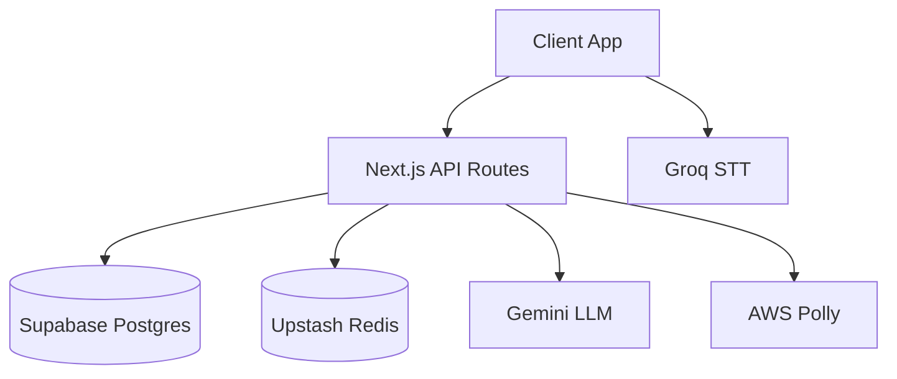

# Architecture Audit
## Tech Stack Found
- Next.js (App Router)
- Supabase
- Upstash Redis
- AWS Polly/S3
- Groq/Whisper
- Gemini
- Piston

## Diagram

```mermaid
graph TD
    Client[Client App] --> API[Next.js API Routes]
    API --> DB[(Supabase Postgres)]
    API --> Redis[(Upstash Redis)]
    Client --> STT[Groq STT]
    API --> AI[Gemini LLM]
    API --> TTS[AWS Polly]
```
