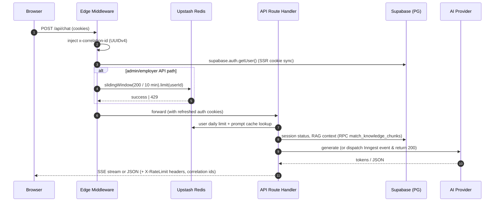
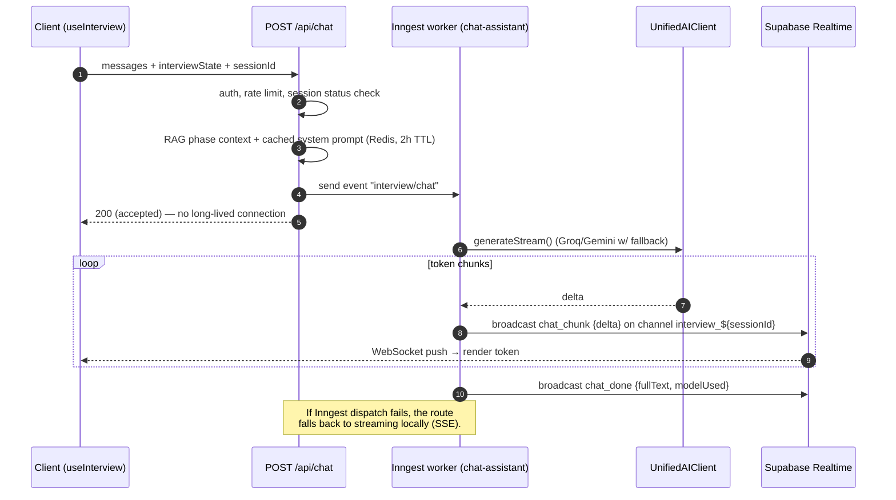
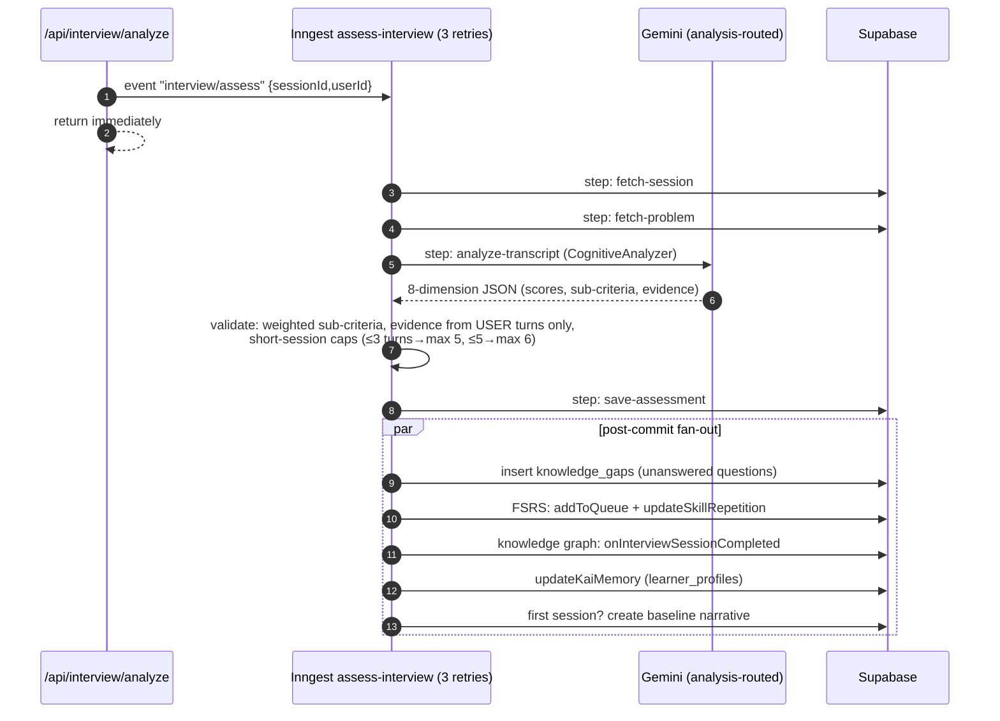
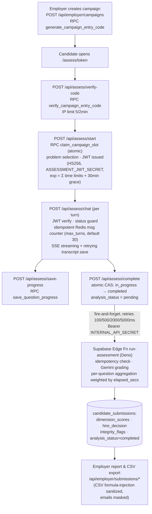
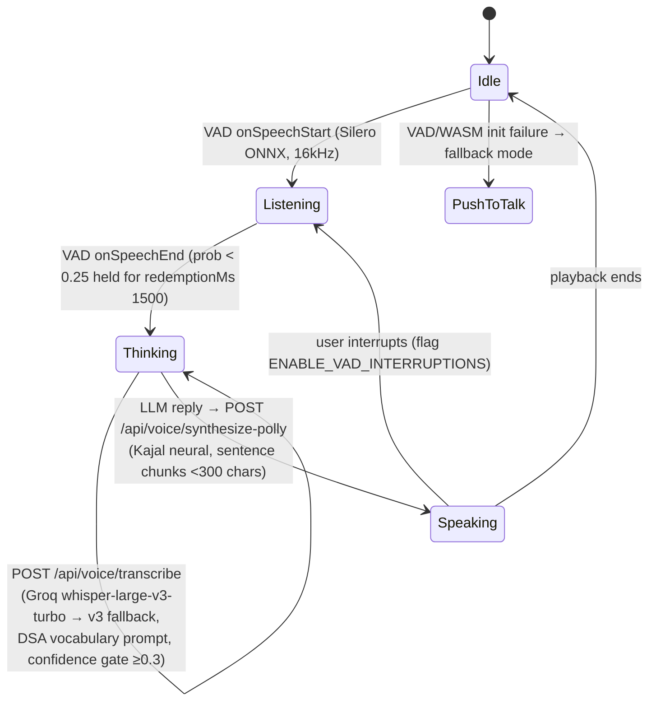
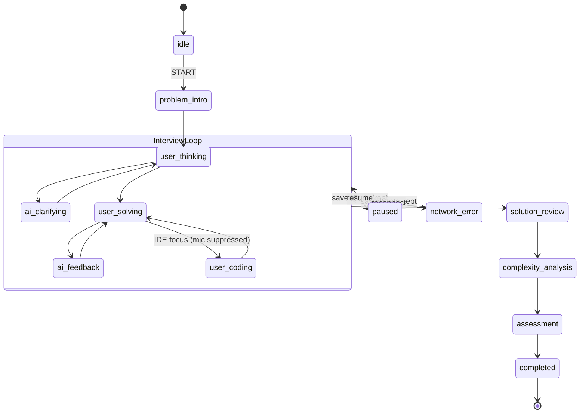
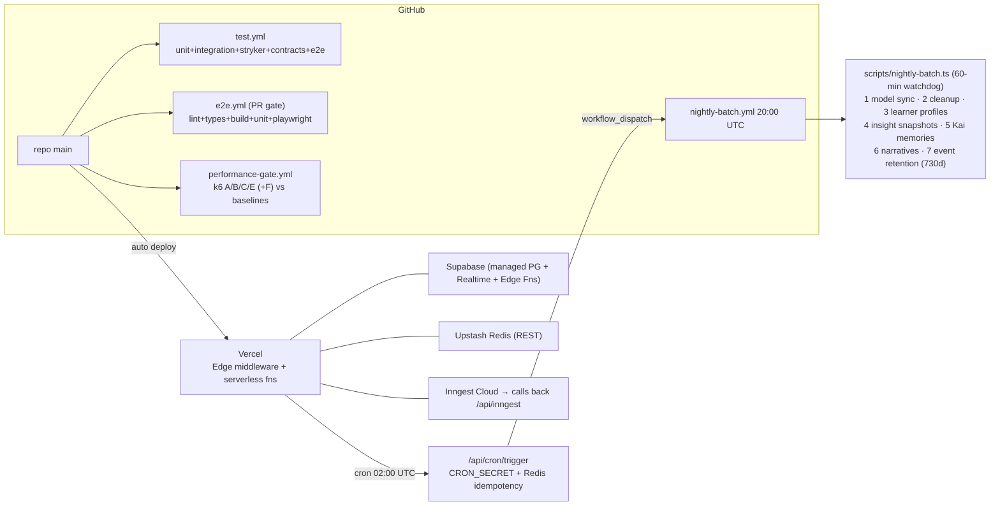
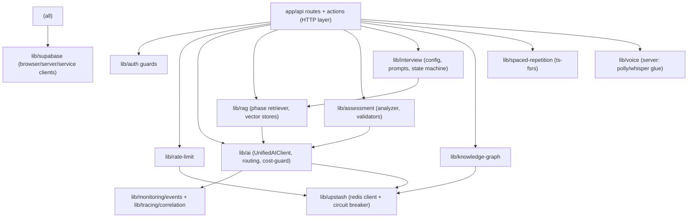
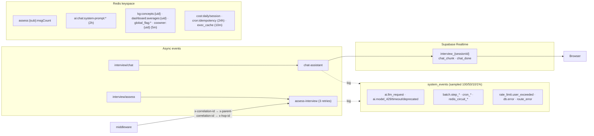

# AlgoMind
## Complete Engineering Interview Handbook
### Repository Reverse Engineering Report — Version 2.0 — Generated from Source Code

> **Provenance.** Every technical claim in this handbook was derived from the repository at commit `c7683ec` (branch `main`) by direct code inspection, cross-validated by six independent analysis passes (backend, AI/ML, frontend, database, infrastructure/testing, security) plus targeted re-verification of disputed claims. **Version 2.0** adds a second-pass principal-level review: the corners v1 left thin were re-verified at file level (server actions, weekly session limits, config/flag registries, the coaching layer, VAD internals, AWS cost accounting, serverless runtime facts), execution traces and operational runbooks were added, and all v1 errata are listed in the Completeness Audit. Where a fact could not be proven from the repository, it is explicitly marked **"Not present in repository"** or **"Cannot be determined from available code."** Claims that appear in the repo's own `docs/` wiki but contradict the code are resolved in favor of the code, and the discrepancy is noted.

---

## Table of Contents

1. [Executive Summary](#section-1--executive-summary)
2. [Project Overview](#section-2--project-overview)
3. [Repository Walkthrough](#section-3--repository-walkthrough)
4. [Complete Architecture (Diagrams)](#section-4--complete-architecture)
5. [Deep Code Walkthrough](#section-5--deep-code-walkthrough)
6. [Technology Deep Dive](#section-6--technology-deep-dive)
7. [Design Decisions](#section-7--design-decisions)
8. [Backend Deep Dive](#section-8--backend-deep-dive)
9. [Frontend Deep Dive](#section-9--frontend-deep-dive)
10. [Database](#section-10--database)
11. [AI / ML / LLM](#section-11--ai--ml--llm)
12. [System Design](#section-12--system-design)
13. [Security](#section-13--security)
14. [Performance Analysis](#section-14--performance-analysis)
15. [Code Quality](#section-15--code-quality)
16. [Interview Preparation Q&A](#section-16--interview-preparation)
17. [Project Defense](#section-17--project-defense)
18. [Resume Discussion](#section-18--resume-discussion)
19. [Cheat Sheets](#section-19--cheat-sheets)
20. [Concept Learning (Teach-Me Mode)](#section-20--concept-learning)
21. [Repository Evidence Index](#section-21--repository-evidence)
22. [Possible Improvements](#section-22--possible-improvements)
23. [Interview Revision Notes](#section-23--interview-revision-notes)
24. [Completeness Audit](#completeness-audit)

---

# SECTION 1 — Executive Summary

## What This Project Does

**AlgoMind is an AI-driven mock technical-interview platform.** A student practices data-structures-and-algorithms interviews by *talking* to an AI interviewer ("Kai") in a realistic interview room: a voice conversation (microphone → speech-to-text → LLM → text-to-speech), a Monaco code editor with real remote code execution, and a timed, turn-limited interview protocol. After each session, an LLM-as-judge grades the candidate across **8 cognitive dimensions** (problem decomposition, pattern recognition, algorithmic thinking, complexity analysis, communication clarity, edge-case awareness, optimization mindset, debugging approach), produces a hire decision, updates a per-user **knowledge graph**, schedules **FSRS spaced-repetition** reviews, and regenerates a persistent AI "memory" of the learner so the next session is personalized.

There is also a **B2B employer tier**: employers create assessment *campaigns* (bundles of problems with entry codes and time limits), external candidates take them **without an account** (authenticated by a dedicated short-lived JWT), and an async pipeline (Supabase Edge Function calling Gemini) grades submissions and produces recruiter-facing reports with integrity flags.

- **Source (product surface):** `src/app/` route tree — `interview/`, `assess/[token]/`, `learn/`, `practice/`, `dashboard/`, `employer/`, `admin/`, `owner/`
- **Source (self-description):** `README.md:3` — "a scalable, AI-driven technical interviewing platform designed to simulate realistic coding interviews, assess candidate proficiency across 8 algorithmic dimensions, and optimize long-term learning via Spaced Repetition (FSRS)."

## Problem Statement

Mock interviews with humans are expensive, hard to schedule, and inconsistent. Grinding LeetCode alone doesn't train the *interview* skills — thinking aloud, handling clarifying questions, communicating complexity analysis, recovering from bugs under time pressure. AlgoMind makes a realistic interviewer available on demand, grades the *process* (not just the final answer), and closes the loop with personalized review scheduling.

## Who Uses It

Three verified user roles plus two operator roles (`profiles.account_type` in `src/types/supabase.ts`; role policy in `src/lib/auth/role-policy.ts`):

| Role | What they do |
|---|---|
| **Candidate (student)** | Mock interviews, learn mode (Socratic tutoring), practice, dashboard, spaced repetition |
| **Employer** | Create campaigns, review candidate submissions/reports, CSV export |
| **Admin** | Model registry, feature flags, health dashboards, employer invites |
| **Owner / Co-owner** | Platform-wide config: model routing, rate limits, AWS usage, users, flags |
| **Guest** | Feature-flag-gated demo interview (`ENABLE_GUEST_MODE`), turn-limited trial |

## Business Value

- **B2C:** interview-prep product for placement-bound students (Hinglish support, `leetcode_profiles` sync, placement outcome tracking suggest an India-focused placement market; AWS region defaults to `ap-south-1` Mumbai — `.env.example:31`).
- **B2B:** employer screening campaigns — an "AI take-home interview" product with anti-cheat flags and hire recommendations.
- **Cost discipline is a first-class feature:** free-tier LLMs (Groq, Gemini free tier) with DB-driven routing and failover, token budgets per user/session (`src/lib/ai/cost-guard.ts`), AWS usage cost logging (`aws_usage_log` table), Redis-backed rate limiting at 6 layers.

## Engineering Value (why this repo impresses in interviews)

1. **A real distributed system on serverless primitives:** Next.js API routes + Inngest background jobs + Supabase Realtime streaming + Supabase Edge Functions + Upstash Redis, with idempotency, atomic compare-and-swap, and circuit breakers implemented explicitly.
2. **A multi-provider LLM gateway** with DB-driven model routing, per-model rate-limit tracking, tiered cooldowns, cross-tier fallback, and an emergency static fallback (`src/lib/ai/`).
3. **LLM-as-judge with engineering rigor:** weighted rubrics, evidence-quote validation, score-consistency correction, short-session caps, golden tests, and mutation testing on the scoring code.
4. **A serious test pyramid:** ~197 unit/integration test files, 8 contract tests, golden tests, 20+ Playwright E2E specs, visual regression snapshots, Stryker mutation testing, and a k6 performance gate in CI with baseline-relative thresholds.
5. **Production-grade voice pipeline in the browser:** Silero VAD via ONNX/WASM (with COOP/COEP headers for SharedArrayBuffer), Groq Whisper STT with confidence gating, AWS Polly neural TTS with sentence chunking and browser fallback.

## Resume Value

One honest resume line this repo supports: *"Built an AI mock-interview platform (Next.js 16/React 19, Supabase Postgres + pgvector, Inngest, Upstash Redis) featuring a multi-provider LLM router with automatic failover, a voice pipeline (Silero VAD → Whisper → Polly), an 8-dimension LLM-as-judge assessment engine validated by golden + mutation tests, and a k6 performance gate in CI."*

## 30-Second Explanation

> "AlgoMind is an AI mock-interviewer. You talk to it like a real interviewer — voice in, voice out — while solving a DSA problem in a code editor with real execution. When you finish, an LLM grades you on 8 cognitive skills with quoted evidence from the transcript, updates your knowledge graph, and schedules spaced-repetition reviews. There's also an employer mode where companies send candidates timed assessment campaigns and get hire-decision reports."

## 1-Minute Explanation

> "It's a serverless monolith: Next.js App Router on Vercel serves both the UI and the API; Supabase provides Postgres, auth, realtime WebSockets, and edge functions; Upstash Redis handles rate limiting and caching; Inngest runs background jobs. The hard problems were: (1) LLM reliability — I built a database-driven model router across Groq and Gemini with per-model cooldowns and a static emergency fallback; (2) grading quality — an LLM-as-judge with weighted sub-criteria rubrics, verbatim-evidence validation, and golden regression tests, plus mutation testing on the scoring code; (3) voice latency — client-side Silero VAD over ONNX WASM detects end-of-speech, Groq Whisper transcribes with a DSA vocabulary prompt and confidence gating, and Polly synthesizes replies in sentence chunks; and (4) integrity under retries — idempotent Redis message counters, atomic slot-claiming via Postgres RPCs, and compare-and-swap completion so assessment endpoints are safe to retry."

## 5-Minute Explanation

Use this structure (each point is expanded in the referenced section):

1. **Product** — mock interviews + learn mode + employer campaigns (Section 2).
2. **Architecture** — serverless monolith with edge enhancements; request path: Edge middleware (auth + rate limit) → API route → services → Supabase/Upstash/AI providers; async path: Inngest workers → Supabase Realtime broadcast to the client (Section 4).
3. **AI subsystem** — unified AI client, DB-driven routing table, intent classifier for smart routing, phase-aware RAG over pgvector, prompt registry with versions (Section 11).
4. **Assessment engine** — 8 weighted dimensions × 4 sub-criteria each, hard rubric gates, evidence extraction, two-pass score validation, async execution in Inngest (B2C) or a Deno edge function (B2B) (Section 11.4).
5. **Data** — 33 verified tables: interview/assessment core, FSRS tables, knowledge-graph tables, B2B campaign tables, telemetry tables; ~35 Postgres RPCs for atomic operations (Section 10).
6. **Quality & ops** — the test pyramid, k6 CI gate, nightly batch (7 steps under a 60-min watchdog), custom observability with correlation IDs and severity-sampled event logging (Sections 12, 14).
7. **Honest limitations** — schema not version-controlled in repo, CSP report-only, payments declared but not implemented, anti-cheat is honor-based (Sections 13, 22).

---

# SECTION 2 — Project Overview

## Objectives (as evidenced by the code)

1. Simulate a realistic technical interview (voice + code + protocol) — `src/components/interview/`, `src/lib/interview/`.
2. Grade the *cognitive process* across 8 dimensions with defensible evidence — `src/lib/assessment/`.
3. Optimize long-term retention via FSRS spaced repetition — `src/lib/spaced-repetition/` (uses `ts-fsrs`).
4. Personalize across sessions via AI memory ("Kai memory") and a knowledge graph — `src/lib/ai/memory-generator.ts`, `src/lib/knowledge-graph/`.
5. Serve employers with campaign-based candidate screening — `src/app/api/employer/`, `src/app/api/assess/`, `supabase/functions/run-assessment/`.
6. Operate near-free at small scale — free-tier LLM routing, cost guards, aggressive caching, keepalive cron for Supabase free tier (`src/app/api/cron/keepalive/route.ts`).

## Feature Inventory (verified)

| Feature | Evidence |
|---|---|
| Voice interview (VAD, STT, TTS, interruptions) | `src/lib/voice/`, `src/hooks/useInterviewVoice.ts`, `public/vad/*.onnx` |
| 4 interview modes: warm-up (20 min/15 turns), practice (30/20), crunch (25/12), sprint (45 min, 2 problems × 10 turns) | `src/lib/interview/interview-config.ts:47-52` |
| Guest/demo mode (flag-gated, practice config with 15 turns, 20 min) | `src/lib/interview/interview-config.ts:57-68`, middleware guest checks |
| Monaco editor + remote code execution (Python/JS/Java/C++) via Piston | `src/components/interview/CodeEditor.tsx`, `src/app/api/execute/route.ts` |
| 8-dimension assessment + hire decision | `src/lib/assessment/skill-registry.ts`, `analyzer.ts` |
| Phase-aware RAG (6 interview phases, per-phase query templates and chunk counts) | `src/lib/rag/phase-retriever.ts` |
| Knowledge graph with concept mastery + learning signals | `src/lib/knowledge-graph/service.ts`, tables `concept_states`, `learning_signals` |
| FSRS spaced repetition (problem-level and skill-level) | `src/lib/spaced-repetition/fsrs.ts`, tables `spaced_repetition`, `skill_repetition` |
| Learn mode: diagnostic + Socratic concept tutoring | `src/app/learn/`, `src/app/api/learn/` |
| Employer campaigns, candidate submissions, CSV export, reports | `src/app/api/employer/`, `src/app/employer/` |
| Session replay with public share tokens and view counts | `src/app/replay/[token]/`, table `session_replays`, RPC `increment_view_count` |
| PDF report export (lazy-loaded `@react-pdf/renderer`) | `src/components/dashboard/PDFReport.tsx` |
| PWA (service worker, manifest, cache-busting on build) | `src/app/manifest.ts`, `scripts/update-sw-version.js`, `@ducanh2912/next-pwa` |
| Admin panel (models, flags, health, costs, employers) | `src/app/admin/`, `src/app/api/admin/` |
| Owner panel (routing, rate limits, AWS usage, users, co-owners) | `src/app/owner/`, `src/app/api/owner/` |
| Hinglish support & TTS provider preference | `user_preferences.hinglish_enabled`, `tts_provider` columns |
| LeetCode profile sync | table `leetcode_profiles` |
| Weekly session limits per subscription plan | `src/lib/rate-limit/weekly-session-limiter.ts`, tables `user_weekly_usage`, `subscriptions` |

## Limitations (verified, be honest about these in interviews)

- **Payments are not implemented.** `razorpay` is a dependency, `.env.example` labels `RAZORPAY_*` CRITICAL, `tests/e2e/billing.spec.ts` mocks `/api/payment/*` endpoints, and `stryker.config.mjs` lists payment routes — but **no `/api/payment/*` route handlers exist in `src/`** (verified by glob + grep). *(v2 correction: `validateEnv.ts` does **not** enforce the Razorpay vars — its `criticalVars` array (lines 34–49) omits them; a stale comment at line 79 claims they "moved to criticalVars" but they never did. The payment env contract exists only in `.env.example`.)* The `subscriptions` table exists and drives weekly limits, but there is no checkout path in this repo.
- **Database schema is not version-controlled here.** `supabase/` contains only `config.toml` and edge functions; no `migrations/*.sql`. Schema truth lives on remote Supabase, validated at CI time by `scripts/verify-migrations.mjs`. The schema-drift test `src/__tests__/integration/schema-contract-drift.test.ts` is `.skip`ped.
- **Anti-cheat is honor-based.** `integrity_flags` are collected client-side and stored, not enforced server-side.
- **CSP is report-only** (`next.config.ts`), with `unsafe-inline`/`unsafe-eval` in `script-src`.
- **English-only, dark-mode-only UI.** No i18n framework present.
- **No real-time collaboration / pair interviewing.** Supabase Realtime is used only for one-way AI token streaming.

## Scope & Tradeoffs (summary; details in Section 7)

The repo consistently trades **operational simplicity and near-zero cost** for **bounded scale**: serverless monolith instead of microservices; free-tier LLMs with heavy failover machinery instead of one paid provider; Redis-and-RPC-based concurrency control instead of a heavyweight workflow engine; docs-plus-verification-script instead of migration files (a genuine weakness, not a virtue — see Section 22).

## Future Improvements

See Section 22 for the full prioritized list (payments completion, migration files, CSP enforcement, per-user cross-campaign limits, HNSW index verification, semantic response caching, etc.).

---

# SECTION 3 — Repository Walkthrough

## Top-Level Layout (826 tracked files)

```text
algomind/
├── .github/workflows/       # 4 CI pipelines: test, e2e, nightly-batch, performance-gate
├── docs/                    # 9 engineering wiki docs (architecture, DB, API, frontend, security, load tests)
├── public/                  # PWA icons, Silero VAD ONNX models + ONNX runtime WASM (public/vad/)
├── scripts/                 # build (SW versioning), nightly batch, DB verification, benchmarks
├── src/
│   ├── app/                 # Next.js App Router: pages + 64 API route.ts handlers + server actions
│   ├── components/          # ~161 React components in 18 domain folders
│   ├── hooks/               # 27 custom hooks (voice/interview state machines live here)
│   ├── lib/                 # The "backend brain": ai, rag, voice, assessment, interview,
│   │                        #   knowledge-graph, spaced-repetition, auth, rate-limit, inngest,
│   │                        #   supabase, aws, monitoring, telemetry, tracing, cache, config...
│   ├── data/                # DSA knowledge corpus (8 markdown topics) + problem recommendations JSON
│   ├── types/               # Domain types + generated supabase.ts (2,461 lines — the schema mirror)
│   ├── test-utils/          # Shared mocks/fixtures (supabase-mock, voice-mocks, playwright-helpers)
│   └── middleware.ts        # Edge middleware: auth, RBAC-lite, rate limiting, diagnostic gating
├── supabase/
│   ├── config.toml          # Local dev config (Postgres 17, Deno 2 edge runtime); schema_paths = []
│   └── functions/run-assessment/   # Deno edge function: async B2B assessment grading
├── tests/
│   ├── e2e/                 # 20+ Playwright specs
│   ├── golden/              # Assessment golden regression tests + fixtures
│   ├── visual/              # Visual regression (responsiveness screenshots per viewport)
│   ├── performance/k6/      # 8 k6 load scenarios + apache-bench smoke
│   └── baseline/            # Performance + observability baselines used by the CI gate
├── next.config.ts           # Security headers, CSP (report-only), COOP/COEP for WASM, image domains
├── vercel.json              # 1 cron: POST /api/cron/trigger at 02:00 UTC daily
├── vitest.config.ts         # Unit test config + per-module coverage thresholds
├── playwright.config.ts     # E2E config (1 worker, auth state reuse)
├── stryker.config.mjs       # Mutation testing on 13 high-risk modules; break threshold 50%
└── package.json             # Next 16.1.7, React 19.2.3, zod 4, inngest 4, ts-fsrs 5, ...
```

## Why Each Major Directory Exists

- **`src/app/`** — Next.js App Router convention: file-system routing for both pages and API. This *is* the deployment unit ("serverless monolith"): every `route.ts` becomes a Vercel serverless function; every `page.tsx` a rendered route; `src/middleware.ts` runs on the Edge runtime in front of everything.
- **`src/lib/`** — framework-agnostic domain logic, deliberately separated from HTTP handlers so it can be unit-tested and reused (the same `CognitiveAnalyzer` is used by the API route and the Inngest worker). This is the closest thing to a "service layer."
- **`src/data/dsa-knowledge/raw/`** — the RAG corpus: 8 markdown files (`arrays`, `linked-lists`, `trees`, `dynamic-programming`, `hashing`, `searching`, `recursion`, `complexity`).
- **`public/vad/`** — Silero VAD ONNX models (`silero_vad_v5.onnx`, `silero_vad_legacy.onnx`) plus `ort-wasm-simd-threaded.wasm/.mjs` and the VAD audio worklet bundle. Served statically because ONNX Runtime Web loads them from URLs; the threaded SIMD WASM requires the COOP/COEP headers set in `next.config.ts`.
- **`supabase/functions/run-assessment/`** — Deno edge function that grades B2B candidate submissions asynchronously. It exists (rather than reusing Inngest) so grading runs close to the database with the service role, is invocable via a single authenticated HTTP call from `/api/assess/complete`, and has no dependency on the Next.js bundle (it calls Gemini directly).
- **`scripts/`** — operational tooling: `update-sw-version.js` (pre-build cache-busting), `nightly-batch.ts` (the 7-step batch), `verify-migrations.mjs` (schema contract check), `compare-load-baseline.ts` (perf gate), `enforce-observability-retention.ts` (2-year event retention).
- **`tests/` vs `src/**/__tests__/`** — colocated unit tests live next to the code; cross-cutting suites (e2e, golden, visual, load, baselines) live in `tests/`.

## Startup Flow & Entry Points

1. **Build:** `npm run build` → `scripts/update-sw-version.js` rewrites the service-worker cache name to `algomind-${Date.now()}` → `next build`.
2. **Boot:** Next.js loads `next.config.ts` (headers, image domains, `serverActions.bodySizeLimit: 2mb`). Env validation lives in `src/lib/startup/validateEnv.ts` (criticality tiers; also asserts `ASSESSMENT_JWT_SECRET ≠ SUPABASE_JWT_SECRET` via `assertAssessmentSecretIsUnique()` from `src/lib/assess/jwt.ts:58`).
3. **Every request:** `src/middleware.ts` (Edge) — correlation ID injection, Supabase SSR cookie sync + `auth.getUser()`, route protection, admin/employer rate limiting, guest-mode and diagnostic-completion gating. Matcher excludes `_next/static`, `_next/image`, `favicon.ico`, `public/`, `vad/`, `api/auth/`, `auth/`.
4. **Page render:** root `src/app/layout.tsx` mounts `QueryProvider` (React Query), `AuthProvider` (Supabase session context), `TourProvider`, Navbar, toaster, service-worker registration.
5. **Async workers:** Inngest functions are *served by* the app itself at `src/app/api/inngest/route.ts` (GET/POST/PUT) — Inngest Cloud calls back into this endpoint to execute steps.
6. **Scheduled:** Vercel cron (`vercel.json`) hits `/api/cron/trigger` daily at 02:00 UTC → dispatches the GitHub Actions `nightly-batch.yml` workflow (with a Redis idempotency key) → GitHub runner executes `scripts/nightly-batch.ts`.

## The Repo's Own Documentation (and where it diverges from code)

`docs/01`–`05` are a self-written wiki (HLD, ERD, API reference, frontend state machines, security). They are broadly accurate but **the code wins where they diverge**:

| Docs claim | Code truth |
|---|---|
| "Next.js 14" (`docs/04-frontend-ui-ux.md:3`) | Next.js **16.1.7** (`package.json`) |
| "Gemini 2.5 Inference" as the AI tier (`docs/01`) | Multi-provider registry: Groq Llama 3.3/3.1/4-Scout, Qwen3-32B, GPT-OSS 120B/20B, Gemini 2.5/3.x-Flash family, Gemma 3 27B (`src/lib/ai/providers.ts`, `model-registry.ts`) |
| ERD shows ~12 tables (`docs/02`) | 33 tables verified in `src/types/supabase.ts` + code usage |

---

# SECTION 4 — Complete Architecture

## 4.1 Overall Architecture

```mermaid
flowchart TD
    subgraph Client["Browser (PWA)"]
        UI["React 19 UI<br/>Interview Room / Dashboard"]
        VAD["Silero VAD<br/>ONNX WASM (public/vad)"]
        SW["Service Worker<br/>(next-pwa)"]
    end

    subgraph Edge["Vercel Edge"]
        MW["src/middleware.ts<br/>Auth sync · RBAC-lite · Rate limits<br/>Correlation IDs · Diagnostic gate"]
    end

    subgraph App["Next.js Serverless (Vercel)"]
        API["64 API route handlers<br/>src/app/api/**"]
        SA["Server Actions<br/>src/app/actions/**"]
        LIB["Domain layer src/lib/**<br/>ai · rag · assessment · interview<br/>voice · knowledge-graph · fsrs"]
    end

    subgraph Data["State & Cache"]
        PG[("Supabase Postgres 17<br/>33 tables · pgvector · RLS · ~35 RPCs")]
        RT(("Supabase Realtime<br/>WebSocket broadcast"))
        REDIS[("Upstash Redis (REST)<br/>rate limits · counters · caches<br/>circuit breaker")]
    end

    subgraph Async["Async & Scheduled"]
        ING["Inngest<br/>assess-interview · chat-assistant"]
        EDGEFN["Supabase Edge Fn (Deno)<br/>run-assessment"]
        CRON["Vercel cron 02:00 UTC<br/>→ GitHub Actions nightly batch"]
    end

    subgraph Ext["External Services"]
        GROQ["Groq<br/>Llama/Qwen chat · Whisper STT"]
        GEM["Google Gemini<br/>chat · analysis · embeddings (768d)"]
        BED["AWS Bedrock (flag-gated)"]
        POLLY["AWS Polly TTS (Kajal neural)"]
        S3["AWS S3 (flag-gated audio/transcripts)"]
        PISTON["Piston API<br/>sandboxed code execution"]
    end

    UI --> VAD
    UI -->|HTTPS| MW --> API
    MW <-->|limit()| REDIS
    API --> LIB
    SA --> LIB
    LIB <--> PG
    LIB <--> REDIS
    API -->|send event| ING
    ING -->|stream chunks| RT --> UI
    ING <--> PG
    ING --> GEM & GROQ
    API --> PISTON
    API --> GROQ & GEM & BED & POLLY & S3
    API -->|invoke w/ INTERNAL_API_SECRET| EDGEFN
    EDGEFN --> GEM
    EDGEFN --> PG
    CRON -.-> API
```

**Explanation.** The platform is a *serverless monolith with edge enhancements* (`README.md:7`). One Next.js codebase provides UI, API gateway, and domain logic; anything long-running or bursty is pushed to Inngest (B2C assessment + chat streaming) or a Supabase Edge Function (B2B assessment). Upstash Redis is the coordination fabric (rate limits, idempotent counters, caches) reached over REST — no TCP connection pools, which matters on serverless. Supabase Realtime carries streamed LLM tokens back to the browser so the HTTP request that *started* generation can return immediately (avoiding serverless timeout limits).

## 4.2 Request Lifecycle (Sequence)



**Explanation.** Auth is *synchronized*, not just checked, in middleware: `@supabase/ssr` re-writes refreshed JWT cookies onto both the request (for downstream handlers) and the response (for the browser). Handlers then re-create a server client and get a validated `user` without re-parsing tokens. Rate limiting happens *before* compute for the admin/employer tiers (429s cost ~61 ms at the edge — measured in `docs/load_test_metrics.md:59`).

## 4.3 Interview Chat — Async Streaming Path



**Explanation.** This is the repo's signature pattern: *decouple generation time from HTTP time.* Vercel serverless functions have bounded execution windows; a 28-second p95 LLM generation (measured under load, `docs/load_test_metrics.md:28`) would risk timeouts and holds a function instance hostage. Instead the API returns immediately and Inngest streams tokens through a Supabase Realtime channel keyed by session ID. A local SSE fallback keeps the product alive if the job queue is down (`src/app/api/chat/route.ts`).

## 4.4 B2C Assessment Pipeline (Inngest fan-out)



## 4.5 B2B Assessment Flow (Campaign → Candidate → Report)



## 4.6 Voice Pipeline (Hardware State Machine)



**Explanation.** VAD runs entirely client-side (`@ricky0123/vad-web` + Silero ONNX in `public/vad/`), so silence detection costs zero server round-trips. The threaded SIMD WASM build needs `SharedArrayBuffer`, which is why `next.config.ts` sets `Cross-Origin-Embedder-Policy: require-corp` + `Cross-Origin-Opener-Policy: same-origin` on `/vad/*`, `/interview*`, and `/assess/*` only (scoping avoids breaking OAuth popups elsewhere). STT responses are gated: a transcript is dropped only if confidence < 0.3 **and** the text is under 2 words — a deliberate accent-friendly compromise (`src/app/api/voice/transcribe/route.ts`).

## 4.7 Interview Protocol State Machine (Logical Layer)



**Source:** `src/lib/interview/state-machine.ts`. The UI maps these states to 6 canonical *phases* (intro, approach, coding, testing, complexity, wrap-up) via a `STATE_TO_PHASE` mapping in the chat route; the phase drives both prompt construction and RAG retrieval (per-phase query templates and chunk counts in `src/lib/rag/phase-retriever.ts`).

## 4.8 ER Diagram (Core, verified subset of 33 tables)

```mermaid
erDiagram
    PROFILES ||--o| USER_PREFERENCES : "1:1"
    PROFILES ||--o| LEARNER_PROFILES : "1:1 (kai_memory)"
    PROFILES ||--o{ INTERVIEW_SESSIONS : takes
    PROFILES ||--o{ SUBSCRIPTIONS : has
    PROFILES ||--o{ ASSESSMENT_CAMPAIGNS : creates
    PROBLEMS ||--o{ INTERVIEW_SESSIONS : tests
    INTERVIEW_SESSIONS ||--o{ ASSESSMENTS : "graded by"
    INTERVIEW_SESSIONS ||--o| SESSION_REPLAYS : "share token"
    INTERVIEW_SESSIONS ||--o{ KNOWLEDGE_GAPS : surfaces
    KNOWLEDGE_CHUNKS ||--o{ KNOWLEDGE_GAPS : resolves
    PROFILES ||--o{ SPACED_REPETITION : "problem FSRS"
    PROFILES ||--o{ SKILL_REPETITION : "skill FSRS"
    CONCEPT_TAGS ||--o{ CONCEPT_STATES : "per-user mastery"
    PROFILES ||--o{ CONCEPT_STATES : owns
    PROFILES ||--o{ LEARNING_SIGNALS : emits
    CONCEPT_TAGS ||--o{ LEARN_SESSIONS : about
    PROFILES ||--o{ LEARN_SESSIONS : takes
    ASSESSMENT_CAMPAIGNS ||--o{ CAMPAIGN_PROBLEM_LINKS : bundles
    PROBLEMS ||--o{ CAMPAIGN_PROBLEM_LINKS : in
    ASSESSMENT_CAMPAIGNS ||--o{ CANDIDATE_SUBMISSIONS : receives
    PROFILES ||--o{ USER_WEEKLY_USAGE : "session limits"
```



**Full inventory:** Section 10 lists all 33 verified tables (plus telemetry/governance tables not drawn here: `system_events`, `aws_usage_log`, `model_registry`, `system_config`, `global_feature_flags`, `admin_users`, `co_owners`, `employer_invites`, `score_benchmarks`, `insight_snapshots`, `user_daily_usage`, `leetcode_profiles`, `code_attempts`).

## 4.9 Deployment & Scheduled-Work Diagram



**Note on the dual schedule:** `vercel.json` fires at 02:00 UTC and `nightly-batch.yml` also has its own cron at 20:00 UTC — two independent triggers for the same batch, deduplicated at the trigger level by the Redis idempotency key in `/api/cron/trigger` (24 h TTL) for the Vercel path. (The purpose of the offset is not documented in the repo — *cannot be determined from available code*.)

## 4.10 Dependency/Layer Graph (logical)



## 4.11 Execution Traces — Every Major Path (v2)

Read each trace top-to-bottom; every hop names the exact file/function so you can narrate it in an interview without the source open.

**T1 — Voice interview turn (the flagship path):**
```text
Mic audio (16 kHz)
 → Silero VAD in AudioWorklet (vad-manager.ts; speech starts at prob≥0.7)
 → onSpeechEnd fires after 1500 ms below 0.25 (≥1200 ms speech required)
 → float32ToWav() in whisper-stt.ts → POST /api/voice/transcribe
 → Groq whisper-large-v3-turbo (fallback: whisper-large-v3), DSA vocabulary prompt, temp 0
 → confidence gate (geo-mean avg_logprob ≥ 0.3 OR ≥2 words) → transcript
 → useInterviewControl.submitUserResponse() (2.5 s smart-pause auto-submit if mic always-on)
 → POST /api/chat: auth → daily limit (RPC check_user_rate_limit) → session status
   → phase RAG (phase-retriever.ts, cached {sessionId}:{phase})
   → system prompt from Redis cache (2 h) with per-turn <session_state> re-render
 → inngest.send("interview/chat") → 200 returned in milliseconds
 → chat-assistant worker: UnifiedAIClient.generateStream()
   → routing stages (model_routing table → cooldown check → provider fetch, Groq 15 s timeout)
   → filterThinkTags() strips <think> blocks across chunk boundaries
 → each delta broadcast to Realtime channel interview_${sessionId} (chat_chunk)
 → client renders tokens → chat_done {fullText, modelUsed}
 → tts-engine.ts: >200 chars ⇒ sentence chunks <300 chars → POST /api/voice/synthesize-polly
   (Kajal neural, 8 s timeout, cost logged to aws_usage_log) → single reused <audio> element
 → user interrupts mid-speech? InterruptionManager cancels playback,
   estimateSpokenContent() computes what was heard, buildInterruptionContext()
   injects "[INTERRUPTION CONTEXT]" into the next turn's prompt
```

**T2 — Parallel coaching layer (runs alongside every turn):**
```text
Each user turn
 → turn-classifier.ts (Groq, 60-token budget): detects one of the 8 dimensions
   with confidence ≥ 0.75 → ConceptImpactBadge pops in the UI (firedDimensions Set
   prevents repeats)
 → silent-observer.ts (flag ENABLE_SILENT_OBSERVER, active only in
   user-thinking / user-solving / ai-clarifying, ≥4 turns):
   scans last 3 turns for procedural gaps —
   complexity_missing (120 s cooldown) · constraints_never_asked (300 s, one-shot)
   · stuck_same_approach (150 s) · code_no_narration (90 s) · hint_available (180 s)
   · vague_complexity_answer (90 s) · no_edge_cases (150 s)
 → emits a ≤100-token coaching nudge or positive badge (30 s global positive cooldown);
   analyzeCode() can add an inline 150-token code hint during user-coding (30 s cooldown)
```

**T3 — B2C assessment (post-interview):**
```text
Interview ends (turns/time limit or FINISH_INTERVIEW)
 → saveInterviewSession() server action: <2 user turns ⇒ zero-score assessment, AI skipped
   (admin needs just 1); else RPC save_interview_session_atomic
 → /api/interview/analyze → inngest event interview/assess
 → assess-interview worker (3 retries): fetch-session → fetch-problem
   → CognitiveAnalyzer.analyze() (Gemini via analysis routing, 3 attempts)
   → evidence-extractor rejects non-USER quotes → score-validator recomputes
     from sub-criteria, applies short-session caps → save-assessment
 → post-commit fan-out: knowledge_gaps inserts · FSRS addToQueue +
   updateSkillRepetition · knowledge-graph onInterviewSessionCompleted ·
   updateKaiMemory (≤2000-char FIFO) · session-1 baseline narrative (idempotent)
 → invalidateDashboardCache(userId) → dashboard shows new radar on next load
```

**T4 — B2B employer flow (end to end):**
```text
Employer: POST /api/employer/campaigns → RPC generate_campaign_entry_code
  (format AAA-NNN-AAA; alphabet excludes I/O/0/1 — entry-code.ts regex)
Candidate: /assess/[token] → verify-code (5/2 min IP) → /api/assess/start
  (5/10 min IP, fail-closed) → RPC claim_campaign_slot → per-question time limits
  (defaults: easy 15 / medium 25 / hard 45 min — question-timer.ts)
  → HS256 JWT (ASSESSMENT_JWT_SECRET, exp = Σ limits + 30 min)
 → assess/chat per turn (idempotent Redis counter, max_turns default 30, SSE)
 → save-progress (RPC save_question_progress; resume-aware timer:
   remaining = total − currentElapsed − previousElapsed)
 → complete: CAS UPDATE … WHERE status='in_progress' → invoke run-assessment
   edge fn (Bearer INTERNAL_API_SECRET, retries 100/500/2000/5000 ms)
 → Deno fn: timing-safe secret check → idempotency (analysis_status) → Gemini
   → multi-question aggregation weighted by elapsed_secs → candidate_submissions
 → employer report / masked-CSV export; failures ⇒ analysis_status='failed'
   → owner retries via /api/owner/retry-assessment
```

**T5 — Learn mode:**
```text
/learn gate: middleware checks diag_done cookie → profiles.has_completed_diagnostic
 → diagnostic (self-assessment questionnaire, answers 1–5 → confidence
   0.20/0.35/0.50/0.70/0.90 — diagnostic/questions.ts) → RPC initialize_concept_states
 → /learn/[slug]: useLearnSession (max 18 exchanges) → POST /api/learn/concept
   (SSE streaming; Kai-Tutor prompt ≤2000 tokens = behavioral contract +
   buildStudentContextPromptBlock)
 → session end → RPC on_learn_session_completed(kai_assessment)
   → upsert_concept_states_batch (confidence deltas: tutor weight 0.08,
     struggle penalty −0.04 — system_config keys) → learning_signals audit rows
```

**T6 — Model failover (what happens when a provider dies):**
```text
generateCompletion() → stage plan (model_routing: primary → secondary → emergency)
 → per model: cooldownMap check → fetch with AbortController
   (Groq 15 s / Gemini 25 s / Bedrock 30 s)
 → 429 ⇒ IntelligentRateLimiter escalates cooldown 5→10→20→40→80 min, next model
 → 404 ⇒ markModelDeprecated() + registry cache invalidation, next model
 → timeout ⇒ ai.model_timeout event, next model
 → all stages exhausted ⇒ typed error envelope {retryable: true};
   telemetry: ModelTelemetry circular buffer (1000 decisions) + system_events sampling
```

**T7 — Guest trial:**
```text
/interview?demo=true + flag ENABLE_GUEST_MODE (middleware)
 → getGuestProblem(): 1 of 5 hardcoded problems with pre-embedded ragContext
   (guest-problems.ts — two-sum, valid-parentheses, reverse-linked-list,
    max-subarray, climbing-stairs)
 → resolveGuestConfig(): 20 min / 15 turns per problem
 → useGuestSession localStorage ledger: TURNS_PER_PROBLEM 15, trial ceiling
   MAX_USER_TURNS 75 (= 5 problems) → login prompt at limit
 → chat rate-limited by IP (100/24 h); no RAG retrieval (context pre-embedded)
```

**T8 — Nightly batch (scheduled):**
```text
Vercel cron 02:00 UTC → GET /api/cron/trigger (Bearer CRON_SECRET)
 → Redis idempotency key (24 h, dup ⇒ 409) → GitHub workflow_dispatch
 → nightly-batch.ts under 60-min watchdog:
   1 sync-models (ping providers, deprecate dead)  2 cleanup (expired sessions)
   3 learner profiles (FSRS recompute)             4 insight snapshots
     (insight-engine: declining_trend, momentum, streak_at_risk, plateau …
      + difficulty tier 1–5 from difficulty-calibrator)
   5 Kai memories (24 h actives, 30 s/user cap)    6 narratives (Gemini, 60 s cap)
   7 observability retention (delete system_events >730 d)
 → per-step batch.step_* events; exit 1 only on total failure
```

**T9 — Replay sharing:** `POST /api/replay/generate` → existing unexpired replay reused, else fresh `public_token` (TTL 30 days, `DEFAULT_REPLAY_TTL_DAYS`, env-overridable but capped) → `/replay/[token]` renders `InterviewSession readOnly` → RPC `increment_view_count`.

## 4.12 Event & Data Flow Map (v2)



**Explanation.** Two Inngest events, one Realtime channel family, one sampled event ledger, and a small disciplined Redis keyspace — that is the entire coordination surface. Correlation IDs stitch the hops (HTTP → cron → batch → edge), contract-tested in `correlation-propagation.contract.test.ts`.

---

# SECTION 5 — Deep Code Walkthrough

This section walks the most load-bearing modules. Each ends with **interview discussion points**.

## 5.1 `src/lib/ai/` — The LLM Gateway

**Purpose.** One facade (`UnifiedAIClient`, `src/lib/ai/client.ts`) hides three providers (Groq, Gemini, optional AWS Bedrock) behind `generateCompletion()`, `generateResponse()` (smart-routed), `generateStream()` (async generator), and `embed()`.

**Key mechanics (all verified in code):**
- **No provider SDKs for chat.** Groq is called via its OpenAI-compatible REST endpoint; Gemini via `generativelanguage.googleapis.com/v1beta/...:generateContent`; only Bedrock uses the AWS SDK (`InvokeModel`/`InvokeModelWithResponseStream`). Direct `fetch` keeps bundle size down and makes timeouts explicit: **Groq 15 s, Gemini 25 s, Bedrock 30 s**.
- **DB-driven routing.** `model_routing` table rows (`model_id, provider, priority, use_case ∈ {chat, analysis}, is_active`) are compiled by `buildRoutingStagePlan()` (`src/lib/ai/model-routing.ts`) into stages: primary → secondary (cross-tier fallback, toggle stored in `system_config.cross_tier_fallback_enabled`) → emergency (static `CHAT_MODELS` heuristic: chat prefers Groq→Gemini; analysis prefers Gemini→Groq because Gemini is more reliable at strict JSON).
- **Model registry with cache.** `src/lib/ai/model-registry.ts` reads the `model_registry` table (rpm/tpm/rpd/tier/context_window/is_active) through a 1-hour Redis cache, with a static in-code fallback array if both DB and cache fail. `markModelDeprecated()` deactivates a model (e.g., on HTTP 404) and invalidates the cache.
- **Rate limiting per model.** `IntelligentRateLimiter` (`src/lib/ai/rate-limiter.ts`) tracks RPM/RPD per model in Redis and escalates cooldowns on repeated failures: 5 → 10 → 20 → 40 → 80 minutes. 429 ⇒ cooldown tier bump; 404 ⇒ deprecate. Redis down ⇒ fail-open (configurable).
- **Cost guard.** `src/lib/ai/cost-guard.ts`: free-tier budgets — 50,000 tokens/user/day (`cost:daily:{userId}`, 24 h TTL) and 15,000 tokens/session (`cost:session:{sessionId}`, 2 h TTL). Over budget ⇒ generation blocked; Redis down ⇒ fail-open.
- **Streaming think-tag filter.** `filterThinkTags()` strips `<think>`/`<thinking>`/`<reasoning>` blocks *statefully across chunk boundaries*, holding back a ~20-char safety margin so a tag split across two SSE chunks is still caught. This exists because Qwen/GPT-OSS-class models emit reasoning tokens that must never reach the candidate.
- **Smart routing.** `generateResponse()` first runs the hybrid intent classifier (below) and routes simple→Groq (cheap/fast), complex→Gemini, logging the decision to `src/lib/analytics/model-telemetry.ts` (~100 ms overhead).

**Complexity.** All routing decisions are O(#models) linear scans over a handful of rows — negligible. The real costs are network: the design minimizes *worst-case* latency via per-provider timeouts and staged fallback rather than optimizing the happy path.

**Alternatives & why not.** LangChain/Vercel AI SDK would provide this plumbing, but the repo's approach gives exact control over fallback order, cooldown state, and cost accounting in ~1 file per concern, with no framework lock-in. The tradeoff: more code to test — which is why `client.ts` and `rate-limiter.ts` are in the Stryker mutation-test list.

**Interview discussion points.**
- How do you fail over between LLM providers without retry storms? (tiered cooldowns + circuit breaker + deprecation on 404)
- Why route "analysis" to Gemini but "chat" to Groq? (structured-JSON reliability vs latency/cost)
- Why strip think-tags server-side with a stateful filter instead of regex on the full response? (streaming — you never hold the full response)

## 5.2 `src/lib/ai/intent-classifier.ts` — Hybrid Classification

**Flow:** regex first-pass (0 ms; greeting/clarification/technical/behavioral/code_review patterns; confidence 0.93–0.98 on strong signals) → fuzzy LRU cache (Levenshtein distance ≤ 2, max 500 entries) → LLM second-pass only if regex confidence < 0.8 (Groq `llama-3.1-8b-instant`, temp 0.1, 3 s timeout, JSON `{complexity, category, confidence, reasoning}`).

**Why this design:** classification runs on *every* smart-routed message; paying an LLM call each time would add latency and cost to the hot path. The cascade means the expensive path runs only for ambiguous inputs. **Complexity:** Levenshtein is O(m·n) per cache probe over a bounded cache — effectively constant.

**Interview discussion points:** classic "cascade classifier" pattern; discuss precision/recall tradeoffs of regex-first, cache-poisoning risk on fuzzy matches, and why temperature 0.1 for classification.

## 5.3 `src/lib/assessment/` — LLM-as-Judge

**Files:** `skill-registry.ts` (8 dimensions × 4 weighted sub-criteria each; dimension weights: problem-decomposition .15, pattern-recognition .15, algorithmic-thinking .15, complexity-analysis .12, communication-clarity .12, optimization-mindset .11, edge-case-awareness .10, debugging-approach .10), `prompts.ts` (`generateAssessmentPrompt()`), `analyzer.ts` (`CognitiveAnalyzer.analyze()`, 3 attempts, exponential backoff), `score-validator.ts` (two-pass validation), `evidence-extractor.ts`, `confidence-calculator.ts`, `key-moments.ts`, `mode-assessment-config.ts` (per-mode strictness/bonus dimension).

**The rubric is engineered against LLM leniency:**
- Hard gates: 1–3 no understanding; 4–5 vague/unexplained; 6–7 correct **only after prompting**; 8–9 correct **unprompted**; 10 exceptional.
- **Evidence must be verbatim quotes from USER turns only** — `evidence-extractor.ts` rejects quotes that come from Kai's own messages (anti-self-grading).
- **Short-session caps:** ≤3 user turns ⇒ max score 5; ≤5 turns ⇒ max 6 (prevents "said hello, scored 9").
- **Consistency correction:** `score-validator.ts` recomputes each dimension from its weighted sub-criteria and corrects drift between the LLM's headline number and its own sub-scores.
- **Mode bonuses:** crunch adds time-efficiency, sprint adds context-switching as a 9th dimension at 10% weight (`mode-assessment-config.ts`).
- Final: overall = Σ(dimension × weight); hire decision thresholds (STRONG_HIRE ≥ 8.5, HIRE ≥ 7.0, …).

**Where it runs:** B2C — Inngest `assess-interview` (3 retries); B2B — Deno edge function `supabase/functions/run-assessment/index.ts` (idempotent via `analysis_status` check, aggregates multi-problem scores weighted by `elapsed_secs`, timing-safe secret comparison on `INTERNAL_API_SECRET`).

**Testing:** golden fixtures (`tests/golden/`) pin expected outputs for easy/medium/short sessions; Stryker mutates `analyzer.ts`, `score-validator.ts`, `confidence-calculator.ts` to prove the tests actually constrain the logic.

**Interview discussion points:** LLM-as-judge failure modes (leniency, hallucinated evidence, self-grading) and the concrete mitigations here; why deterministic *validation* beats prompting alone; why golden + mutation tests are the right shape of test for scoring code.

## 5.4 `src/lib/rag/` — Phase-Aware RAG

- **Corpus:** 8 markdown topic files (`src/data/dsa-knowledge/raw/`).
- **Embeddings:** Gemini embedding model, **768 dimensions**; falls back to Amazon Titan v2 (1024-d) if Bedrock is enabled (`UnifiedAIClient.embed()`).
- **Stores:** production = `supabaseVectorStore.ts` → RPC `match_knowledge_chunks(query_embedding, match_threshold = 0.5, match_count)` over pgvector in the `knowledge_chunks` table; dev/simple = `vectorStore.ts` (JSON file store, cosine similarity, plus keyword Jaccard and 0.7/0.3 hybrid scoring).
- **Phase awareness (`phase-retriever.ts`):** per-phase query templates (approach: `"{title} algorithm pattern {tags}"`; complexity: `"time complexity space complexity {title}"`, …) and per-phase chunk counts (intro 2, approach 4, coding 3, testing 2, complexity 3, wrap-up 3), with a session-scoped cache keyed `{sessionId}:{phase}`.
- **Injection:** top-K chunks formatted `[n] {title} ({topic})` + 400-char excerpts, wrapped in `<rag_context>` XML tags in the system prompt, injected **once** (route checks the base prompt to avoid re-injection).
- **Feedback loop:** questions RAG couldn't answer become `knowledge_gaps` rows (with `best_similarity_score`, admin review fields, optional AI-drafted chunk suggestions) — the corpus improves from real usage.
- **Match threshold 0.5** is deliberately permissive (recall over precision) — a wrong-ish chunk in context is cheaper than a missing one, since the LLM filters.
- **Vector index type (IVFFlat vs HNSW): cannot be determined from available code** (no migration SQL in repo; only the RPC call site is visible).

**Interview discussion points:** why phase-aware retrieval beats one-shot retrieval for a *conversation* (query drift across interview phases); threshold tuning; the lazy-loading change (contexts fetched per-phase on demand rather than all 6 prefetched — saved ~1.5 s at assessment start per code comments in the chat route).

## 5.5 `src/lib/voice/` + `src/hooks/use*Voice*` — Voice Pipeline

- **VAD:** `vad-manager.ts` wraps `@ricky0123/vad-web` (Silero ONNX, 16 kHz mono). Exact tuning (v2-verified `DEFAULT_CONFIG`): `positiveSpeechThreshold 0.7` (only clear speech starts capture), `negativeSpeechThreshold 0.25` (tolerates mid-sentence dips), `redemptionMs 1500` (silence held before end-of-speech — captures full sentences), `preSpeechPadMs 300` (lead-in audio for cleaner Whisper context), `minSpeechMs 1200` (rejects sub-1.2 s bursts — the main Whisper-hallucination source). The `whisper-stt.ts` client wrapper defaults `maxDurationMs 30000` / `silenceGapMs 800` and converts VAD `Float32Array` → mono 16-bit WAV in-browser (`float32ToWav()`, dependency-free), skipping uploads <1000 bytes. Assets (`ort.min.js` ~358 KB, VAD bundle ~69 KB, ONNX models) are served from `public/vad/` and warmed by `prefetchVADAssets()` on page mount; `window.__FORCE_VAD_FAILURE__` exists as a test hook. VAD state machine: `IDLE → INITIALIZING → PAUSED ↔ LISTENING → ERROR/DESTROYED`, with multi-subscriber callback sets (`onSpeechStart/End/Misfire/FrameProcessed`). Failure cascades to push-to-talk with browser STT (`checkVADSupport()` requires AudioContext + getUserMedia + WebAssembly + AudioWorkletNode; supported: Chrome 66+, Edge 79+, Firefox 76+, Safari 16.4+).
- **STT:** client records → `POST /api/voice/transcribe` → Groq Whisper (`whisper-large-v3-turbo`, fallback `whisper-large-v3`), `response_format=verbose_json`, temperature 0, **DSA vocabulary prompt** ("binary search, BFS, dynamic programming, hash map…") to bias decoding; confidence = geometric mean of segment `avg_logprob`s; **reject only if confidence < 0.3 AND < 2 words**. Both models fail ⇒ 502 with `degraded_mode: 'browser_stt'`.
- **TTS:** `tts-engine.ts` prefers AWS Polly (voice **Kajal**, neural, Indian English; MP3 22050 Hz; ap-south-1) via `POST /api/voice/synthesize-polly` (2900-char cap under Polly's 3000 limit; markdown stripped by `tts-preprocessor.ts`; fire-and-forget cost logging). Long replies are chunked by sentence (<300 chars/chunk) so first audio arrives fast. Fallback: browser `speechSynthesis`. Single `<audio>` element reused for iOS autoplay compliance.
- **Vocabulary correction:** `vocabulary-ai.ts` uses a Groq pass (with pattern fallback) to fix technical terms STT mangles.
- **Client orchestration:** `useInterviewVoice.ts` composes `useTTS` + `useSTT` + `useVAD`; mic intent `off | push-to-talk | always-on`; smart-pause auto-submit after ~2 s silence; `InterruptionManager` decides whether user speech may cut off TTS (flag `ENABLE_VAD_INTERRUPTIONS`, default true).

**Interview discussion points:** end-to-end voice latency budget (VAD detection ~800 ms + Whisper p50 ~193–450 ms measured + LLM + Polly p50 ~450 ms measured — `scripts/benchmark-results.json`); why VAD client-side; why confidence gating is two-condition; why sentence-chunked TTS.

## 5.6 `src/lib/spaced-repetition/` — FSRS

- Library `ts-fsrs`, FSRS-6 default 21-weight vector; `request_retention: 0.85`, `maximum_interval: 180` days, `enable_fuzz: true` (declusters reviews).
- Interview score → FSRS rating map: 0–3 Again, 4–5 Hard, 6–7 Good, 8–10 Easy.
- `computeNextReviewFSRS()` persists the full card: `fsrs_stability, fsrs_difficulty, fsrs_state, fsrs_due, fsrs_reps, fsrs_lapses, fsrs_scheduled_days, fsrs_elapsed_days, fsrs_last_review` — on both `spaced_repetition` (per problem) and `skill_repetition` (per cognitive dimension).
- No intra-day learning steps (reviews land on future sessions). Due reviews surface via RPC `get_due_reviews` and the dashboard badge (`useReviewCount`).

**Interview discussion points:** why FSRS over SM-2 (stability/difficulty model, better calibrated intervals); mapping a 10-point interview score onto a 4-value recall grade; why fuzz matters.

## 5.7 `src/lib/knowledge-graph/` — Mastery Model

- `service.ts` singleton; per-user `concept_states` rows: `confidence (0..1)`, `evidence_count`, FSRS fields, `signal_history` JSON; Redis cache `kg:concepts:{userId}` (1 h TTL).
- Mastery bands: unknown (no evidence) / emerging (<0.3) / developing (<0.6) / proficient (<0.85) / mastered (≥0.85).
- Problem tags → concept slugs via `tag-concept-map.ts`, so interview performance emits concept signals; learn sessions update confidence atomically via RPC `upsert_concept_states_batch`; diagnostics bulk-initialize via `initialize_concept_states`.
- `learning_signals` table stores every confidence delta (before/after/delta/source) — an audit trail for the mastery model.

## 5.8 `src/middleware.ts` — Edge Interceptor

Runs on everything except static assets/auth callbacks. Responsibilities, in order: correlation-ID injection (UUIDv4, `x-correlation-id`); Supabase SSR cookie sync + `auth.getUser()`; E2E bypass (`playwright-e2e` cookie, **dev/test only**); route protection (dashboard/settings/interview/admin/owner/employer/learn → `/login?redirect=…`); guest-mode exception for `/interview` (flag `ENABLE_GUEST_MODE` + `?demo=true` or `algomind_demo_mode` cookie); sliding-window rate limits for admin/employer API tiers (200/10 min; owners unlimited); diagnostic gating for `/learn/*` (checks `has_completed_diagnostic` or `concept_states.evidence_count > 0`, caches result in a 24 h `diag_done` cookie).

**Interview discussion points:** why sync cookies in middleware (Server Components can't set cookies; refresh must happen at the edge); why role *checks* are page/API-level while middleware only checks *authentication* (avoids a DB query per request at the edge); cookie-cache for the diagnostic gate as a latency optimization.

## 5.9 `src/hooks/useInterview.ts` — The 1,300-line Client Orchestrator

Two reducers consolidate what would otherwise be ~10 `useState`s: `roundReducer` (`count, isLimitReached, limitReason: 'rounds'|'time', startTime`) and `voiceReducer` (mic errors, VAD failure/probability, TTS errors, empty-transcript feedback). Composes `useSTT/useTTS/useVAD` via `useInterviewVoice`, accumulates messages, streams from `/api/chat`, enforces per-mode turn/time limits client-side (server re-enforces), tracks guest trial turns, and auto-triggers assessment submission at the limit.

**Interview discussion points:** reducer-consolidation to cut re-renders; refs (`isSpeakingRef` etc.) to avoid stale-closure bugs in audio callbacks; why limits are enforced on **both** client (UX) and server (integrity).

## 5.10 Notable smaller modules

- `src/lib/upstash/client.ts` — Redis singleton + **circuit breaker**: opens after 5 consecutive failures, half-opens after 60 s; state changes logged as `redis_circuit_open/closed` events.
- `src/lib/api/error-response.ts` — canonical error envelope `{error, code, retryable, degraded_mode?, user_action?, details?(dev)}` — contract-tested (`api-error-envelope.contract.test.ts`).
- `src/lib/monitoring/events.ts` — event taxonomy with severity-based DB sampling (FATAL/ERROR 100%, WARN 50%, INFO 10%, DEBUG 1% in prod).
- `src/lib/tracing/correlation.ts` — `x-correlation-id` / `x-parent-correlation-id` / `x-hop-id` propagation across HTTP → cron → batch → edge hops; strict UUIDv4 validation; contract-tested.
- `src/lib/ai/memory-generator.ts` / `narrative-generator.ts` — post-session ~500-word coaching memory (structured weaknesses/strengths/learning style, low temp 0.2–0.3) into `learner_profiles.kai_memory(_structured)`; one-time session-1 baseline narrative (idempotent).
- `scripts/nightly-batch.ts` — 7 sequential steps under a 60-minute watchdog; per-step try/catch + timeout wrappers; per-user throttles (200–500 ms); outcome logged as `batch.completed` / `batch.failed` with counts.

## 5.11 The Coaching Layer (v2) — `silent-observer.ts`, `turn-classifier.ts`

Two lightweight Groq-powered watchers run *beside* the main conversation, invisible to the interviewer prompt:

- **`SilentObserver`** (`src/lib/interview/silent-observer.ts`, ~232 lines): every few turns (min 4, only in `user-thinking`/`user-solving`/`ai-clarifying`) it scans the last 3 turns for **procedural gaps** and emits either a coaching nudge or a positive badge, each signal with its own cooldown so nudges never nag: `complexity_missing` 120 s, `constraints_never_asked` 300 s one-shot, `stuck_same_approach` 150 s, `code_no_narration` 90 s, `hint_available` 180 s, `vague_complexity_answer` 90 s, `no_edge_cases` 150 s. Nudges are capped at 100 tokens; `analyzeCode()` gives an inline ≤150-token code hint while `user-coding` (30 s cooldown). Errors return `null` — coaching never breaks the interview.
- **`classifyTurnSignal()`** (`turn-classifier.ts`): per user turn, a 60-token Groq call returns `{dimension, confidence, triggerPhrase}` against the same 8 cognitive dimensions the assessment uses; only signals with **confidence ≥ 0.75** surface, driving the real-time `ConceptImpactBadge` (a `firedDimensions` Set in `InterviewSession.tsx` prevents duplicates).

**Why it matters in interviews:** this is *real-time formative feedback* layered on the same skill taxonomy as the summative assessment — one rubric, two delivery moments. And it's a good cost story: tiny token budgets, tight cooldowns, fail-silent.

Supporting pieces: **`interruption-context.ts`** wraps the <150-char unspoken remainder in an `[INTERRUPTION CONTEXT]` prompt fragment (acknowledge, don't repeat) and `estimateSpokenContent()` estimates what the user actually heard from elapsed time (~3000 ms/chunk); **`transcript-enricher.ts`** appends the final code block (`[FINAL CODE SUBMITTED — LANG]`, line count, assessor note) to the transcript before grading — no timestamps/phases are added, only code.

## 5.12 Server Actions (v2 — complete export inventory)

| File | Exports | Notes (verified) |
|---|---|---|
| `actions/save-session.ts` | `saveInterviewSession()`, `retryAssessment()` | atomic RPC write; **<2 user turns ⇒ zero-score assessment, AI skipped (admins: 1)**; AI failure ⇒ fallback result flagged `analysisFailure: 'system_fault'`; triggers FSRS, KG, Kai memory, session-1 narrative, dashboard-cache invalidation |
| `actions/learn.ts` | `updateKaiMemory()`, `getKaiMemory()`, `recordLearnSession()` | kai_memory appended FIFO ≤~2000 chars; increments `sessions_at_last_narrative` |
| `actions/dashboard.ts` | `getDashboardAveragesAction()` | RPC `get_user_sessions_with_assessment` (limit 20) → skill averages → Redis 5-min cache |
| `actions/co-owner.ts` | `checkCoOwnerStatus()` | service-role read of `co_owners` |
| `actions/owner-mutations.ts` | `updateSystemConfig`, `updateFeatureFlag`, `setRateLimitOverride`, `updateUserAccountType`, `toggleUserSuspension`, `updateUserTTSProvider`, `addAIModel`, `updateModelRouting`, `addCoOwner`, `removeCoOwner` | all service-role, all `revalidatePath` the owner console |
| `actions/rate-limit.ts` | `checkRateLimitAction()` | thin wrapper over `checkUserRateLimit()` |
| `actions/spaced-repetition.ts` | `upsertSpacedRepetition()`, `getReviewQueue()` (due ≤1 day, limit 10), `getSpacedReviewForProblem()`, `addProblemToReviewQueue()` | reads back fsrs_due/scheduled/reps after write |

## 5.13 Config, Flags & Failure Policy (v2)

- **`system_config` keys** (`src/lib/config/system-config-keys.ts`, Redis-cached 5 min): `CROSS_TIER_FALLBACK_ENABLED` ('true'), `PRIMARY_OWNER_EMAIL` (''), `FREE_TIER_WEEKLY_SESSION_LIMIT` ('5'), `FREE_TIER_WEEKLY_INTERVIEW_LIMIT` ('5'), `FREE_TIER_WEEKLY_LEARN_LIMIT` ('5'), `ENABLE_SESSION_GATING` ('true'), `CONCEPT_CONFIDENCE_INTERVIEW_WEIGHT` ('0.2'), `CONCEPT_CONFIDENCE_TUTOR_WEIGHT` ('0.08'), `CONCEPT_CONFIDENCE_STRUGGLE_PENALTY` ('-0.04'). The last three are the knowledge-graph's learning-rate dials — interviews move concept confidence 2.5× more than tutoring, and struggling costs half a tutor-win.
- **Weekly session limits** (v1 couldn't verify; now exact, `weekly-session-limiter.ts`): free tier defaults **5/week per type** from system_config (per-user `rate_limit_override` wins); admins/employers **20/week combined**; owners/co-owners/`rate_limit_override=0` unlimited; premium subscriptions bypass; global kill-switch `ENABLE_SESSION_GATING`; atomic RPC `check_and_increment_weekly_usage`; **fail-closed if the RPC fails** (line 179); weeks bucket on Monday UTC.
- **Feature flags:** 15 client-side flags in `feature-flags.ts` (localStorage + browser-support checks + a sticky `getABGroup()` 0–99 device bucket with `isInTreatmentGroup() = group < 50` — A/B scaffolding, unused elsewhere), mirrored by server-side `global_feature_flags` DB table behind `feature-flags-server.ts` (Redis `global_flag:*`, 5-min TTL, always fail-open "to avoid breaking interviews"). Notable defaults: `ENABLE_SILENT_OBSERVER` true, `ENABLE_LEARN_MODE` **false**, `ENABLE_GUEST_MODE` true, all AWS flags false.
- **Central failure-policy map** (`rate-limit/decision-layer.ts`) — v2 finding that upgrades the v1 "per-endpoint choices" story into a *policy registry*: `classifyEndpoint()`/`getFailureMode()` classify endpoints as **critical/fail-closed** (`assess_start`, `assess_complete`, `assess_chat`, `execute_code`, `ai_model_selection`), **service/fail-closed** (`chat`, `interview_analysis`, `voice_transcribe`, `replay_generate`, `user_rate_limit`, `weekly_session_limit`) or **non-critical/fail-open** (`flags`, `verify_code`, `employer_export`, `health`, `whisper_guest`, `learn_*`). Callers of the IP limiter pass an endpoint name and inherit the policy. (Nuance to keep: the `/api/execute` route's *own* per-user counter is advisory/fail-open in the route code; the decision-layer policy governs limiter calls that consult it.)

## 5.14 Personalization Data Plane (v2)

- **`kai-context/`** builds the `StudentContext` injected into prompts: weakest/strongest `ConceptSnapshot[]` (confidence bands unknown/weak/developing/solid/strong), `PerformanceSummary` (sessions, avg/last score, streak), structured Kai memory (`topStrength`, `mainWeakness`, `communicationStyle`, `focusForNextSession`), subscription usage, diagnostic status — flattened to strings by `buildStudentContextPromptBlock()`; invalidated on session completion (`invalidateStudentContext`).
- **`recommendations/engine.ts`** picks the 2 weakest dimensions, maps them to problem tags (`SKILL_TO_TAGS`), and pulls matching problems; **`difficulty-calibrator.ts`** computes a 1–5 tier from session count + average score with per-tier difficulty mixes (T1 100% easy → T5 5/30/65 easy/med/hard) and weighted-random problem difficulty selection; **`insight-engine.ts`** materializes nightly `insight_snapshots` with 8 insight types (`declining_trend`, `unexplored_pattern`, `momentum`, `streak_at_risk`, `consistency_gap`, `difficulty_plateau`, `skill_imbalance`, `problem_type_gap`).
- **`cache/dashboardCache.ts`**: `dashboard:averages:{userId}`, 5-min TTL, deleted on session save — the reason a finished interview shows on the radar immediately while repeat dashboard loads stay cheap.

## 5.15 Guest Mode Internals (v2)

`src/lib/guest/guest-problems.ts` hardcodes **5 problems** (two-sum, valid-parentheses, reverse-linked-list, max-subarray, climbing-stairs), each with **pre-embedded `ragContext`** markdown (pattern, approach, complexity, edge cases) so guests get RAG-quality interviews with **zero retrieval or embedding cost**. Limits are two-layered: per-session `resolveGuestConfig()` (20 min / 15 turns) and a cross-session trial ledger in `useGuestSession` (localStorage `algomind_guest_session`: `TURNS_PER_PROBLEM 15`, `MAX_USER_TURNS 75`, `MAX_AI_TURNS 75` → login prompt). Server-side, guest chat is IP-limited 100/24 h.

## 5.16 AWS Cost Accounting (v2)

`src/lib/aws/usage-logger.ts` prices every call before fire-and-forget logging to `aws_usage_log`: Polly **$4.00/M chars neural** ($1.00 standard), Bedrock **$3/M input + $15/M output tokens** (~4 chars/token), Transcribe **$0.024/min**, S3 **$0.005/1000 PUTs + $0.023/GB**. `isAWSEnabled()` (any AWS flag on) and `requireAwsConfig()` guard client creation. This ledger feeds `/api/owner/aws-usage` and RPC `get_aws_usage_summary` — the owner sees spend per service without opening the AWS console.

---

# SECTION 6 — Technology Deep Dive

For each: why it's here, tradeoffs, and the alternative you should be ready to defend against.

| Technology | Why used here (evidence) | Advantages | Disadvantages / risks | Main alternative & why not |
|---|---|---|---|---|
| **Next.js 16 (App Router)** | Single deployable for UI + API + middleware (`src/app`, `src/middleware.ts`) | One repo/deploy; Edge middleware; Server Components cut client JS; Vercel-native | Serverless execution limits (hence Inngest); vendor gravity toward Vercel | Separate SPA + Express/Nest: more infra, no edge auth sync, slower iteration for a solo team |
| **React 19** | `package.json`; Suspense + Server Components used | Concurrency features; modern Suspense | Bleeding-edge; ecosystem lag | React 18: fine, but repo already targets 19 |
| **Supabase (Postgres + Auth + Realtime + Edge Fns)** | `src/lib/supabase/*`, Realtime streaming in Inngest worker, `supabase/functions/` | One vendor covers DB/auth/WebSockets/serverless-near-DB; RLS; pgvector | RLS policies & schema not in repo (governance gap); vendor coupling | Firebase (no SQL/pgvector); RDS+Cognito+API GW (far more ops) |
| **pgvector (in Postgres)** | RPC `match_knowledge_chunks`, `knowledge_chunks.embedding` 768-d | No extra vector DB; joins with relational data; one backup story | Index tuning invisible here; scale ceiling vs dedicated stores | Pinecone/Weaviate: another service + sync pipeline for a corpus of 8 documents — overkill |
| **Upstash Redis (REST)** | `src/lib/upstash/client.ts`, `@upstash/ratelimit` | Serverless-safe (no TCP pools); per-request pricing; sliding-window primitives | REST latency > TCP; every feature must tolerate Redis-down (hence circuit breaker + fail-open/closed decisions) | ElastiCache: needs VPC + connection mgmt — wrong shape for Vercel functions |
| **Inngest** | `src/lib/inngest/`, served at `/api/inngest` | Durable step functions with retries over plain HTTP; no queue infra to run; local dev server | External dependency for core UX (hence local SSE fallback in chat route) | SQS/BullMQ: needs workers/servers; Vercel has none to offer |
| **Groq** | `src/lib/ai/providers.ts`, Whisper STT route | Extremely low latency (measured p50 406 ms), generous free tier, OpenAI-compatible | Model churn; rate limits (hence cooldown machinery) | OpenAI: cost; the whole design targets free tiers |
| **Gemini** | providers + embeddings + edge fn grading | Strong structured-JSON compliance (routed for "analysis"); free tier; 768-d embeddings | Slower under load (p95 28 s measured) | Claude/OpenAI embeddings: cost; single-provider risk |
| **AWS Bedrock (flag-gated)** | `@aws-sdk/client-bedrock-runtime`, `ENABLE_AWS_BEDROCK` | Enterprise escape hatch; Titan embeddings fallback | Off by default; extra family-detection code | — |
| **AWS Polly** | `/api/voice/synthesize-polly` (Kajal neural) | Indian-English neural voice; measured p50 450 ms from ap-south-1 | Per-char cost (hence 2900-char cap + cost logging + browser fallback) | ElevenLabs (cost), browser TTS (quality — kept as fallback) |
| **@ricky0123/vad-web + Silero ONNX** | `public/vad/`, `src/lib/voice/vad-manager.ts` | Client-side end-of-speech detection: zero server cost, ~0 added RTT | WASM + SharedArrayBuffer complexity (COOP/COEP headers); model download weight | Server-side VAD: streams all audio upstream — cost + latency |
| **Piston** | `/api/execute` (default `emkc.org` public endpoint) | Free sandboxed multi-language execution; zero infra | Public-endpoint rate limits shared across users; availability out of your control | Judge0 (self-host burden), Firecracker DIY (way out of scope) |
| **ts-fsrs** | `src/lib/spaced-repetition/fsrs.ts` | Modern FSRS-6 scheduler, typed | Niche library | Hand-rolled SM-2: measurably worse retention model |
| **zod 4** | env validation only (`src/lib/env.ts`) | Runtime validation + TS inference | **Not used on API request bodies** — routes validate manually (verified; see Section 13) | — |
| **@tanstack/react-query 5** | `QueryProvider` (5-min stale, 24-h GC) | Cache/dedupe/background refetch for dashboard data | — | SWR: fine too; RQ chosen |
| **Tailwind 4 + Radix/shadcn + framer-motion** | `components/ui/`, `design-tokens.ts` | Accessible primitives + tokenized dark theme | Dark-only | MUI/Chakra: heavier, less control |
| **Monaco (`@monaco-editor/react`)** | `CodeEditor.tsx`, lazy `dynamic()` | VS Code editing experience | ~2 MB chunk (hence lazy load + loading state) | CodeMirror 6: lighter, fewer IDE features |
| **@react-pdf/renderer** | `PDFReport.tsx`, lazy-loaded | Client-side PDF, no server render fleet | 1.5 MB+ (lazy-loaded on first export click) | Server puppeteer: needs chromium in serverless |
| **@ducanh2912/next-pwa** | `next.config.ts`, `scripts/update-sw-version.js` | Installable app; SW caching with build-time cache-bust | SW staleness risk (mitigated by timestamp cache name) | — |
| **Vitest 4 + Playwright + Stryker + k6 + fast-check + msw** | configs at root | Full pyramid incl. mutation + load + property-based | CI time | Jest (slower w/ ESM), no mutation testing (weaker tests) |
| **jose** | assessment JWTs (`src/lib/assess/jwt.ts`) | Standards-compliant, edge-compatible JWT | — | jsonwebtoken: Node-only, not edge-safe |

---

# SECTION 7 — Design Decisions

Each decision: what/why/tradeoffs/how to defend it live.

### D1 — Serverless monolith instead of microservices
**What:** All product surfaces in one Next.js app; async work in Inngest/Edge Functions. **Why:** solo-scale operability; the domains share one database and one auth context. **Cons:** one blast radius, coupled deploys, function cold starts. **Defense:** "I split by *execution profile*, not by team boundary: request/response work stays in route handlers; long-running or fan-out work goes to Inngest; DB-adjacent B2B grading goes to a Supabase Edge Function. That's the microservices *benefit* (independent scaling of the slow path) without the operational tax."

### D2 — Stream LLM tokens via Inngest → Supabase Realtime instead of holding the HTTP response
**What:** `/api/chat` dispatches `interview/chat` and returns 200; the worker broadcasts `chat_chunk` events on `interview_${sessionId}`. **Why:** Vercel function duration limits vs 28 s p95 generation under load (measured). **Cons:** more moving parts; ordering/delivery depend on Realtime. **Mitigation in code:** local SSE fallback when Inngest is unavailable. **Defense:** cite the measured p95 — this is a data-driven decision documented in `docs/load_test_metrics.md`.

### D3 — DB-driven model routing with staged fallback (vs hardcoding one provider)
**What:** `model_routing` + `model_registry` tables consulted at runtime; owner can re-order models from the panel without deploys; emergency static fallback in code. **Why:** free-tier models get rate-limited and deprecated constantly. **Cons:** significant machinery (registry cache, cooldown tiers, telemetry). **Defense:** "Model availability is *operational state*, not code. When Groq 429s at 2 am, the owner panel — or the cooldown logic itself — reroutes without a deploy."

### D4 — Dedicated `ASSESSMENT_JWT_SECRET` (never the Supabase secret)
**What:** `src/lib/assess/jwt.ts` throws if unset/short and asserts at startup it differs from `SUPABASE_JWT_SECRET`. **Why:** shared secret ⇒ any valid Supabase JWT holder could forge assessment tokens (cross-token forgery, documented in the file header). **Defense:** this is *key separation by trust domain* — candidate tokens and user sessions have different lifetimes, issuers, and blast radii.

### D5 — Idempotent Redis message counter for assessment chat
**What:** key `assess:{submissionId}:msgCount` (`src/app/api/assess/chat/route.ts:127`); if missing, initialize with `SET NX` from the DB transcript count + 1; on race loss, `INCR` the winner's key; TTL = `max(jwtExp − now, 60)` seconds (90 min fallback if the JWT has no exp) — lines 128–155; Redis down ⇒ fall back to DB transcript count + 1 (lines 169–181). **Why:** clients retry on flaky networks; a naive counter double-charges turns; a DB-only counter adds a write per message. **Defense:** walk the race: two concurrent first-messages both see no key; one wins `SET NX`; the loser increments — the count is exact either way.

### D6 — Atomic CAS completion + fire-and-forget grading
**What:** `UPDATE candidate_submissions SET status='completed', analysis_status='pending' WHERE id=? AND status='in_progress'`; 0 rows ⇒ `alreadyCompleted: true` (200). Grading invoked with backoff retries [100, 500, 2000, 5000] ms; total failure ⇒ `analysis_status='failed'` + system event (owner can retry via `/api/owner/retry-assessment`). **Why:** candidates must never wait on grading; completion must be retry-safe. **Defense:** optimistic locking via conditional UPDATE — no explicit transactions or locks needed for a single-row state machine.

### D7 — Atomic slot claiming via Postgres RPC
**What:** `claim_campaign_slot(p_campaign_id)` decrements campaign capacity inside the database. **Why:** two candidates racing for the last slot must not both enter; app-level check-then-write is racy across serverless instances. **Defense:** push invariants into the database when the app tier is horizontally replicated and stateless.

### D8 — Client-side VAD; server-side STT/TTS
**What:** Silero ONNX in-browser for end-of-speech; Whisper/Polly behind API routes. **Why:** VAD must run continuously (server round-trips would be costly and laggy); STT/TTS need API keys that can't ship to the client. **Cost:** COOP/COEP headers scoped to interview routes for SharedArrayBuffer. **Defense:** split by *secret-boundary and duty-cycle*: continuous+public → client; episodic+secret-bearing → server.

### D9 — Docs-wiki + CI verification script instead of migration files
**What:** no `supabase/migrations/*.sql`; `scripts/verify-migrations.mjs` asserts 8 tables/5 RPCs/columns/constraints at CI preflight. **Honest assessment:** this is the repo's weakest engineering decision — schema truth is unversioned; the drift test is skipped. **Defense (honest form):** "I mitigated with a CI schema-contract check and a generated types file, but versioned migrations are the top item on my improvement list — I'd say that proactively in an interview rather than defend it."

### D10 — Fail-open vs fail-closed, chosen per resource
**What:** Redis-down behavior differs by endpoint: rate limits and cost guards generally fail-open (availability over strictness); the assessment message counter falls back to DB counting (correctness preserved); IP limiter on assessment start is fail-closed per the security analysis. **Defense:** "Failure policy is a per-resource product decision: blocking every user because Redis blipped is worse than briefly unmetered chat; but assessment-turn accounting affects fairness, so it degrades to the database instead of opening."

### D11 — Severity-sampled observability into Postgres (no external APM)
**What:** `system_events` table; FATAL/ERROR always stored, WARN 50%, INFO 10%, DEBUG 1%; correlation IDs across hops; 730-day retention enforced nightly; owner dashboard shows ERROR+FATAL. **Why:** zero-budget observability with bounded storage. **Cons:** no distributed tracing UI, no alerting pipeline visible in repo. **Defense:** sampling keeps the table small enough to query in the owner dashboard while never losing an error.

### D12 — Per-mode interview configs as data
**What:** `LIMITS` map in `interview-config.ts` (warm-up 20 min/15 turns; practice 30/20; crunch 25/12; sprint 45/10-per-problem ×2) + per-mode assessment strictness/bonus dimensions in `mode-assessment-config.ts`. **Defense:** product tuning without touching engine code; the same engine powers guest, B2C, and B2B ("employer" mode = strictest config).

---

# SECTION 8 — Backend Deep Dive

## 8.1 Endpoint Inventory (64 `route.ts` handlers, verified count)

Grouped by domain. Auth legend: **SSR** = Supabase session cookie; **AJWT** = assessment JWT (HS256, `ASSESSMENT_JWT_SECRET`); **Admin/Owner/Employer** = SSR + role guard; **CRON** = Bearer `CRON_SECRET`; **None** = public.

| Domain | Endpoints (methods) | Auth | Rate limit | Purpose |
|---|---|---|---|---|
| Chat | `/api/chat` (POST) | SSR or guest (flag) | user daily 10/day (override-able) or IP 100/24h guest | interview turn; Inngest dispatch if `Accept: text/event-stream`, else sync JSON |
| Assessment (B2B candidate) | `/api/assess/verify-code`, `/start`, `/chat`, `/save-progress`, `/complete` (POST) | None → AJWT after start | verify-code 5/2min IP; start 5/10min IP (**fail-closed**); chat per-session `max_turns` (default 30) | campaign entry → slot claim → chat → progress → CAS completion + async grading |
| Code exec | `/api/execute` (POST) | SSR | 1 per 3 s per user | Piston sandbox (Python/JS/Java/C++), 8 s abort, SHA-256 result cache 10 min |
| Voice | `/api/voice/transcribe`, `/synthesize-polly` (POST) | SSR (transcribe allows guest w/ IP 20/60s) | see left | Whisper STT w/ vocab prompt + confidence gate; Polly TTS w/ cost log |
| Interview | `/api/interview/analyze` (POST) | SSR / IP | per-user or IP | triggers `interview/assess` Inngest event |
| RAG | `/api/rag/context` (GET), `/api/rag/search` (GET) | SSR/Admin; search public | — | phase context (lazy per phase); corpus search |
| Knowledge | `/api/knowledge/concepts`, `/recommendations`, `/session-impacts`, `/session-limit` (GET) | SSR | — | knowledge graph reads + weekly limit status |
| Learn | `/api/learn/diagnostic` (GET/POST), `/concept` (POST), `/results/[sessionId]` (GET) | SSR | weekly session limit | diagnostic, Socratic tutoring, results |
| User | `/api/user/me`, `/account-type`, `/owner-status`, `/preferences`, `/placement-context`, `/placement-outcome`, `/submissions/[id]/report` | SSR | — | profile/preferences/self-service |
| Employer | `/api/employer/campaigns` (GET/POST), `/campaigns/[id]` (GET/PUT/DELETE), `/submissions/[campaignId]` (GET), `.../report/[submissionId]` (GET), `.../export` (GET) | Employer + `created_by` ownership check | middleware 200/10min; export 20/5min IP | campaign CRUD, reports, sanitized CSV export |
| Admin | `/api/admin/{admins, employers, employer-invites, models, models/verify, ai-status, cost-stats, cache-stats, reset-model, trigger-cron, health, rag, events}` | Admin (`requireAdminForApi` → RPC `check_is_admin`) | middleware 200/10min | ops console APIs |
| Owner | `/api/owner/{co-owners, flags, system-config, users, rate-limits, user-rate-limit, aws-usage, kg-stats, model-routing, retry-assessment}` | Owner (`requireOwnerForApi` → `isOwnerOrCoOwner`; co-owners POST additionally requires `isPrimaryOwner`) | none (exempt) | platform config APIs |
| Health | `/api/health`, `/api/health/ai`, `/api/health/connectivity` (GET) | None | — | DB/Redis/circuit state, AI providers, connectivity |
| Cron | `/api/cron/keepalive` (GET), `/api/cron/trigger` (GET) | CRON secret | trigger: Redis idempotency key 24 h (409 on dup) | Supabase keepalive; GitHub workflow dispatch |
| Infra | `/api/inngest` (GET/POST/PUT), `/api/flags` (GET public / POST admin), `/api/log-error` (POST), `/api/storage/transcript` (GET/POST), `/api/replay/generate` (POST) | mixed | flags 60/60s IP | Inngest serve endpoint; feature flags; client error sink (also CSP report-uri); S3 transcript IO; replay link generation |

**Verified negatives:** no GraphQL anywhere; no self-hosted WebSocket server (Supabase Realtime is external); no queue other than Inngest (the spaced-repetition "queue" is a Postgres table — `src/lib/spaced-repetition/queue.ts` writes to `spaced_repetition`); **no `/api/payment/*` routes** despite test mocks and env vars.

## 8.2 Request Lifecycle in Detail

1. **Edge middleware** (`src/middleware.ts`): correlation ID → SSR cookie sync + `auth.getUser()` → route protection (redirect matrix, lines 84–139) → admin/employer sliding-window limits (lines 143–172) → diagnostic gate for `/learn/*`.
2. **Handler**: parse body (manual — **no zod on request bodies**, verified: zod appears only in `src/lib/env.ts`) → auth/role guard → endpoint rate limit → domain logic in `src/lib/**` → canonical response (`src/lib/api/error-response.ts` envelope on errors).
3. **Headers out**: correlation IDs echoed; usage headers on assess chat (`X-Messages-Used`, `X-Messages-Limit`).

## 8.3 The Two Inngest Functions (exact, from `src/lib/inngest/functions.ts`)

| Function | ID / trigger | Retries | Steps |
|---|---|---|---|
| `assessInterviewFunction` | `assess-interview` ← event `interview/assess` (lines 25–26) | **3 (explicit)** | fetch-session → fetch-problem → analyze-transcript (CognitiveAnalyzer) → save-assessment → post-commit fan-out (knowledge gaps, FSRS queue + skill repetition, knowledge graph, Kai memory, first-session narrative) |
| `chatAssistantFunction` | `chat-assistant` ← event `interview/chat` (lines 203–204) | **not configured** (SDK default applies) | subscribe Realtime channel `interview_${sessionId}` → `generateStream()` → broadcast `chat_chunk` per delta → `chat_done` with fullText → `incrementUserUsage` if authenticated |

Concurrency limits: **not configured on either function** (no `concurrency` option present in either `createFunction` call).

## 8.4 Chat Route Control Flow (verified line-level)

`src/app/api/chat/route.ts`: auth/guest check → parallel rate-limit checks → session status check → phase RAG (lazy) → Redis-cached system prompt (`ai:chat:system-prompt:{scope}:{sessionId}`, 2 h) → weekly-session check on first turn (`checkAndIncrementWeeklySession`) → **if `Accept: text/event-stream`** (line 259): `inngest.send('interview/chat')` (line 263) and return 200 immediately (lines 320–322); on dispatch exception, a local `fallbackStream()` (lines 276–318) subscribes to the same Realtime channel, runs `client.generateStream()` itself, broadcasts chunks, and is invoked fire-and-forget (`.catch(() => {})`, lines 317–318). **Else**: synchronous `generateResponse()` JSON path (line 325+).

## 8.5 Concurrency, Transactions, Idempotency (the interview-gold patterns)

| Pattern | Where | Mechanism |
|---|---|---|
| Idempotent counter | assess chat | `GET` → `SET NX` (seed = DB transcript count + 1) → on race loss `INCR`; TTL `max(jwtExp−now, 60)` s; Redis-down ⇒ DB count fallback |
| Optimistic lock (CAS) | assess complete | conditional `UPDATE … WHERE status='in_progress'`; 0 rows ⇒ idempotent success response |
| Atomic multi-row write | session save | RPC `save_interview_session_atomic` (session + assessment + learner profile in one Postgres function) |
| Atomic capacity | assess start | RPC `claim_campaign_slot` |
| Atomic quota | weekly limits | RPC `check_and_increment_weekly_usage` |
| Idempotent trigger | cron trigger | Redis `cron:idempotency:{key}` 24 h TTL; duplicate ⇒ 409 |
| Idempotent grading | run-assessment edge fn | early-return if `analysis_status='completed'` |
| Circuit breaker | Upstash client | open after 5 consecutive failures, half-open after 60 s |
| Retry w/ backoff | edge-fn invoke; analyzer | [100, 500, 2000, 5000] ms; analyzer 3 attempts w/ backoff |
| Fire-and-forget + audit | usage/cost logging, transcript save | non-blocking with 3 retries (200/400/600 ms) then system-event log |

## 8.6 Caching Layers (server)

| Key | TTL | Purpose |
|---|---|---|
| `ai:chat:system-prompt:{scope}:{sessionId}` | 2 h | skip prompt rebuild per turn |
| `exec_cache:{sha256(lang+code+stdin)}` | 10 min | dedupe identical code runs |
| model registry cache | 1 h | avoid `model_registry` reads per request |
| `kg:concepts:{userId}` | 1 h | knowledge-graph reads |
| `coowner:{userId}` | 5 min | role check |
| `cost:daily:{userId}` / `cost:session:{id}` | 24 h / 2 h | token budgets |
| phase-RAG session cache | session-scoped | `{sessionId}:{phase}` |
| `CACHE_BACKEND` env | — | selects memory vs redis backend (`src/lib/cache/`) |

## 8.7 Error Handling & Logging

Canonical envelope `{error, code, retryable, degraded_mode?, user_action?, details?}` with status mapping 400/401/403/404/429/500/502/503; `degraded_mode` powers client fallbacks (`browser_tts`, `browser_stt`). System events written via `src/lib/monitoring/events.ts` with severity sampling; ERROR+FATAL surfaced on the owner dashboard; client errors and CSP reports land in `/api/log-error`.

## 8.8 Serverless Execution Profile & Cold Starts (v2)

- **Runtimes, verified:** only `src/middleware.ts` runs on the **Edge runtime**. **No API route declares `runtime = 'edge'`** — all 64 handlers are Node serverless functions. This is deliberate: routes need Node-only deps (AWS SDK, `postgres` driver, crypto), while the middleware's work (cookie sync, Redis REST, redirects) is edge-safe.
- **Per-route time budgets (`export const maxDuration`, verified):** `/api/chat` 60 s · `/api/interview/analyze` 60 s · `/api/learn/concept` 60 s · `/api/voice/transcribe` 30 s · `/api/assess/complete` 20 s · `/api/execute` 10 s. These are the *declared ceilings*; the architecture keeps actual p95s far lower by pushing generation to Inngest. Note the design coherence: chat's 60 s budget exists for the **local SSE fallback** path only — the happy path returns in milliseconds.
- **`force-dynamic`** is set on admin/owner/health/flags/storage/voice routes (~20 handlers) to opt out of route-segment caching for always-fresh operational data.
- **Cold-start posture:** no explicit warmers for route functions (the only keepalive is Supabase's, via `/api/cron/keepalive`). Mitigations that *are* present: Redis via REST (no connection pool to re-establish per cold start), Supabase via REST likewise, singleton clients module-scoped so a warm instance reuses them, heavy client bundles (Monaco, react-pdf) lazy-loaded so page functions stay small, and VAD assets prefetched client-side (`prefetchVADAssets()`). **Cold-start timings: cannot be determined from available code** (no measurements in repo).
- **Also outside `api/`:** the OAuth callback handler `src/app/auth/callback/route.ts` (`force-dynamic`) — excluded from middleware by the matcher, hence easy to miss in route inventories.

---

# SECTION 9 — Frontend Deep Dive

## 9.1 Route Map (pages)

Public: `/` (marketing, snap-scroll hero, particles/3D tilt), `/login` (OAuth Google/GitHub), `/legal/*`, `/assess/[token]` (+ `/expired`, `/complete`), `/replay/[token]`, 404. Authenticated: `/dashboard` (5 tabs: overview/knowledge/skills/history/insights), `/interview` (+ `/analysis`, `/history/[sessionId]`), `/practice`, `/learn` (+ `/diagnostic`, `/[slug]`, `/[slug]/results`), `/settings`. Role-gated: `/admin`, `/admin/employers`, `/employer`, `/employer/dashboard`, and the `/owner/*` console (overview, models, rate-limits, aws, knowledge, users, co-owners, admins, settings, flags, cache).

Most pages are client components hydrated with React Query; server components are used for guard-then-render pages (owner pages call `isPrimaryOwner()` server-side) and initial data fetch (learn, analysis).

## 9.2 State Management

- **Server state:** React Query (5-min stale, 24-h GC) — `useProgress`, `useConceptHeatmap`, etc.
- **Auth:** `AuthProvider` context over Supabase session.
- **Interview room:** `useInterview.ts` — two `useReducer`s (round state, voice state) collapse ~10 `useState`s into 2 dispatch surfaces (one render per event instead of a cascade), plus refs for audio-callback safety.
- **Layout sharing:** `InterviewLayoutContext` feeds both `DesktopLayout` (three `react-resizable-panels`: problem 25% / conversation 50% / editor 25%) and `MobileLayout` (4 swipe tabs) without prop drilling.
- No Redux/Zustand/MobX — **not present in repository.**

## 9.3 The Interview Room (composition)

`InterviewSession.tsx` orchestrates: problem intro → chat loop (`useInterview`) → voice (`useInterviewVoice`: mic intent off/push-to-talk/always-on, smart-pause ~2 s auto-submit, interruption manager) → Monaco `CodeEditor` (lazy `dynamic()`, Ctrl+Enter run, output tabs, "share code with AI") → limit bar (turns/time per mode) → auto-submit assessment at limit → replay/read-only modes → guest overlay. The same component serves B2C interviews, replays, and B2B assessments (`isAssessment` + `assessmentSessionToken` props) — one engine, many products.

## 9.4 Performance Work (verified)

Lazy `dynamic()` for Monaco (~2 MB) and `@react-pdf/renderer` (~1.5 MB, loaded on first export click); `React.memo` on `ConversationView` and `SkillTrendCard`; reducer consolidation; React Query dedupe/stale-while-revalidate; `calc(100dvh - …)` mobile editor sizing; per-tab `AnimatePresence` unmounting; Next `<Image>`; snapshot-tested responsive layouts (30 visual-regression PNGs across 6 pages × 5 viewports in `tests/visual/`).

## 9.5 PWA

`manifest.ts` (icons 192/512 + maskable, theme `#6366f1`), service worker via `@ducanh2912/next-pwa` registered by `ServiceWorkerRegistration.tsx`, cache name rewritten to `algomind-${Date.now()}` pre-build by `scripts/update-sw-version.js` (deployment cache-busting). Offline = app shell + cached static pages; chat/execute need connectivity by design.

## 9.6 Design System

`src/lib/design-tokens.ts` — dark-only palette (surfaces `#0a0a0f`→`#1e1e2a`, accent `#6366f1`), **a dedicated color per cognitive skill** (used consistently across radar chart, skill cards, and PDF), spring presets, transition durations. Tailwind 4 + Radix/shadcn primitives + framer-motion; Recharts for the 8-axis radar and trend sparklines; Geist Sans/Mono.

## 9.7 PDF Reports

`PDFReport.tsx` renders header banner → score hero → stats row → 8-skill table → rasterized radar image → transcript excerpt → next steps → footer w/ page numbers, via `@react-pdf/renderer` entirely client-side (no server rendering fleet needed); reached from dashboard history, analysis page, and employer reports.

---

# SECTION 10 — Database

## 10.1 Where the Schema Lives (important honest answer)

**There are no migration files in the repo.** `supabase/config.toml` sets `schema_paths = []`; the `supabase/` dir holds only config + edge functions. Schema truth = remote Supabase, mirrored in the generated `src/types/supabase.ts` (2,461 lines) and enforced at CI preflight by `scripts/verify-migrations.mjs` (asserts 8 required tables, 5 RPCs, key columns/constraints like `user_preferences UNIQUE(user_id)` and `knowledge_chunks_embedding_dim_check`; exits 1 on failure). The drift test `schema-contract-drift.test.ts` is `.skip`ped. **RLS policy SQL: not present in repository** (behavior described in `docs/02-database-schema.md`, enforced remotely).

## 10.2 Table Inventory — 33 tables verified in code

**Identity & roles:** `profiles` (account_type, subscription_status, rate_limit_override), `user_preferences` (1:1; tts_provider, hinglish_enabled, voice_rate, leetcode_username), `learner_profiles` (1:1; kai_memory, kai_memory_structured, narrative, narrative_session_1, streaks, hire_readiness_trend), `admin_users`, `co_owners`, `employer_invites`.

**Interview core:** `problems` (examples JSON, hints[], tags[]), `interview_sessions` (status, difficulty_mode, transcript JSON, audio_s3_key, sprint_problem_ids, attempt_number, self-referencing previous_session_id), `assessments` (8 dimension columns + raw/adjusted/overall score, skill_evidence JSON, sub_criteria JSON, hire_decision, model_used, validation_pass_done), `session_replays` (public_token, is_public, expires_at NOT NULL, view_count).

**Learning:** `learn_sessions` (transcript, kai_assessment, concepts_understood/struggled), `concept_tags` (prerequisites[], sort_order), `concept_states` (confidence + full FSRS card + signal_history), `learning_signals` (confidence before/after/delta audit trail), `knowledge_chunks` (embedding 768-d, embedding_status/model, effectiveness_score, source_gap_id), `knowledge_gaps` (user_query, best_similarity_score, ai_drafted, admin review fields).

**Spaced repetition:** `spaced_repetition` (per problem), `skill_repetition` (per cognitive dimension) — full FSRS card fields on both.

**B2B:** `assessment_campaigns` (entry_code UNIQUE, public_token, max_uses/uses_count, max_turns, campaign_questions JSON, question_pool, per-difficulty default minutes), `campaign_problem_links` (order_index, time_limit_min), `candidate_submissions` (question_states JSON, current_transcript JSON, dimension_scores JSON, hire_decision, integrity_flags[], analysis_status, expires_at).

**Governance/telemetry:** `global_feature_flags`, `system_config` (KV), `model_registry` (rpm/tpm/rpd/tier/context_window/is_active/deprecated_at), `system_events` (severity, correlation_id, metadata), `aws_usage_log` (estimated_cost_usd), `user_daily_usage`, `user_weekly_usage` (per-week interview/learn counts), `subscriptions` (plan_type, provider fields, weekly_session_limit, trial/period fields), `score_benchmarks` (p25/p50/p75/p90 per skill×difficulty), `insight_snapshots`, `leetcode_profiles`, `code_attempts`.

**Docs-only (no code usage found — treat as unverified):** `placement_outcomes`, `system_flags`. A `user_progress` aggregate (view) is referenced as a query/join target.

## 10.3 Postgres Functions (RPCs) — the atomic layer (~35 verified call sites)

- **Concurrency-critical:** `claim_campaign_slot`, `check_and_increment_weekly_usage`, `save_interview_session_atomic`, `save_question_progress`, `upsert_concept_states_batch`, `initialize_concept_states`.
- **Auth:** `check_is_admin`, `is_owner`, `get_my_permissions`, `safe_delete_admin`.
- **Rate limiting:** `check_user_rate_limit`, `check_code_rate_limit`, `record_code_attempt`, `record_user_question`.
- **Campaigns:** `verify_campaign_entry_code`, `generate_campaign_entry_code`, `mark_submission_dropped`, `expire_stale_submissions`.
- **Reads:** `match_knowledge_chunks` (vector search), `get_user_sessions_with_assessment`, `get_due_reviews`, `get_random_problem`, `get_hardest_concepts`, `get_admin_analytics`, `get_model_rate_stats`, `get_aws_usage_summary`, `get_student_context`, `get_system_health`, `get_user_progress`.
- **Lifecycle:** `on_learn_session_completed`, `on_interview_session_completed`, `update_user_streak`, `ensure_learner_profile`, `increment_view_count`, `cleanup_old_events`, `compute_adjusted_score`, `count_distinct_diagnosed_users`.

**Design meaning:** anything that must be atomic under concurrent serverless invocations lives *inside Postgres*. This is the repo's substitute for app-level transactions.

## 10.4 Vector Store

`knowledge_chunks.embedding` — 768-dim (Gemini embeddings; dimension constraint `knowledge_chunks_embedding_dim_check` asserted by the verify script). Search via RPC `match_knowledge_chunks(query_embedding, match_threshold=0.5, match_count)` returning similarity-scored chunks. **Index type (IVFFlat/HNSW) and tuning: cannot be determined from available code.** Async vectorization is tracked by `embedding_status` (pending/processing/done); the ingestion job itself is not visible in app code.

## 10.5 Access Model

Three clients (`src/lib/supabase/`): browser (anon key, RLS enforced), server SSR (anon key + cookies, RLS enforced), service (`SUPABASE_SERVICE_ROLE_KEY`, bypasses RLS — used in owner/admin APIs, rate limiters, knowledge-graph writes, the `save-session` action, and the Deno edge function). Service-role usage is always behind server-side code and role guards; the key never reaches the client.

---

# SECTION 11 — AI / ML / LLM

*(Mechanics detailed in §5.1–5.7; this section adds the inventory + interview-facing summaries.)*

## 11.1 Exact Models (from `src/lib/ai/providers.ts` / `model-registry.ts` — the DB registry can override)

- **Chat (Groq):** `llama-3.3-70b-versatile`, `llama-3.1-8b-instant`, `meta-llama/llama-4-scout-17b-16e-instruct`, `openai/gpt-oss-120b`, `openai/gpt-oss-20b`, `qwen/qwen3-32b`
- **Chat (Gemini):** `gemini-2.5-flash`, `gemini-2.5-flash-lite`, `gemini-3.5-flash`, `gemini-3.1-flash-lite`, `gemma-3-27b-it`
- **Bedrock (flag-gated):** model-family detection (anthropic.* / openai.* / amazon.*)
- **Embeddings:** Gemini embedding (768-d) → Amazon Titan v2 (1024-d) fallback when Bedrock enabled
- **STT:** Groq `whisper-large-v3-turbo` → `whisper-large-v3`
- **TTS:** Polly `Kajal` (neural) / `Aditi` (standard) → browser speechSynthesis
- **Intent classifier:** Groq `llama-3.1-8b-instant` (temp 0.1, 3 s timeout)
- **Env overrides:** `GEMINI_FREE_TIER_MODEL_ID`, `GROQ_GPT_OSS_MODEL_ID`, `GROQ_GPT_OSS_20B_MODEL_ID`

## 11.2 Prompt Inventory

| Prompt | Location | Notes |
|---|---|---|
| Interviewer system prompt | `src/lib/interview/interviewer-prompt.ts` | per-mode behavior blocks (warm-up encouraging … employer strictest); RAG + Kai memory injected inside XML tags (`<rag_context>`, `<kai_memory>`) to resist prompt injection; remaining turns/time updated per turn; optimal approach included for hint accuracy but never revealed |
| Turn prompts (per phase) | `src/lib/interview/prompts.ts` | versioned: `interview-chat.v1`, `interviewer-system.v1`; registry `PROMPT_REGISTRY_VERSION='phase3.v1'` |
| Assessment rubric prompt | `src/lib/assessment/prompts.ts` | JSON output schema, hard scoring gates, verbatim-user-evidence requirement, short-session caps, bonus-dimension block |
| Memory generator | `src/lib/ai/memory-generator.ts` | ~500-word coaching snapshot, low temperature |
| Narrative generator | `src/lib/ai/narrative-generator.ts` | 100-word third-person baseline after session 1, idempotent |
| STT vocabulary prompt | `/api/voice/transcribe` | DSA term biasing for Whisper decoding |

## 11.3 Guardrails & Hallucination Mitigation (all code-verified)

1. Think-tag stripping across stream chunk boundaries (`client.ts` `filterThinkTags()`).
2. XML-delimited context injection (prompt-injection resistance).
3. Evidence must be verbatim USER-turn quotes (`evidence-extractor.ts`).
4. Two-pass score validation + weighted sub-criteria recomputation (`score-validator.ts`).
5. Short-session score caps (≤3 turns → max 5; ≤5 → max 6).
6. STT confidence gate (drop only if confidence < 0.3 AND < 2 words).
7. Temperature discipline: 0.7 chat / 0.2–0.3 analysis-memory / 0.1 classification.
8. Golden tests pin assessment outputs; Stryker mutates the scorer.
9. Cost guard + per-model rate limiter prevent runaway generation.
10. Max user message length 3,000 chars.

## 11.4 Where AI Runs

| Workload | Runtime | Routing preference |
|---|---|---|
| Live interview chat | Inngest worker (or local SSE fallback) | chat stage plan (Groq-first) |
| B2C assessment | Inngest `assess-interview` | analysis stage plan (Gemini-first, JSON reliability) |
| B2B assessment | Supabase Edge Fn (Deno) | Gemini direct |
| Learn tutoring / diagnostic | API routes | chat plan |
| Memory / narrative / insights | nightly batch + post-session | Groq/Gemini low-temp |
| Intent classification | in-process, hot path | Groq 8B |

---

# SECTION 12 — System Design

## 12.1 Scalability Story

- **Stateless app tier** — Vercel functions scale horizontally; all coordination state lives in Redis/Postgres (which is exactly why counters, locks, and caches are external services).
- **Measured headroom:** 50 concurrent VUs on SSR+DB: 100% success, avg 405 ms, p95 1.3 s (`docs/load_test_metrics.md`). AI inference is the bottleneck: 5 concurrent chat users → p95 28.09 s (Gemini generation), which motivated the async streaming architecture and smart routing to faster models.
- **CI-enforced SLOs** (`tests/performance/k6/options.js` + `tests/baseline/performance/*.json`): p50 ≤ 600 ms, p95 ≤ 2000 ms, p99 ≤ 3500 ms, error ≤ 1%; regression gate: p95 > baseline + 20% or throughput < 0.85× baseline ⇒ hard fail; plus a cost-per-1k-request budget (fail at > 1.15× baseline).
- **Scale-out levers already in code:** DB-driven model routing (add providers without deploys), Inngest concurrency (currently default — a known lever), per-phase RAG chunk counts, Redis-backed caches, per-user rate-limit overrides.

## 12.2 Availability & Fault Tolerance

| Dependency | Failure behavior (verified) |
|---|---|
| LLM provider | staged fallback (primary → secondary → emergency), per-model cooldowns 5→80 min, deprecate on 404 |
| Inngest | local SSE fallback stream inside the chat route |
| Redis | circuit breaker (5 fails → open, 60 s half-open); per-feature fail-open/closed policy (assess-start IP limit **fail-closed**; middleware limits fail-open; message counter → DB fallback) |
| Polly / Whisper | `degraded_mode` responses → browser TTS/STT |
| Piston | 8 s abort → 503 with retryable envelope |
| Edge-fn grading | 4 retries w/ backoff → `analysis_status='failed'` + owner retry endpoint |
| Supabase free-tier pause | keepalive cron |

## 12.3 Observability

Custom, DB-backed: severity-sampled `system_events` (FATAL/ERROR 100%, WARN 50%, INFO 10%, DEBUG 1% in prod), correlation IDs (`x-correlation-id` / `x-parent-correlation-id` / `x-hop-id`) across HTTP→cron→batch→edge hops (contract-tested), 730-day retention enforced nightly, health endpoints polled by the CI soak job (3 consecutive unhealthy or 60 s total unhealthy ⇒ gate fail). **No external APM/Sentry/OpenTelemetry exporter present in repository** (the CSP report endpoint exists; "BetterStack" appears in comments only — cannot be confirmed as wired).

## 12.4 Known Bottlenecks (measured, honest)

1. LLM generation latency under concurrency (p95 28 s at 5 VUs) — mitigated by async streaming; further mitigations (semantic caching, more aggressive fast-model routing) are proposed in docs, not implemented.
2. Public Piston endpoint — shared IP rate limits across all users; `PISTON_URL` env allows self-hosting.
3. Inngest default concurrency — unconfigured; a burst of assessments serializes.
4. Nightly batch is sequential per-user with throttling sleeps — fine at current scale, O(users) wall-clock growth.

## 12.5 Debugging & Operations Runbook (v2)

**Tracing a request.** Every request carries `x-correlation-id` (UUIDv4 minted in middleware); async hops append `x-parent-correlation-id` + `x-hop-id`. To debug a failed assessment: take the correlation ID from the client response → query `system_events` on `correlation_id` → follow `parent_correlation_id` into the cron/batch/edge hops. Response headers echo the IDs, so users can report them.

**Where the logs are.** `system_events` (severity-sampled: FATAL/ERROR 100%, WARN 50%, INFO 10%, DEBUG 1% in prod; 730-day retention). Owner dashboard Overview shows ERROR+FATAL. Client-side errors and CSP violations arrive via `POST /api/log-error` (`telemetry/report-error.ts` uses `navigator.sendBeacon` with fetch-keepalive fallback — never throws). Routing decisions live in the in-memory `ModelTelemetry` ring buffer (last 1000 decisions; per-model latency averages; estimated savings vs an assumed ~800 ms Gemini overhead) — inspect via `/api/admin/ai-status`.

**Health semantics** (`/api/health`, verified): DB check = `global_feature_flags` query; Redis check = ping + circuit state; backlog check = `candidate_submissions` stuck `analysis_status='pending'` older than **2 h**. Status: **degraded** if stuck > 2, **unhealthy** (HTTP 503) if stuck > 5 or DB down. The CI soak job fails the gate on 3 consecutive unhealthy polls or 60 s total.

**Common failures → recovery (all mechanisms verified in code):**

| Symptom | Likely cause | Recovery path |
|---|---|---|
| Candidate report never appears | edge-fn invoke exhausted retries | `analysis_status='failed'` → owner hits `/api/owner/retry-assessment` |
| Chat tokens stop mid-stream | Inngest or Realtime hiccup | route's local SSE fallback on dispatch failure; client re-fetches transcript (persisted server-side) |
| Everything AI 429s | provider rate limits | cooldown tiers already rotating models; owner can reprioritize `model_routing` or `reset-model` |
| `redis_circuit_open` events | Upstash outage | circuit half-opens after 60 s; per-endpoint policy (decision-layer) decides open/closed behavior meanwhile |
| Mic dead for a user | VAD/WASM unsupported | automatic push-to-talk + browser STT cascade; check `getVADErrorMessage()` string in client logs |
| Model silently disappeared | nightly `sync-models` deprecated it | `model_registry.deprecated_at`; re-verify via `/api/admin/models/verify` |
| Stale dashboard after session | cache invalidation missed | `dashboard:averages:{uid}` TTL is 5 min worst-case |

**Debug tooling in repo:** `window.__FORCE_VAD_FAILURE__` (VAD failure injection), `NEXT_PUBLIC_VAD_DEBUG` flag, k6 `failure-injection.js` chaos scenario, `simulate-observability-check.ts` in CI.

## 12.6 Deployment & Environments (v2)

**Deploy unit:** git push → Vercel build (`update-sw-version.js` stamps the SW cache name → `next build`) → atomic deploy; PWA clients pick up the new SW cache key on next load. **Supabase** is not deployed from this repo (no migrations) except `supabase/functions/run-assessment` (deployed via Supabase CLI — config in `supabase/config.toml`, Deno 2). **Inngest** functions deploy *with* the app (served at `/api/inngest`; Inngest Cloud is registered against that URL). **Secrets** live in Vercel env + GitHub Actions secrets (CI needs Supabase/Groq/Gemini/Upstash for nightly batch and E2E); startup `validateEnv()` fails fast on the 7 CRITICAL vars (Supabase trio, `SUPABASE_JWT_SECRET`, `INTERNAL_API_SECRET`, `ASSESSMENT_JWT_SECRET`, Gemini key or alias) and warns on 13 HIGH vars with precise blast-radius messages (e.g., missing `INTERNAL_API_SECRET` ⇒ "all candidate assessments complete with no AI analysis"). `validateDB()` additionally probes 4 critical RPCs + 6 tables at boot. **Schedules:** Vercel cron 02:00 UTC → workflow dispatch; the workflow's own 20:00 UTC cron is a second trigger (offset purpose undocumented). **Regions:** AWS pinned `ap-south-1`; Vercel/Supabase regions not configured in repo (cannot be determined).

---

# SECTION 13 — Security

## 13.1 Authentication

- **Users:** Supabase Auth (OAuth Google/GitHub on `/login`); sessions carried in cookies; refreshed and synchronized by edge middleware via `@supabase/ssr`. Client and server must share `NEXT_PUBLIC_SUPABASE_URL` because cookie names derive from it (documented safety check in `src/lib/supabase/server.ts`).
- **B2B candidates (no account):** dedicated HS256 JWT signed with `ASSESSMENT_JWT_SECRET` (`src/lib/assess/jwt.ts`): throws if unset or < 32 chars; **never falls back** to the Supabase secret; startup assertion `assertAssessmentSecretIsUnique()` (lines 58–73) prevents cross-token forgery. Payload `{submissionId, campaignId, sub: userId|'' , exp}`; expiry = Σ question time limits + 30 min grace (`/api/assess/start`, lines ~319–335); verified with `jose.jwtVerify` in assess routes.
- **Machine auth:** `CRON_SECRET` bearer for cron routes; `INTERNAL_API_SECRET` bearer for the run-assessment edge function (timing-safe comparison in the Deno function); Inngest SDK signature verification on `/api/inngest`.
- **E2E bypass:** `playwright-e2e` cookie honored **only** when `NODE_ENV` is development/test (`src/middleware.ts:96-97`).

## 13.2 Authorization (RBAC)

Role policy matrix (`src/lib/auth/role-policy.ts`, matrix-tested):

| Action | admin | owner | employer | candidate |
|---|---|---|---|---|
| `admin_api` | ✅ | ❌* | ❌ | ❌ |
| `owner_api` | ❌ | ✅ | ❌ | ❌ |
| `employer_scope` | ✅ | ✅ | ✅ | ❌ |

\* Admin *pages* additionally admit owners via `isOwnerOrCoOwner()` in `src/lib/auth/is-admin.ts`.

Enforcement layers: (1) middleware requires authentication on protected prefixes; (2) API guards `requireAdminForApi()` (RPC `check_is_admin`, `src/lib/auth/requireAdminForApi.ts:17-33`) and `requireOwnerForApi()` (`isOwnerOrCoOwner`, `src/lib/auth/requireOwnerForApi.ts:18-42`) returning 401/403; owner co-owner management POST additionally requires `isPrimaryOwner()`; (3) resource-level ownership in queries (employer submissions filtered by `created_by = auth.user.id`); (4) RLS at the database for anon-key paths.

**Verified correction:** an earlier automated pass claimed owner API routes lack guards. Spot-check of `/api/owner/co-owners`, `/flags`, `/system-config`, `/users` shows **all four call a guard before any work** — the claim was false.

## 13.3 Rate Limiting & Failure Modes (exact)

| Limiter | Config | Redis/DB down |
|---|---|---|
| Middleware admin/employer | sliding window 200/10 min per user (`src/lib/rate-limit.ts:15-31`) | limiter object is `null` ⇒ **fail-open** |
| User daily chat | 10/day (`user-rate-limiter.ts:23`), per-user override column, admin/owner exempt | **fail-open** |
| Weekly sessions | RPC-backed atomic check+increment; premium/owner/co-owner bypass | — |
| IP limiter (generic) | default **fail-open** (`ip-rate-limiter.ts:42-44, 68-74`) | per-endpoint override |
| Assessment start | 5/10 min per IP, explicitly `failureMode: 'fail-closed'` (`assess/start/route.ts:97-111`) | **fail-closed** (blocks) |
| Entry-code attempts | 5/2 min per IP via RPC | fail-open |
| Assess messages | per-session `max_turns` (default 30), idempotent counter | falls back to DB count (**correctness kept**) |
| Code execution | 1/3 s per user | fail-open (advisory) |
| CSV export | 20/5 min per IP | fail-open |

*(v2)* These per-endpoint failure modes are not ad-hoc: `src/lib/rate-limit/decision-layer.ts` is a **central policy registry** mapping endpoint names to `critical/service/non-critical` classes and `fail-open/fail-closed` modes (assess_start/complete/chat, execute_code, ai_model_selection = critical fail-closed; chat, voice_transcribe, interview_analysis = service fail-closed; flags, verify_code, health, learn_* = non-critical fail-open). Limiters consult `getFailureMode(endpoint)` — failure policy is one reviewable table, which is itself a strong interview talking point.

## 13.4 Input Validation

- **zod:** environment variables only (`src/lib/env.ts`). **API bodies are manually validated** (length caps, regex email, language whitelist, entry-code regex) — verified across `/api/assess/*`, `/api/execute`, `/api/admin/admins`. This is a real gap to own in interviews (see §22).
- **Code execution:** language whitelist (python/javascript/java/cpp), code ≤ 100 KB, stdin ≤ 10 KB, remote sandbox (Piston), 8 s abort — no code ever runs on the app server.
- **CSV export:** formula-injection guard (prefix `'` on `=+-@`), quote escaping, email masking.
- **AI output:** stored as JSON, rendered by React (auto-escaped); no server-side HTML rendering of model output.

## 13.5 Headers & CSP

Global (all routes, `next.config.ts`): `X-Frame-Options: DENY`, `X-Content-Type-Options: nosniff`, `Referrer-Policy: strict-origin-when-cross-origin`, HSTS 2 years incl. subdomains, `Permissions-Policy` (camera/geo/payment/usb blocked; mic/autoplay self), legacy `X-XSS-Protection`. **CSP is `Content-Security-Policy-Report-Only`** (`next.config.ts:93`) with `'unsafe-inline' 'unsafe-eval'` in script-src and `report-uri /api/log-error?source=csp` — violations are logged, not blocked. COOP/COEP (`require-corp` / `same-origin`) scoped to `/vad/*`, `/interview*`, `/assess/*` for SharedArrayBuffer.

## 13.6 Secrets

- `.env*` gitignored; **only `.env.example` is tracked; `.env.local` has zero git history** (verified with `git ls-files` and `git log --all`). A live-credential `.env.local` exists on the dev machine only — normal practice; rotate if the machine is ever compromised.
- Service-role key confined to `src/lib/supabase/service.ts` and server contexts; no secret logging; generic error messages on misconfiguration; minimum-entropy checks on crypto secrets at startup (`validateEnv.ts` — warns rather than fails for short third-party keys, line 114).
- `dangerouslySetInnerHTML`: exactly 2 occurrences (`src/app/owner/layout.tsx:147`, `src/app/page.tsx:181-186`), both static CSS strings — safe.

## 13.7 Assessment Integrity (honest posture)

Server-enforced: entry-code verification via RPC; atomic slot claim; JWT expiry bound to assessment duration; per-session message cap; status guard (no chat after completion/analysis start); CAS completion. **Not enforced:** `integrity_flags` — the server accepts and stores them un-validated (`assess/complete/route.ts:68,133`), and the current client **does not send them at all** (`CompleteAssessmentRequest` has no such field — `src/lib/api/adapters/assessment-adapter.ts:48-52`). No proctoring, no server-side elapsed-time sanity checks. The product is honor-based screening, not high-stakes proctored testing — say this proactively.

## 13.8 OWASP Top-10 Mapping (repo status)

| Risk | Status | Evidence |
|---|---|---|
| A01 Broken access control | Good | guards + ownership filters + RLS; IDOR-tested queries |
| A02 Crypto failures | Good | HSTS, unique JWT secrets ≥32 chars, jose HS256 |
| A03 Injection | Good | supabase-js parameterization, no raw SQL in routes, sandboxed execution, CSV sanitization, React escaping |
| A04 Insecure design | Medium | honor-based anti-cheat; cross-campaign AI-cost loophole (5 IP-limited starts × 30 msgs) |
| A05 Misconfig | Medium | CSP report-only with unsafe-inline/eval |
| A06 Vulnerable components | Managed | npm `overrides` pin `serialize-javascript ≥7.0.4`, `dompurify ≥3.3.3` |
| A07 Auth failures | Good | Supabase-managed hashing/refresh; dedicated assess secret |
| A08 Integrity failures | Acceptable | Inngest SDK signing; GitHub API over HTTPS |
| A09 Logging failures | Medium | events + sampling exist; no SIEM/alerting in repo |
| A10 SSRF | Good | no user-controlled fetch URLs (Piston URL is env-config) |

## 13.9 Security Tests Present

`phase1-security.test.ts` (secret presence/entropy/uniqueness), `requireAdminForApi.test.ts` (6 cases incl. 401-vs-403 distinction), `role-policy-matrix.test.ts`, `message-counter-race.test.ts`, `auth-boundaries.test.ts`, `namespace-guard.contract.test.ts`, `assess-auth-boundary.contract.test.ts`.

---

# SECTION 14 — Performance Analysis

## 14.1 Measured Numbers (from repo artifacts — quote these in interviews)

| Metric | Value | Source |
|---|---|---|
| Groq chat latency | p50 406 ms · p95 708 ms | `scripts/benchmark-results.json` |
| Polly TTS (ap-south-1) | p50 450 ms · p95 669 ms | same |
| AWS Transcribe | p50 193 ms · p95 423 ms | same |
| SSR+DB under 50 VUs | avg 405 ms · p95 1.3 s · 100% success | `docs/load_test_metrics.md` Phase 2 |
| Chat with Gemini under 5 VUs | median 1.7 s · p95 28.09 s | Phase 1 |
| Edge 429 rejection | ~61 ms | Phase 2 (Upstash blocked 579/779 employer-API calls at exactly the 200 limit) |
| CI SLO gate | p50 ≤600 · p95 ≤2000 · p99 ≤3500 ms · err ≤1% | `k6/options.js`, baselines |

## 14.2 Optimization Catalog (what exists, why it matters)

**Latency:** client-side VAD (no audio upload for silence detection); lazy per-phase RAG (saved ~1.5 s at assessment start); Redis prompt cache (2 h); sentence-chunked TTS (first audio < full synthesis); regex-first intent classifier (LLM only on ambiguity); async chat streaming (HTTP returns in ms, tokens via WebSocket); edge rate-limit rejection before compute.

**Cost:** free-tier-first model routing; token budgets (50k/day, 15k/session); execution result cache (SHA-256, 10 min); response-cache flag; model cooldowns avoid burning rate-limited providers; event sampling caps DB writes; AWS usage ledger.

**Bundle:** lazy Monaco + react-pdf; Server Components for data-heavy pages; PWA asset caching.

**Complexity notes:** hot paths are O(1)/O(k) — Redis ops, top-K vector search (index type unverified), k≤4 chunk assembly; FSRS update O(1) per card; scoring O(dimensions × sub-criteria) = O(32) per assessment. Nothing algorithmically interesting is on the request path by design — the heavy lifting is network orchestration.

## 14.3 Benchmark Opportunities (not yet done)

Vector search latency vs corpus growth (verify index type first); Inngest end-to-end token latency vs local SSE; Whisper turbo-vs-v3 accuracy/latency on accented audio; PDF render time on 100+ turn transcripts; cold-start profiles for the 64 route functions.

---

# SECTION 15 — Code Quality

## 15.1 Patterns Actually In Use (name → where)

| Pattern | Where |
|---|---|
| Facade | `UnifiedAIClient` over 3 providers |
| Strategy | per-mode interview configs; routing stage plans; cache backend selection |
| Chain of responsibility | model fallback stages; STT model cascade; TTS provider cascade |
| Circuit breaker | `src/lib/upstash/client.ts` |
| Singleton | AI client, Supabase clients, KG service |
| Repository-ish service layer | `src/lib/*` domain modules over supabase-js |
| State machine | interview protocol; voice hardware states; reducers in `useInterview` |
| Observer/pub-sub | Supabase Realtime broadcast; Inngest events |
| Adapter | `src/lib/api/adapters/*` (client↔API DTOs) |
| Registry | model registry; prompt version registry; event taxonomy |
| Saga-lite (no compensation) | assess post-commit fan-out — deliberate: score persists even if enrichment fails |
| Optimistic locking / CAS | assess completion |
| Token bucket-ish sliding window | Upstash `Ratelimit.slidingWindow` |

## 15.2 SOLID / DRY / KISS Assessment

- **SRP:** strong in `lib/` (one concern per module); violated by `useInterview.ts` (~1,300 lines) and `InterviewSession.tsx` — acknowledged hotspots.
- **OCP:** model routing/table-driven configs extend without code change.
- **DIP:** routes depend on `getAIClient()`/service functions, not providers.
- **DRY:** good (shared error envelope, guards, test-utils); minor duplication between the two vector stores.
- **YAGNI violations (verified):** Razorpay dependency + env contract without implementation; `DEEPSEEK_API_KEY` used for "model verification only"; docs-only tables.

## 15.3 Technical Debt Register (all verified)

1. No SQL migrations / RLS policies in repo; drift test skipped. **(highest)**
2. Payment scaffolding without implementation (dep, env, mocked e2e, stale Stryker targets `src/app/api/payment/*` that don't exist).
3. No zod on API bodies (manual validation only).
4. CSP report-only + unsafe-inline/eval.
5. `useInterview.ts` monolith.
6. Inngest concurrency/retries not tuned (chat-assistant defaults).
7. Baseline-compare script partially skeletal (`findLatestBaseline()` returns null; rollback job is an echo placeholder).
8. Docs drift (Next 14 vs 16; single-model narrative vs multi-provider reality).
9. Coverage floor 50% global (raised per-module to 75–90% only for core engines).
10. `.skip`ped schema-contract test.

## 15.4 Testing Quality (the standout)

Unit (~197 files, Vitest 4) with per-module coverage gates (assessment 85–90%, interview 80–85%, spaced-repetition 85–90%, rag/recommendations 75–80%); integration (28); contract (8 — error envelope, correlation propagation, event taxonomy, auth boundaries, replay sharing, run-assessment parser); golden (assessment fixtures); E2E (20+ Playwright specs incl. adversarial swipe tests); visual regression (30 snapshots); **mutation testing** (Stryker on 13 highest-risk modules, thresholds 80/60/break-50); **property-based** (fast-check dep present); **load** (8 k6 scenarios incl. failure-injection and 90-min soak) wired into a CI performance gate with baseline comparison and health polling. CI: `test.yml` (push/PR full pyramid), `e2e.yml` (PR gate + comment bot), `performance-gate.yml` (preflight → parallel k6 → baseline compare → gate verdict), `nightly-batch.yml`.

**Why each test type exists (v2 — say this, not just the list):**

| Layer | The failure it uniquely catches |
|---|---|
| Unit (Vitest, per-module gates) | logic regressions in scoring/routing/limits, cheap and per-commit |
| Integration | supabase/redis wiring — mocks lie, these don't |
| Contract (8) | seam drift between app ↔ edge fn ↔ event schema ↔ error envelope — the distributed-system killer |
| Golden | *silent* behavior drift when prompts or models change while all unit tests still pass |
| Mutation (Stryker, break 50%) | tests that execute code without constraining it — proves the safety net is real on the modules where wrong scores/auth are catastrophic |
| Property-based (fast-check) | edge-case inputs humans don't enumerate |
| E2E (Playwright, 1 worker) | full-stack flows incl. auth cookies, swipe gestures, modals |
| Visual (30 snapshots) | responsive layout regressions across 5 viewports |
| k6 + baselines | performance *regressions relative to last known good*, plus cost-per-request drift |
| Health-soak in gate | slow-burn instability that a 30 s smoke test misses |

---

# SECTION 16 — Interview Preparation

Format per question: **Q** → **2-minute answer** → follow-ups → common mistakes → what the interviewer evaluates → difficulty.

### Q1 (Beginner — SDE). "Walk me through what happens when a user sends a chat message in an interview."

**A:** "The browser POSTs to `/api/chat` with the message history and interview state. Edge middleware runs first: it injects a correlation ID, syncs the Supabase auth cookies, and checks authentication. In the handler we run rate-limit checks in parallel — a daily per-user limit backed by a Postgres RPC — then verify the session isn't completed. We fetch phase-specific RAG context lazily and check a Redis cache for the assembled system prompt so we don't rebuild it every turn. Then the key decision: if the client asked for streaming, we don't generate in the request at all — we publish an `interview/chat` event to Inngest and return 200 immediately. The Inngest worker streams tokens from the LLM and broadcasts each chunk over a Supabase Realtime WebSocket channel named after the session, which the client is subscribed to. If Inngest is down, the route falls back to streaming locally. This keeps HTTP latency in milliseconds even when generation takes 20+ seconds."
**Follow-ups:** Why not SSE directly? (serverless duration limits; but SSE *is* the fallback) — What if the broadcast drops? (client re-fetches; transcript persisted server-side) — Where's the turn counted? (usage increment in worker/route).
**Mistakes:** describing a plain synchronous OpenAI call; forgetting middleware; not knowing the fallback.
**Evaluated on:** end-to-end tracing ability, async reasoning. **Difficulty:** ⭐⭐

### Q2 (Intermediate — Backend). "How do you prevent a candidate from getting extra AI turns by retrying requests?"

**A:** "Each B2B session has a Redis counter keyed `assess:{submissionId}:msgCount`. The subtlety is initialization: the counter may not exist when the first request lands, and two retries can race. So: read the key; if missing, compute the seed from the persisted transcript length in Postgres plus one, and write it with `SET NX` and a TTL derived from the JWT's remaining lifetime. If our `SET NX` wins we use our seed; if we lose the race we just `INCR` whatever the winner wrote — either way the count is exact, and a retried request increments once per actual message. If Redis is down entirely we degrade to counting the DB transcript, preserving correctness at the cost of latency. When the count exceeds the campaign's `max_turns` — default 30 — we return 429 with usage headers."
**Follow-ups:** why not Postgres only? (write per message + latency) — why TTL = JWT lifetime? (garbage collection tied to session validity) — what about across campaigns? (known gap: only IP start-limit bounds it).
**Mistakes:** proposing `INCR` alone (wrong seed), or transactions where a conditional write suffices.
**Evaluated on:** race-condition reasoning, degraded-mode thinking. **Difficulty:** ⭐⭐⭐

### Q3 (Intermediate — AI Engineer). "Your grader is an LLM. Why should anyone trust its scores?"

**A:** "Four defenses, all deterministic code around the model. First, the rubric prompt has hard gates — e.g., a candidate who only got the right answer after direct prompting is capped at 6–7 — and demands per-dimension sub-criteria scores plus evidence. Second, evidence must be verbatim quotes from *user* turns; an extractor rejects quotes drawn from the AI's own messages, which kills the most common self-grading failure. Third, a validator recomputes every dimension from its weighted sub-criteria and corrects drift from the LLM's headline number, and short sessions are hard-capped — three turns can't score above 5 no matter what the model says. Fourth, regression protection: golden-fixture tests pin scores for reference transcripts, and Stryker mutation testing runs on the analyzer and validator so the tests provably constrain the logic. Analysis is also routed to Gemini specifically because it's the most reliable at strict JSON output."
**Follow-ups:** how would you calibrate across models? (`score_benchmarks` percentile table exists; A/B on golden set) — bias concerns? — temperature? (low for analysis).
**Mistakes:** answering only with "better prompting."
**Evaluated on:** LLM-as-judge maturity. **Difficulty:** ⭐⭐⭐

### Q4 (Advanced — System Design). "Scale this to 10,000 concurrent interviews."

**A:** "Identify what actually saturates. The app tier is stateless — measured at 50 VUs with p95 1.3 s on SSR+DB, Vercel scales that horizontally. The real constraints: (1) LLM throughput — measured p95 28 s at just 5 concurrent generations on Gemini. The architecture already decouples this via Inngest + Realtime; I'd set explicit Inngest concurrency per function, spread load across the model registry — Groq's p95 is 708 ms — and add semantic caching for common questions. (2) Postgres connections — supabase-js is REST so no pool exhaustion, but hot RPCs like `claim_campaign_slot` are row-contended; campaigns partition naturally. (3) Realtime channel fan-out — one channel per session is fine, Supabase handles that scale, but I'd load-test broadcast latency. (4) Redis — Upstash sliding windows are O(1); the circuit breaker already protects against its failure. (5) Piston — the public endpoint dies first; self-host a pool behind `PISTON_URL`. The k6 suite already encodes SLOs, so each change re-runs against the burst and soak scenarios."
**Follow-ups:** multi-region? (Postgres primary in one region; edge already global) — cost model at that scale? — where does it *break first*? (expect: model provider rate limits).
**Evaluated on:** bottleneck-first reasoning with numbers. **Difficulty:** ⭐⭐⭐⭐

### Q5 (Advanced — Security). "An attacker has a valid user account. What can they do, and what stops them?"

**A:** "Vertical escalation: admin/owner APIs call `requireAdminForApi`/`requireOwnerForApi`, which check a `check_is_admin` RPC or the owner/co-owner tables via the service client — the account type lives server-side, so no client claim helps. Horizontal: their queries run under RLS with the anon key, and employer endpoints filter by `created_by`. Cost abuse: 10 chat turns/day via an RPC-backed counter, token budgets in Redis, code execution at 1/3s, and model-level cooldowns. Assessment forgery: they can't mint assessment JWTs — those use a dedicated secret with a startup assertion that it differs from the Supabase secret, precisely to block cross-token forgery. Honest residual risks: API bodies are manually validated rather than schema-validated, CSP is report-only with unsafe-inline, and per-IP limits fail open if Redis dies — deliberate availability tradeoffs I can defend but wouldn't hide."
**Evaluated on:** attacker-model thinking + honesty about gaps. **Difficulty:** ⭐⭐⭐⭐

### Q6 (Senior — Architecture). "Why Inngest AND a Supabase Edge Function? That's two async systems."

**A:** "They serve different trust and latency domains. B2C assessment runs in Inngest because it fans out into five post-commit updates against app-layer services — FSRS, knowledge graph, memory generation — that live in the Next.js codebase; Inngest gives step-level retries there. B2B grading runs as a Deno function inside Supabase because it's invoked by `/api/assess/complete` for possibly-unauthenticated candidates, needs only DB + Gemini, benefits from running adjacent to Postgres with the service role, and must be independently retryable by an owner endpoint. Collapsing either into the other means either dragging the app bundle into Deno or giving the candidate path a dependency on the app's job queue. The cost is two operational surfaces — I'd consolidate only if the team grew and standardized on one."
**Evaluated on:** justifying heterogeneity vs cargo-culting consistency. **Difficulty:** ⭐⭐⭐⭐

### Q7 (Staff/Principal — org-level). "What's the riskiest engineering decision in this codebase, and what would you do about it?"

**A:** "Unversioned database schema. There are no migration files; schema truth is the remote Supabase instance, mirrored into generated types and checked by a CI script that asserts eight tables and five RPCs exist. That's a tripwire, not version control: no rollback, no reviewable schema diffs, no reproducible environments, and the RLS policies — the actual multi-tenant security boundary — aren't code-reviewed at all. The drift test exists but is skipped, which tells you the author knew. Remediation is cheap: `supabase db pull` to snapshot current state as migration zero, commit policies, un-skip the drift test, and gate CI on it. I'd rank this above every feature because it converts an unauditable security surface into a reviewed one."
**Evaluated on:** judgment — picking governance risk over shiny technical debt. **Difficulty:** ⭐⭐⭐⭐⭐

### Q8 (Behavioral). "Tell me about a hard bug in this project."

**A (grounded in real tests/commits):** "The assessment message counter had a race: on a flaky network the client retries its first message, two requests arrive concurrently, neither finds the Redis counter, both initialize it — the candidate silently gains turns, or worse, transcript count and counter diverge. The fix was an idempotent init: seed from the persisted transcript with `SET NX`, and treat losing that race as a signal to increment instead. I locked it in with a dedicated regression test — `message-counter-race.test.ts` — and the same review pass produced the CAS guard on completion, because it had the same retry-shaped hazard." (Also usable: the `swipe-capture-bug.spec.ts` mobile gesture bug; PWA scroll/pull-to-refresh regression fixed in commit `8c99df1`.)
**Evaluated on:** concrete detail, test-first closure. **Difficulty:** ⭐⭐

### Q9 (SDE — coding discussion). "Implement the model-fallback loop. What are the edge cases?"

**A:** sketch: iterate stage plans (primary→secondary→emergency); per model check cooldown map → attempt with per-provider timeout (AbortController) → on 429 escalate cooldown tier (5→80 min), on 404 mark deprecated + invalidate registry cache, on timeout record and continue; return first success with model metadata; exhaustion ⇒ typed error envelope with `retryable: true`. Edge cases: all-models-cooling (serve emergency anyway or 503?), streaming partial failure mid-generation (client saw tokens; must broadcast error event), clock skew in cooldowns, registry cache staleness after deprecation, think-tag filtering when a tag spans chunks.
**Evaluated on:** production-hardening instincts. **Difficulty:** ⭐⭐⭐

### Q10 (AI Engineer). "Why phase-aware RAG instead of retrieving once per session?"

**A:** "The information need changes with interview phase. During 'approach' the useful context is pattern-level ('two-pointer, when to use'), during 'complexity' it's asymptotic analysis of *this* algorithm. One retrieval at session start either misses later phases or blows the context budget. So retrieval templates are per-phase — six templates, each with a tuned chunk count between 2 and 4 — cached per `{sessionId}:{phase}` so each phase pays retrieval once. It also moved from eager prefetch of all six phases to lazy per-phase fetch, which cut ~1.5 s off assessment start and eliminated embedding calls for phases never reached. Threshold is 0.5, deliberately recall-biased, because the LLM tolerates a mediocre chunk better than a missing one. The feedback loop is the nice part: questions retrieval couldn't answer are logged to `knowledge_gaps` with the best similarity score, and admins or AI drafts turn them into new chunks."
**Difficulty:** ⭐⭐⭐

### Q11 (Frontend). "How does the voice UI stay responsive while audio, network, and LLM events race each other?"

**A:** "Two reducers and a composition hook. All voice signals — mic errors, VAD probability, TTS failures — dispatch into a single `voiceReducer`, and turn/limit logic into a `roundReducer`, so each event causes one render instead of a setState cascade. Audio callbacks read refs (`isSpeakingRef`, `isListeningRef`) rather than state to avoid stale closures, because VAD callbacks outlive renders. The pipeline is `useVAD` → `useSTT` → `useTTS` composed in `useInterviewVoice` with a mic-intent state machine (off / push-to-talk / always-on), a ~2 s smart-pause auto-submit, and an interruption manager that decides whether user speech should cut off TTS. Failure cascades are explicit: VAD/WASM init failure downgrades to push-to-talk with browser STT; Polly failure returns a `degraded_mode` that flips the client to browser speechSynthesis."
**Difficulty:** ⭐⭐⭐

### Q12 (System design — data). "Design the spaced-repetition subsystem."

**A:** cover: FSRS-6 via ts-fsrs (retention 0.85, max interval 180 d, fuzz on); mapping 10-point interview scores to Again/Hard/Good/Easy; two granularities (problem-level `spaced_repetition`, skill-level `skill_repetition`) because interviews evidence both a problem and the 8 dimensions; full card persisted per row; due-review query via RPC; queue writes from the Inngest post-commit fan-out; dashboard badge from `useReviewCount`. Tradeoff worth volunteering: no intra-day learning steps — acceptable because sessions, not flashcards, are the review unit.
**Difficulty:** ⭐⭐⭐

### Q13 (Architecture — why). "Why Next.js App Router at all? You could have built a Vite SPA + a small API server."

**A:** "Three concrete reasons in this codebase. First, the edge middleware: auth-cookie synchronization, correlation IDs, and tier rate-limiting run *before* any compute, globally, in one file — a SPA+API split would need a separate gateway for that. Second, co-location of execution profiles: the same repo ships edge code (middleware), Node serverless handlers (64 routes with per-route `maxDuration` budgets), server actions for mutations, and static/PWA assets, each deployed correctly by one `git push`. Third, Server Components let data-heavy pages (owner console, learn pages) query Supabase server-side with zero client waterfall. The cost I accept is platform gravity toward Vercel and cold starts — which the design offsets with REST-based Redis/Supabase clients and by never holding long connections in handlers." **Evaluated on:** framework choice argued from *this* repo's features, not fashion. ⭐⭐⭐

### Q14 (Architecture — alternatives). "Why Inngest and not a cron poller, SQS, or Postgres LISTEN/NOTIFY?"

**A:** "The requirement is durable, retryable, multi-step jobs *without owning a worker fleet* — Vercel gives me no resident process. SQS needs a consumer that must run somewhere; LISTEN/NOTIFY needs a persistent connection, which serverless can't hold; cron polling adds latency and turns every job into idempotent-batch design. Inngest inverts control: it calls back into my deployed app at `/api/inngest`, so workers scale exactly like the app, steps get individual retries (assess-interview: 3), and local dev is one CLI. The honest costs: an external dependency on the critical chat path — mitigated by the in-route SSE fallback — and no dead-letter queue in my current config, which I'd flag as a known gap." **Evaluated on:** eliminating alternatives by *constraint*, not preference. ⭐⭐⭐⭐

### Q15 (Scale — what breaks). "Your campaign has 5,000 candidates starting at 9 AM Monday. Walk me through what happens."

**A:** "Sequenced by dependency: (1) middleware/edge — fine, stateless. (2) `/api/assess/start` — every start calls RPC `claim_campaign_slot`, an atomic decrement on **one campaign row**; 5,000 concurrent claims serialize on that row lock. Postgres handles thousands of short row-lock transactions per second, so this holds but is the first hot spot; if it hurts, shard the counter or pre-issue slot tokens. (3) The per-IP 5/10-min fail-closed start limit will false-positive on corporate NAT — 200 candidates behind one office IP get blocked; I'd add campaign-scoped allowances. (4) Chat fan-out: 5,000 × Groq calls hits provider rate limits long before my infra; the cooldown ladder rotates models but effective throughput is capped by the registry's aggregate RPM — this is the real ceiling, and the fix is paid-tier keys in the registry, no code change. (5) Grading: completions fire 5,000 edge-fn invocations; Gemini rate limits queue them; `analysis_status` tracks stragglers and the health endpoint's stuck-analysis counter (>5 ⇒ unhealthy) is my early-warning. Notice the design already made the two scariest parts — slot claiming and completion — atomic and idempotent, so the failure mode is *slow*, not *wrong*." **Evaluated on:** ordering bottlenecks, naming the wrong-vs-slow distinction. ⭐⭐⭐⭐⭐

### Q16 (Tradeoffs). "You cache the system prompt for 2 hours but rebuild `<session_state>` every turn. Explain that split."

**A:** "The prompt has two change frequencies. The expensive parts — problem statement, RAG context, Kai memory, mode behavior — are stable for a whole session, so they're assembled once and cached in Redis (`ai:chat:system-prompt:{scope}:{sessionId}`, 2 h ≈ max session length). Turn-varying facts — remaining turns, elapsed time, phase — are cheap strings, so `useInterviewControl` re-renders only the `<session_state>` block per turn. Same caching principle as ISR: cache by change-rate, not by object. The known limitation: the cache key doesn't include a prompt version, so a mid-session prompt-code deploy serves the old prompt until TTL — acceptable for 2 h, and the prompt registry version (`phase3.v1`) makes drift observable in traces." **Evaluated on:** cache-key design maturity. ⭐⭐⭐

### Q17 (AI Engineer — routing). "Your intent classifier costs ~100 ms. Prove it's worth it."

**A:** "The telemetry answers this — `ModelTelemetry` records every routing decision with classification time, chosen model, and actual latency, keeping the last 1000 in memory with an estimated-savings counter against a ~800 ms Gemini overhead assumption. The cascade means the 100 ms is mostly *not* paid: regex patterns (7 simple, 5 medium, 9 complex, confidence 0.80–0.98) resolve most turns instantly, a Levenshtein-distance-2 LRU cache catches near-repeats, and only ambiguous residue pays the 8B-model call with a 3 s timeout. If Groq p50 is 406 ms and Gemini adds ~800 ms, routing even a third of traffic down saves more than the classifier costs. And if telemetry disagreed, the flag `ENABLE_SMART_ROUTING` turns it off without a deploy." **Evaluated on:** instrumentation-first justification. ⭐⭐⭐⭐

### Q18 (Data). "Why does concept confidence move by 0.2 for interviews but 0.08 for tutoring?"

**A:** "Those are `system_config` keys — `CONCEPT_CONFIDENCE_INTERVIEW_WEIGHT` 0.2, `TUTOR_WEIGHT` 0.08, `STRUGGLE_PENALTY` −0.04 — so the learning rates are operator-tunable data, not code. The rationale: an interview is summative evidence under pressure (high signal), a tutoring exchange is formative (lower signal), and struggling should decay confidence but gently — asymmetric because false negatives (over-penalizing a bad day) hurt the recommendation loop more than false positives. Every delta is also audited in `learning_signals` with before/after values, so if the dials are wrong, the data to re-fit them already exists." **Evaluated on:** treating hyperparameters as product decisions with audit trails. ⭐⭐⭐⭐

### Q19 (Frontend/Voice). "Why is end-of-speech detection 1.5 seconds? Users hate latency."

**A:** "It's a tuned tradeoff against *worse* failure modes, and every number in `DEFAULT_CONFIG` exists for a reason: `redemptionMs 1500` is the silence needed to end an utterance — shorter values cut people off mid-sentence when they pause to think, which in an *interview* context users do constantly; `minSpeechMs 1200` rejects sub-1.2 s bursts because short clips are Whisper's main hallucination trigger; `positiveSpeechThreshold 0.7` starts capture only on confident speech while `negativeSpeechThreshold 0.25` avoids ending it on brief dips; `preSpeechPadMs 300` keeps the lead-in so Whisper gets context. The perceived-latency fix isn't lowering redemption — it's that TTS replies stream back in sentence chunks so the answer starts fast." **Evaluated on:** knowing your constants and their failure modes. ⭐⭐⭐⭐

### Q20 (Backend). "A user says their finished interview isn't on the dashboard. Debug it live."

**A:** "First: is it the write or the read? Reads are cached — `dashboard:averages:{userId}` in Redis, 5-min TTL, invalidated by `saveInterviewSession`; if invalidation raced, worst case is 5 minutes stale — ask them to wait/refresh. If it persists: check the write path. `saveInterviewSession` skips AI analysis for <2 user turns and writes a zero-score assessment — a very short session *looks* missing on skill charts. Then `system_events` filtered by the response's correlation ID: an `ai.model_error` with `analysisFailure: 'system_fault'` means the analyzer failed and the fallback wrote a stub — `retryAssessment(sessionId)` re-runs it, owner-side. If the session row itself is absent, the atomic RPC failed and there'll be a `db.error` event. The point is each hop leaves a distinct fingerprint, so the diagnosis is a decision tree, not archaeology." **Evaluated on:** using the system's own observability. ⭐⭐⭐⭐

### Q21 (Security/Product). "Guest mode gives free LLM calls to anonymous users. Justify the cost exposure."

**A:** "Guests are the cheapest users in the system by design. Their five problems are hardcoded with pre-embedded RAG context — zero retrieval, zero embedding calls. Limits stack: 15 turns per problem from the config, a 75-turn lifetime ledger in localStorage, IP-based 100/24 h on the server, plus the global cost-guard token budgets. Worst case per IP per day is bounded and small on free-tier models. The localStorage ledger is trivially clearable — but the server-side IP cap is the real fence; the client ledger is UX (a timely login prompt), not security. And the whole feature sits behind `ENABLE_GUEST_MODE`, so abuse response is one flag flip." **Evaluated on:** distinguishing UX limits from security limits. ⭐⭐⭐

### Q22 (Principal — evolution). "You add a second AI product line tomorrow (system-design interviews). What survives, what breaks?"

**A:** "Survives untouched: the AI gateway (routing/cooldowns/cost-guard are content-agnostic), voice pipeline, auth/RBAC, rate limiting, Inngest+Realtime streaming, observability. Parameterizes cleanly: the interviewer prompt is already mode-driven; assessment dimensions live in `skill-registry.ts` as data — a system-design rubric is a new registry + weights; RAG needs a new corpus but `phase-retriever` templates are per-phase strings. Breaks: the interview state machine is DSA-shaped (`user-coding`, complexity phases) and would need a variant; problem/`campaign_questions` schemas assume coding problems; golden tests are all DSA transcripts. So the honest architecture grade: the *infrastructure* layers are product-agnostic, the *domain* layer is one product deep — which is the right amount of abstraction for a single-product stage; I'd extract interfaces only when the second product actually lands." **Evaluated on:** knowing which abstractions were deliberately not built. ⭐⭐⭐⭐⭐

*(Section 17 contains fifteen more adversarial questions with answers; Section 23 has rapid-fire flashcards.)*

---

# SECTION 17 — Project Defense (Adversarial Q&A)

**D1. "Your docs say Gemini 2.5 powers this. Your code says half a dozen models. Which is it — and why should I trust anything you say?"**
Own it: "The docs lag the code — the wiki froze at an earlier phase while the router grew. The runtime truth is the `model_registry`/`model_routing` tables plus `providers.ts`, and I treat code as canonical. It's a fair criticism of my docs hygiene, and it's why I built the CI schema-verification script — I'd extend the same 'verified against reality' principle to the wiki."

**D2. "You have Razorpay keys marked CRITICAL and no payment code. Explain."**
"Payments were scaffolded outside-in: env contract, legal copy, a mocked E2E covering the intended checkout flow, and mutation-test targets for the future routes — then the routes themselves were deferred while the subscription *enforcement* side (the `subscriptions` table gating weekly limits) shipped first. I'd either finish the checkout or strip the scaffolding; shipping a CRITICAL env requirement for absent code is the kind of inconsistency I'd flag in review."

**D3. "No migrations. If Supabase loses your project tomorrow, what happens?"**
"Data comes back from backups; schema comes back from `src/types/supabase.ts` plus the verify script's assertions — but not the RLS policies or indexes, and that's the honest exposure. Mitigation is one command (`supabase db pull`) and process discipline. It's my number-one debt item and I say so before interviewers find it."

**D4. "Your rate limiting fails open. So when Redis dies, I get free unlimited LLM calls?"**
"Partially — and deliberately, per resource. Middleware tier limits fail open because blocking every admin during a Redis blip is worse than 10 minutes of unmetered dashboards. But the expensive paths keep guarantees: the assessment message counter falls back to counting the Postgres transcript, and assessment-start is explicitly fail-closed to protect campaign slots. Also 'Redis dies' is bounded by a circuit breaker, and the user daily limit is Postgres-RPC-backed, not Redis. So the actual exposure is short-window, breadth-limited, and I can name it precisely."

**D5. "30 messages × 5 IP-limited starts = free LLM abuse across campaigns. Why didn't you fix it?"**
"Correct finding — cross-campaign aggregation isn't limited per candidate identity, only per IP per campaign start. Cost math bounded the risk (150 free-tier calls, cost guard caps tokens), so it lost priority to correctness bugs. The fix is a per-email/device counter across campaigns; it's on the improvement list with a concrete design."

**D6. "Why is a 1,300-line hook acceptable?"**
"It isn't, long-term. It's cohesive — one interview session's causal logic in one place beat premature splitting while the feature was in flux, and the reducers inside it already carve seams. The extraction path is visible: limits, messaging, and persistence are separable behind the existing reducer actions. I'd rather show a monolith with clean seams and tests than a premature abstraction."

**D7. "You claim 8-dimension 'cognitive assessment.' Isn't that pseudo-science with an LLM behind it?"**
"The dimensions are interview-rubric engineering, not psychometrics claims: they mirror what human interviewers at strong companies actually score — decomposition, patterns, complexity, communication. What makes it defensible is falsifiability: evidence quotes are mandatory and validated to come from the candidate, scores are recomputed from sub-criteria, short sessions are capped, and golden transcripts pin behavior across model upgrades. I'd never claim it measures cognition; it measures interview performance consistently."

**D8. "Why roll your own observability instead of Sentry — that's a weekend integration."**
"Budget and shape. The consumers are the owner dashboard and CI health polling — both need queryable structured events, which a Postgres table gives me with severity sampling to bound cost. Correlation IDs propagate across HTTP→cron→batch→edge and are contract-tested. What I lose is alerting and trace visualization; that's the first thing I'd add with actual budget, and events are already schema'd so exporting is additive."

**D9. "Guest mode, demo cookies, E2E auth bypass — that's three backdoors."**
"Three *gates*, each bounded: guest mode requires a server-side feature flag and grants a turn-limited practice config; the demo cookie only matters if that flag is on; the Playwright bypass is dead code in production — it checks `NODE_ENV` at the middleware top. The E2E secret risk is `.playwright/auth.json`, which is gitignored and documented as never-commit."

**D10. "What breaks first on Black Friday?"** — "Model-provider rate limits, and I know because the failure machinery is the most-exercised code in the repo: cooldown tiers, registry deprecation, cross-tier fallback. Second: the public Piston endpoint. Third: Inngest default concurrency serializing assessments. The k6 burst scenario at 80 VUs is the rehearsal for exactly this question."

## 17.2 v2 — Criticize → Defend → Improve Triads

**D11. "Turn counting lives in Redis, transcripts in Postgres. Two sources of truth — they *will* diverge."**
*Defend:* divergence is bounded and self-healing: the counter is *seeded from* the transcript on first touch (`SET NX` with DB count + 1), TTL-scoped to the JWT lifetime, and on any Redis failure the route recounts from Postgres — Postgres is the truth, Redis is a fast lease on it. *Improve:* reconcile on completion — compare final counter vs transcript length and emit a `WARN` event on mismatch; it's a five-line invariant check that turns a theoretical drift into a measured one.

**D12. "Your coaching layer fires two extra LLM calls per user turn. That's cost and latency you're hiding."**
*Defend:* both are fire-and-forget off the response path (badge and nudge render asynchronously), budgeted at 60/100 tokens on the cheapest 8B model, gated by per-signal cooldowns of 90–300 s, and the observer runs only in three states after turn 4 — measured against Groq's 406 ms p50 that's pennies and no user-visible latency. *Improve:* batch them — one classified call returning `{badge?, nudge?}` halves the call count; and record their token spend in the cost guard, which currently only meters the main conversation.

**D13. "The nightly batch is a 60-minute sequential monolith. One slow user stalls everyone behind them."**
*Defend:* every per-user step has its own timeout (30 s memory, 45 s insights, 60 s narrative) so a slow user costs a bounded slice, failures don't cascade (per-step try/catch, partial-success semantics), and the watchdog kills the whole run at 60 min — at current scale the sequential design is a *feature*: it self-throttles against LLM rate limits with its 200–500 ms sleeps. *Improve:* chunk users into Inngest fan-out jobs when user-count × per-user-time approaches the watchdog; the steps are already stateless per user, so parallelization is a dispatch change, not a redesign.

**D14. "localStorage feature flags on the client? Anyone can flip `ENABLE_GUEST_MODE` in DevTools."**
*Defend:* client flags only gate client behavior (VAD debug, UI experiments); every security- or cost-relevant flag is re-checked server-side against the `global_feature_flags` table — middleware reads guest mode from the server flag, not from anything client-writable. Flipping the localStorage copy changes your own UI, not your entitlements. *Improve:* rename to make the boundary self-documenting (`ui-flags.ts` vs server flags) and add a lint rule forbidding client-flag imports in `src/app/api/**` — the safety is real today but relies on discipline, not tooling.

**D15. "You built an A/B testing bucket (`getABGroup`) that nothing uses. That's dead code shipping to every client."**
*Defend:* guilty — it's speculative scaffolding (sticky 0–99 device bucket, `isInTreatmentGroup` at <50), a YAGNI violation alongside the Razorpay env contract; the honest defense is only that it's inert, tiny, and isolated. *Improve:* delete it or wire it to the one experiment worth running (smart-routing on/off), reporting through the already-existing `ModelTelemetry` — the measurement side exists, ironically, it's the assignment side that's unused.

**D16. "Your health endpoint says 'healthy' while every LLM provider is down. It's lying."**
*Defend:* `/api/health` deliberately measures *my* infrastructure (DB, Redis, analysis backlog) — provider health is a separate, flakier signal exposed at `/api/health/ai`, and conflating them would page on-call for Groq's outages, which I can't fix and which the cooldown ladder already routes around. Also the stuck-analysis counter *is* an indirect provider signal: if Gemini dies, pending analyses age past 2 h and health degrades on evidence of user impact, not provider status pages. *Improve:* add `degraded_reasons[]` to the payload naming which subsystem tripped, and surface the emergency-fallback-active state — "we're up but on the last-resort model" is information an operator wants.

---

# SECTION 18 — Resume Discussion

**"Tell me about this project."** → Use the 1-minute pitch (§1), then steer to whichever subsystem matches the interviewer (AI → §11, infra → §12, product → §2).

**"What was your contribution?"** — Own subsystems, not files: "the LLM gateway with DB-driven failover; the assessment engine and its validation layers; the voice pipeline including the VAD/WASM header work; the concurrency patterns on the assessment API; the test strategy through mutation and load gates." (Git history is single-author: `ANIRUDDH-001`.)

**"Biggest challenge?"** — LLM streaming vs serverless timeouts → the Inngest/Realtime architecture with local SSE fallback; measured 28 s p95 generation is the motivating number.

**"Biggest bug?"** — Message-counter race (Q8, §16) — retries double-charging turns; fixed with SET-NX idempotent init + regression test.

**"Biggest learning?"** — "Free-tier engineering forces the same disciplines as high-scale engineering: budgets, fallbacks, circuit breakers, idempotency — just with cost instead of traffic as the forcing function."

**"Why this architecture?"** — D1–D3 in §7: serverless monolith by execution profile; async by measured latency; DB-driven routing because model availability is operational state.

**"Why these technologies?"** — Table in §6; lead with Supabase (5 services in one) and Upstash (REST Redis is the only Redis that makes sense from serverless).

**"What would you improve?"** — Rank: migrations in git → finish or remove payments → zod on API bodies → CSP enforce → cross-campaign candidate limits → Inngest concurrency tuning → semantic response cache.

---

# SECTION 19 — Cheat Sheets

## Architecture one-liner
Next.js 16 serverless monolith (Vercel) + Supabase (PG17/pgvector/Auth/Realtime/Edge Fns) + Upstash Redis + Inngest + Groq/Gemini/Bedrock + Polly/Whisper + Piston. Async AI via events + WebSocket broadcast.

## The 8 dimensions (weights)
problem-decomposition .15 · pattern-recognition .15 · algorithmic-thinking .15 · complexity-analysis .12 · communication-clarity .12 · optimization-mindset .11 · edge-case-awareness .10 · debugging-approach .10 (+ mode bonus 10%: crunch=time-efficiency, sprint=context-switching)

## Modes
warm-up 20 min/15 turns · practice 30/20 · crunch 25/12 · sprint 45/10×2 problems · employer = strictest · guest = practice-style, 15 turns/20 min

## Key files (memorize)
`src/middleware.ts` · `src/app/api/chat/route.ts` · `src/app/api/assess/{start,chat,complete}/route.ts` · `src/lib/ai/{client,model-routing,rate-limiter,cost-guard,intent-classifier}.ts` · `src/lib/assessment/{analyzer,score-validator,skill-registry,prompts}.ts` · `src/lib/rag/{phase-retriever,supabaseVectorStore}.ts` · `src/lib/interview/{interview-config,state-machine,interviewer-prompt}.ts` · `src/lib/spaced-repetition/fsrs.ts` · `src/lib/inngest/functions.ts` · `src/lib/assess/jwt.ts` · `src/lib/upstash/client.ts` · `supabase/functions/run-assessment/index.ts` · `src/hooks/useInterview.ts` · `scripts/nightly-batch.ts`

## Numbers to quote
64 API routes · 33 tables · ~35 RPCs · 768-d embeddings, threshold 0.5 · limits: 10 chat/day, 30 assess msgs, 1 exec/3s, 200/10min admin-employer, 5 starts/10min IP · timeouts: Groq 15s/Gemini 25s/Bedrock 30s/Piston 8s · cooldowns 5→80 min · circuit breaker 5 fails/60s · FSRS retention .85, max 180d · budgets 50k tok/day, 15k/session · measured: Groq p50 406ms, Polly p50 450ms, SSR p95 1.3s@50VU, Gemini p95 28s@5VU, edge 429 in 61ms · SLO p95 ≤2s · nightly batch 7 steps/60-min watchdog · events sampled 100/50/10/1% · retention 730d · coverage floor 50%, core 75–90% · Stryker break 50%

## v2 numbers (second-pass verified)
weekly limits: free 5/type (system_config), admin+employer 20 combined, owner ∞, fail-closed on RPC failure · guest: 15 turns/problem, 75-turn trial, 5 hardcoded problems, IP 100/24h · VAD: pos 0.7 / neg 0.25 / redemption 1500ms / minSpeech 1200ms / pad 300ms · maxDuration: chat & analyze & learn 60s, transcribe 30s, complete 20s, execute 10s · runtimes: middleware=Edge, all routes=Node · coach: badge ≥0.75 conf / 60 tok, nudges ≤100 tok, cooldowns 90–300s · KG dials: interview 0.2 / tutor 0.08 / struggle −0.04 · costs: Polly $4/M chars, Bedrock $3+$15/M tok, Transcribe $0.024/min · Kai memory ≤2000 chars FIFO · min turns for AI grading: 2 (admin 1) · learn: 18 exchanges max · entry code AAA-NNN-AAA (no I/O/0/1) · question defaults 15/25/45 min · replay TTL 30d · health: stuck>2 degraded, >5 unhealthy, stale=2h · telemetry ring 1000 · zero-score stub on analysis failure (`system_fault`)

## Commands
`npm run dev` · `npx inngest-cli dev` · `npm run test|test:e2e|test:mutation|test:golden|test:coverage` · `npm run verify:db` · `npm run load:normal|burst|assess|fault|soak` · `npm run build` (SW version bump first)

## Redis key map
`assess:{sub}:msgCount` · `exec_cache:{sha256}` · `ai:chat:system-prompt:{scope}:{sid}` · `cost:daily:{uid}` / `cost:session:{sid}` · `kg:concepts:{uid}` · `coowner:{uid}` · `cron:idempotency:{key}` · `exec:{uid}:rpm` · `@upstash/ratelimit/admin|employer`

---

# SECTION 20 — Concept Learning (Teach-Me Mode)

Each concept: plain English → technical → in this project → interview phrasing.

**Serverless.** *Plain:* you rent function executions, not servers. *Technical:* stateless, ephemeral runtimes; horizontal scale is automatic; state must live outside; cold starts and duration caps are the tax. *Here:* every `route.ts` is a function; state is in Postgres/Redis; the duration cap is precisely why chat generation moved to Inngest. *Say:* "I design for statelessness: any instance can serve any request because coordination lives in Redis and Postgres."

**Idempotency.** *Plain:* doing it twice = doing it once. *Analogy:* an elevator button. *Technical:* retries are inevitable (clients, queues, crons), so mutating operations need dedupe keys or conditional writes. *Here:* SET-NX counter, CAS completion, cron idempotency key, edge-fn early-return. *Say:* "every mutation on the assessment path is safe to retry, and I can name the mechanism for each."

**CAS / optimistic locking.** *Plain:* update only if it's still in the state you expect. *Technical:* conditional UPDATE beats SELECT-then-UPDATE because the check and write are atomic. *Here:* `WHERE status='in_progress'` on completion; 0 rows = someone beat you = return success idempotently.

**Circuit breaker.** *Plain:* stop calling a service that keeps failing; try again later. *Technical:* closed→open after N failures→half-open probe. *Here:* Upstash client, 5 failures, 60 s, state-change events logged. *Say:* "it converts a hanging dependency into a fast, handled failure."

**RAG.** *Plain:* let the model look things up instead of remembering. *Technical:* embed corpus → vector search on query → stuff top-K into the prompt. *Here:* 8-doc DSA corpus, Gemini 768-d embeddings, pgvector RPC at threshold 0.5, per-phase templates/counts, `<rag_context>` tags, gap-capture feedback loop.

**Embeddings / cosine similarity.** *Plain:* meaning as coordinates; nearby = similar. *Here:* 768 dimensions; pgvector computes similarity in-database so no separate vector service exists.

**LLM-as-judge.** *Plain:* an AI grades the transcript against a rubric. *Risk:* leniency, fabricated justification, self-grading. *Here:* gates + verbatim user evidence + sub-criteria recomputation + caps + golden tests (§5.3).

**FSRS.** *Plain:* review just before you'd forget. *Technical:* per-item stability & difficulty updated by each review's grade; schedules next review at target retention. *Here:* ts-fsrs, retention 0.85, 180-day cap, fuzz; interview scores map to Again/Hard/Good/Easy; tracked per problem *and* per skill.

**VAD.** *Plain:* detecting when you start/stop talking. *Here:* Silero neural VAD compiled to ONNX, running in a browser worklet at 16 kHz; ~800 ms silence = end of utterance; requires SharedArrayBuffer hence COOP/COEP headers.

**JWT & key separation.** *Plain:* a signed, self-contained pass. *Here:* two disjoint trust domains (user sessions vs candidate assessment passes) with two secrets, and a startup assertion they differ — because sharing a secret lets one domain forge the other's tokens.

**RLS.** *Plain:* the database itself refuses to show you other people's rows. *Here:* anon-key queries are policy-filtered (`user_id = auth.uid()`); service-role bypasses for guarded server paths. Policies live remotely — the repo's governance gap.

**Sliding-window rate limiting.** *Plain:* "at most N in any rolling window," no burst-at-boundary loophole of fixed windows. *Here:* `Ratelimit.slidingWindow(200, "10 m")` per user ID at the edge.

**Mutation testing.** *Plain:* break the code on purpose; good tests should notice. *Here:* Stryker on scoring/auth/limits/JWT modules, break threshold 50% — the honest answer to "how do you know your tests test anything?"

**Golden testing.** *Plain:* pin known-good outputs; diffs demand explanation. *Here:* reference transcripts → expected assessments, protecting against silent prompt/model drift.

**Contract testing.** *Plain:* agree on the shape at the seams. *Here:* error envelope, correlation headers, event taxonomy, run-assessment parser — the seams between app, edge function, and DB.

**Correlation IDs.** *Plain:* one tracking number for a request across systems. *Here:* UUIDv4 minted at the edge, `parent`/`hop` headers across cron→batch→edge hops, strict validation, contract-tested.

**PWA / service worker.** *Plain:* a website that installs and works offline-ish. *Here:* next-pwa app-shell caching; cache name is timestamped at build so deploys invalidate atomically.

## 20.2 Technology Ladders — beginner → advanced → this repo → common mistakes (v2)

**Serverless/Next.js.** *Beginner:* your code runs as short-lived functions; the platform handles servers. *Intermediate:* three runtimes coexist — Edge (V8 isolates, no Node APIs, near-zero cold start) for middleware; Node functions for routes; the client. State must be external; duration is budgeted. *Advanced:* design by execution profile — here middleware is the only Edge code (cookie sync + Redis REST are isolate-safe), all 64 routes are Node (AWS SDK, crypto), `maxDuration` declares intent per route, and everything long-running is inverted to Inngest callbacks. *Mistakes:* claiming "it's all edge" (false here); forgetting cold starts share nothing (hence module-scoped singletons); holding SSE open as the primary plan instead of the fallback.

**Redis (serverless flavor).** *Beginner:* fast shared scratchpad. *Intermediate:* TCP pools don't survive function churn → Upstash REST; atomic primitives (`SET NX`, `INCR`) replace locks. *Advanced:* here every key has an owner, a TTL, and a documented failure policy (decision-layer); the circuit breaker makes Redis-down a fast, classified event rather than a hang. *Mistakes:* counters without seeded initialization (the race this repo explicitly solved); caching without invalidation story (here: session-save deletes dashboard cache).

**LLM orchestration.** *Beginner:* call a model API. *Intermediate:* models fail (429/404/timeout) → fallback lists, timeouts, budgets. *Advanced:* availability as *data* (registry + routing tables + cooldown state), routing as *classification* (cascade classifier), spend as *ledger* (cost guard + telemetry ring), output hygiene as *stream transforms* (think-tag filter). *Mistakes:* retrying 429s immediately (thundering herd — this repo escalates cooldowns instead); trusting one provider; validating LLM JSON by parsing alone (here: recompute + gates).

**RAG.** *Beginner:* look things up, paste into the prompt. *Intermediate:* embeddings + vector search + top-K + threshold. *Advanced:* retrieval keyed to *conversation state* (per-phase templates/counts), recall-biased threshold with the LLM as final filter, gap capture as a growth loop, and pre-embedded context for the free tier (guest problems) as a cost-elimination trick. *Mistakes:* one retrieval per session; threshold-chasing precision when the consumer is an LLM; no feedback loop.

**FSRS/spaced repetition.** *Beginner:* review before you forget. *Intermediate:* per-item difficulty & stability, next-review scheduling at target retention. *Advanced:* two granularities (problem + skill) fed by one grading event; interview scores quantized to 4 recall grades; fuzz to decluster; operator-tunable retention (0.85). *Mistakes:* treating review scheduling as a queue ("what's due") without the memory-model update; intra-day steps where sessions are the natural unit.

**Voice UX.** *Beginner:* record, transcribe, speak. *Intermediate:* VAD for endpointing, provider fallbacks, chunked TTS. *Advanced:* every constant is a failure-mode dial (1500/1200/0.7/0.25/300 ms), hallucination is managed at *input* (minSpeech) and *acceptance* (confidence gate), interruptions are first-class state with prompt-context repair. *Mistakes:* tuning for latency and shipping mid-sentence cutoffs; server-side VAD (cost); ignoring iOS audio-element rules.

---

# SECTION 21 — Repository Evidence Index

Claim → source (spot-check list; each major section embeds its own citations):

| Claim | Evidence |
|---|---|
| 64 API route handlers | `find src/app/api -name route.ts \| wc -l` = 64 (none under `__tests__`) |
| Mode limits 15/20/12/10×2 | `src/lib/interview/interview-config.ts:47-52` |
| Dedicated assess secret + uniqueness assert | `src/lib/assess/jwt.ts:22-45, 58-73` |
| Inngest IDs/retries | `src/lib/inngest/functions.ts:25-26, 203-204` |
| Chat Inngest dispatch condition + fallback | `src/app/api/chat/route.ts:259-322` |
| Msg counter key/TTL/NX | `src/app/api/assess/chat/route.ts:127-181` |
| Daily limit 10 | `src/lib/rate-limit/user-rate-limiter.ts:23` |
| Admin/employer 200/10min sliding window | `src/lib/rate-limit.ts:15-31`; applied `src/middleware.ts:154-159`; owner exempt `:149-151` |
| Piston 8s abort; exec cache SHA-256/600s; 1-per-3s | `src/app/api/execute/route.ts:64-65, 110-111, 145, 214` |
| Cron flow + idempotency 24h | `vercel.json`; `src/app/api/cron/trigger/route.ts:19-139` |
| CSP report-only | `next.config.ts:93` (`Content-Security-Policy-Report-Only`) |
| zod only for env | grep: sole API-adjacent import in `src/lib/env.ts` |
| `.env.local` untracked | `git ls-files` (only `.env.example`); empty `git log --all -- .env.local`; `.gitignore:54` `.env*` |
| No payment routes | glob/grep over `src/`: zero `/api/payment` references |
| dangerouslySetInnerHTML: 2 static-CSS uses | `src/app/owner/layout.tsx:147`, `src/app/page.tsx:181-186` |
| Integrity flags unvalidated & unsent | `assess/complete/route.ts:68,133`; `assessment-adapter.ts:48-52` |
| Owner API guards present | `api/owner/{co-owners:18-28, flags:17-18, system-config:9,43-44, users:20-21}` |
| Load/latency numbers | `docs/load_test_metrics.md`, `scripts/benchmark-results.json`, `tests/baseline/performance/*.json` |
| No migrations; `schema_paths=[]`; drift test skipped | `supabase/config.toml`; `src/__tests__/integration/schema-contract-drift.test.ts` |
| 33 tables / RPC list | `src/types/supabase.ts` + `.from()` / `.rpc()` call sites across `src/` |
| Assessment rubric mechanics | `src/lib/assessment/{prompts,skill-registry,score-validator,evidence-extractor}.ts` |
| FSRS params | `src/lib/spaced-repetition/fsrs.ts` |
| VAD/COOP/COEP | `public/vad/*`, `next.config.ts` path headers |
| Nightly batch 7 steps/watchdog | `scripts/nightly-batch.ts`, `.github/workflows/nightly-batch.yml` |
| Docs-vs-code divergences | `docs/04:3` (Next 14) vs `package.json` (16.1.7); `docs/01` (Gemini-only) vs `providers.ts` |
| *(v2)* VAD tuning constants | `src/lib/voice/vad-manager.ts` `DEFAULT_CONFIG` (0.7 / 0.25 / 1500 / 300 / 1200 ms) |
| *(v2)* Weekly limits: free 5, admin/employer 20, fail-closed | `src/lib/rate-limit/weekly-session-limiter.ts:44,88,101,179`; `system-config-keys.ts:21-51` |
| *(v2)* Failure-policy registry | `src/lib/rate-limit/decision-layer.ts:27-48` |
| *(v2)* Coaching layer signals/cooldowns | `src/lib/interview/silent-observer.ts` (COOLDOWNS_MS); `turn-classifier.ts` (≥0.75, 60 tok) |
| *(v2)* Guest internals: 5 problems, 75-turn ledger | `src/lib/guest/guest-problems.ts:20-381`; `src/hooks/useGuestSession.ts` |
| *(v2)* maxDuration budgets; middleware-only Edge | grep `export const maxDuration|runtime` over `src/app` (chat/analyze/learn 60, transcribe 30, complete 20, execute 10) |
| *(v2)* validateEnv omits Razorpay from criticalVars | `src/lib/startup/validateEnv.ts:34-49` (stale comment line 79) |
| *(v2)* AWS cost rates | `src/lib/aws/usage-logger.ts` (Polly $4/M neural; Bedrock $3/$15 per M tokens; Transcribe $0.024/min) |
| *(v2)* KG confidence weights 0.2/0.08/−0.04 | `src/lib/config/system-config-keys.ts` defaults |
| *(v2)* Health thresholds (2 h stale; >2 degraded; >5 unhealthy) | `src/app/api/health/route.ts:35-37` |
| *(v2)* Entry-code format AAA-NNN-AAA | `src/lib/campaign/entry-code.ts:19` |
| *(v2)* Min-turns grading guard (2; admin 1) | `src/app/actions/save-session.ts:72,116` |
| *(v2)* Replay TTL 30 d | `src/app/api/replay/generate/route.ts:19,31` |
| *(v2)* OAuth callback outside api/ | `src/app/auth/callback/route.ts:18` |

---

# SECTION 22 — Possible Improvements

**Low effort:** commit baseline migration (`supabase db pull`) + un-skip drift test; delete payment scaffolding or hide behind a flag; set explicit `retries`/`concurrency` on `chat-assistant`; fix stale Stryker payment targets; sync docs versions; enable CSP enforcement on a canary path.

**Medium:** zod schemas on all API bodies (start with assess/execute/chat); per-candidate cross-campaign limits (email/device key); server-side elapsed-time sanity checks on submissions; alerting webhook on FATAL/ERROR events; verify + tune pgvector index (HNSW) and record it in a migration; extract `useInterview` into 3 hooks along existing reducer seams.

**High impact:** semantic response caching for common questions (directly attacks the measured 28 s p95); real payments closing the subscriptions loop; self-hosted Piston pool; RLS policies as reviewed SQL; distributed tracing export (events → OTel) reusing existing correlation IDs; assessment calibration harness using `score_benchmarks` percentiles across model versions.

---

# SECTION 23 — Interview Revision Notes

## One-page revision

**What:** AI mock-interviewer + employer screening. **Stack:** Next 16/React 19 on Vercel · Supabase (PG17, pgvector, Auth, Realtime, Deno fns) · Upstash Redis · Inngest · Groq+Gemini(+Bedrock) · Whisper/Polly · Piston. **Flow:** edge middleware (auth-sync, correlation, 200/10min tiers) → route → lib services → RPC-atomic Postgres; chat = event → Inngest → Realtime broadcast (SSE fallback); B2B grading = edge fn, CAS + retries. **AI:** DB-routed multi-model with cooldowns 5→80min + emergency fallback; phase-RAG (768-d, 0.5, per-phase templates); judge = gated rubric + verbatim-user evidence + sub-criteria recompute + caps; FSRS (.85/180d) per problem & skill; Kai memory + knowledge graph personalization. **Integrity:** SET-NX counters, CAS, slot-claim RPC, dual JWT secrets w/ startup assert, circuit breaker, per-resource fail-open/closed. **Quality:** golden + contract + mutation (break 50) + 20 e2e + visual + 8 k6 scenarios gating CI on baseline-relative SLOs; nightly 7-step batch. **Own these gaps:** no migrations/RLS in repo · payments scaffolded not built · zod only on env · CSP report-only · honor-based anti-cheat · docs drift.

## Flashcards (Q→A)

- Two Inngest functions? → `assess-interview` (retries 3) & `chat-assistant` (defaults) — `functions.ts:25,203`
- Chat streaming trigger? → `Accept: text/event-stream` → Inngest; else sync JSON; local SSE on dispatch failure
- Assess counter recipe? → GET → SET NX (DB count+1, TTL≈JWT) → INCR on race loss → DB fallback
- Why two JWT secrets? → cross-token forgery; startup `assertAssessmentSecretIsUnique()`
- 8 dimensions? → decomposition, patterns, algorithmic thinking, complexity, communication, edge cases, optimization, debugging
- Score gates? → prompted-only ≤7; vague ≤5; ≤3 turns cap 5; ≤5 turns cap 6
- RAG numbers? → 768-d Gemini, threshold 0.5, 2–4 chunks/phase, 6 phases, XML-wrapped
- Voice chain? → Silero ONNX VAD (client) → Groq Whisper turbo→v3 (conf≥0.3 or ≥2 words) → Polly Kajal chunks <300 chars → browser fallbacks
- FSRS? → ts-fsrs, retention .85, max 180d, fuzz; scores→Again/Hard/Good/Easy
- Cooldowns? → 5/10/20/40/80 min; 404⇒deprecate; registry cache 1h
- Breaker? → 5 fails → open → 60s half-open
- Fail-closed where? → assessment start IP limit (slot protection); counter degrades to DB
- Piston? → 8s abort, 1/3s/user, SHA-256 cache 10min, langs py/js/java/cpp
- Perf receipts? → Groq p50 406ms; SSR p95 1.3s@50VU; Gemini p95 28s@5VU; 429 in 61ms; SLO p95 2s
- Test pyramid? → ~197 unit + 28 integration + 8 contract + golden + 20 e2e + 30 visual + Stryker(50) + 8 k6
- Nightly batch? → sync models, cleanup, learner profiles, insights, Kai memories, narratives, retention — 60-min watchdog
- Biggest debt? → schema/RLS unversioned (drift test skipped)
- Most impressive talking points? → async LLM streaming architecture (with the 28s number), judge validation stack, SET-NX/CAS concurrency story, mutation-tested scoring, CI perf gate with cost budgets

## Most-likely questions
Q1/Q2/Q3 (§16) in some form; "why Supabase"; "how do you test AI code"; "what breaks at scale"; "biggest weakness of the project" (→ migrations, delivered confidently with the fix).

---

# Completeness Audit

**Coverage.** All top-level directories analyzed: `src/app` (64 API handlers + all page routes + 7 action files), `src/lib` (all 30+ domains), `src/components` (18 folders), `src/hooks` (27), `src/data`, `src/types`, `src/test-utils`, `supabase/` (config + run-assessment edge fn), `scripts/` (all 11 + batch/), `tests/` (e2e, golden, visual, performance, baseline), `.github/workflows` (4), `docs/` (9), root configs (next/vercel/vitest/playwright/stryker/eslint/postcss/tsconfig/components.json/.env.example/.gitignore). Six independent domain passes + two strict re-verification passes; every disputed claim re-read at file level.

**Intentionally excluded:** `node_modules/`, `.git/` internals, `coverage/`, `playwright-report/`, `test-results/`, `tsconfig.tsbuildinfo`, binary assets (PNGs/WASM/ONNX inspected by role, not content), `package-lock.json` (dependency truth taken from `package.json`), `.agents/`, `.vscode/`, `.playwright/` (gitignored auth state).

**Could not be determined from available code:** actual SQL DDL, RLS policies, index types/tuning (incl. pgvector IVFFlat-vs-HNSW) — no migrations in repo; embedding ingestion job for `knowledge_chunks`; Inngest/Supabase production plan/region config; whether the CSP report endpoint has a downstream consumer; the reason for the dual 02:00/20:00 UTC batch schedules; exact weekly session limit values (resolved at runtime from `system_config`/`subscriptions`); a `review-reminders` edge function was referenced in one analysis pass but only `run-assessment` is verified in `supabase/functions/` — treat the former as unverified.

**Corrections made during cross-validation (transparency):** `.env.local` is *not* committed (initial automated claim false); owner API routes *do* have guards; assessment JWT uses a *dedicated* secret; turn limits are 15/20/12/10 (not 5/10/20); embeddings are Gemini 768-d (not OpenAI); Razorpay is scaffolding only; route count fixed to 64; chat-assistant retries are SDK-default (not 0).

## Version 2.0 Addendum (second-pass audit)

**Re-verified at file level in v2:** all 7 server-action files (full export inventories), weekly-session-limiter (exact limits + fail-closed branch), system-config key registry, both feature-flag layers, decision-layer failure-policy map, guest problems/ledger, campaign entry-code + question-timer, diagnostic confidence mapping, recommendations/difficulty-calibrator/insight-engine, kai-context types, telemetry ring buffer, AWS cost estimators, validateEnv criticality tiers, health endpoint thresholds, replay TTL, storage/flags routes, silent-observer, turn-classifier, transcript-enricher, interruption-context, state-machine events (16), tts-engine, vad-manager/utils, whisper-stt, voice-utils, key hooks (control/limits/guest/learn/draft), providers.ts static tiers, patterns.ts, common-questions.ts (78 pre-warm queries), onboarding/tour (14 steps).

**v1 errata corrected in v2:** (1) `validateEnv.ts` does **not** enforce `RAZORPAY_*` (criticalVars omits them; stale comment at line 79) — v1 overstated the payment env contract. (2) VAD end-of-speech is `redemptionMs 1500` with thresholds 0.7/0.25 and `minSpeechMs 1200`; v1's "~800 ms silence" conflated the separate `whisper-stt.ts` `silenceGapMs` default. (3) Weekly session limits, unresolved in v1, are now exact (free 5/type via system_config; admin/employer 20 combined; fail-closed). (4) v1's "per-endpoint fail-open/closed choices" is actually a central policy registry (`decision-layer.ts`).

**Newly documented in v2:** execution traces T1–T9 (§4.11), event/data-flow map (§4.12), coaching layer (§5.11), server-action inventory (§5.12), config/flag/failure-policy registries (§5.13), personalization data plane (§5.14), guest internals (§5.15), AWS cost accounting (§5.16), serverless execution profile & cold-start posture (§8.8), debugging runbook (§12.5), deployment & environments (§12.6), test-rationale table (§15.4), Q13–Q22 (§16), defense triads D11–D16 (§17.2), v2 cheat-sheet numbers (§19), technology ladders (§20.2).

**Still cannot be determined from available code (unchanged):** SQL DDL/RLS/indexes (no migrations), pgvector index type, embedding ingestion job, cold-start timings, Vercel/Supabase region config, dual batch-schedule rationale, Inngest production plan, CSP report consumer.

*End of handbook (v2.0).*
