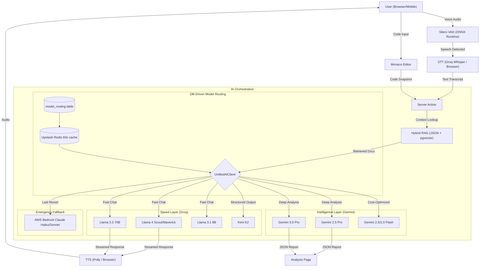

# DESIGN.md

## 1. System Overview

**Design Philosophy:**
AlgoMind follows a **"Voice-First, Latency-Critical"** design philosophy. The core value proposition is simulating a real human interview — latency is the enemy. The architecture prioritizes edge computing, direct API calls (no SDK overhead), and intelligent model routing to keep voice-to-voice latency under 1 second.

**Technology Choices:**
- **Next.js 16:** App Router with Server Actions for unified frontend/backend, Edge Middleware for auth
- **Groq (Llama 4 / Llama 3.3 / Kimi K2):** Lightning-fast inference (~300+ TPS) for real-time conversation
- **Gemini 2.5/3.0 Pro:** Deep reasoning and code analysis for 8-dimensional scoring
- **Supabase:** PostgreSQL + Auth + RLS for data layer
- **Upstash Redis:** Sub-millisecond caching for model routing and feature flags
- **Silero VAD:** In-browser ONNX-based voice activity detection (zero server latency)

## 2. Architecture Design

### System Architecture

### Layer Descriptions

**Frontend (UI Layer):**
- Next.js 16 with React 19, Tailwind CSS 4, Radix UI primitives
- Monaco Editor for code editing, Recharts for data visualization
- Framer Motion for animations, shadcn/ui component library
- Mobile-first: swipe navigation, collapsible code editor

**Application Layer:**
- Next.js Server Actions for type-safe server calls
- Edge Middleware for JWT validation and route protection
- `@tanstack/react-query` for server state management

**AI/ML Layer:**
- `UnifiedAIClient` with DB-driven model routing
- Direct `fetch` calls to Groq (OpenAI-compatible) and Gemini REST APIs
- 4-tier fallback: DB routing → cross-tier → legacy provider → Bedrock
- `IntelligentRateLimiter` with Redis-backed quota tracking

**Data Layer:**
- Supabase PostgreSQL with Row Level Security
- Upstash Redis for caching (model routing 60s, feature flags)
- Hybrid RAG: JSON vector store (MVP speed) + pgvector schema (production scale)
- localStorage for voice config persistence

## 3. Technology Stack

### Frontend
- **Framework:** Next.js 16.1.6 (App Router, Server Actions)
- **UI Library:** Radix UI 1.4.3 + shadcn/ui
- **Language:** TypeScript 5.x (Strict Mode)
- **Styling:** Tailwind CSS 4.x
- **Animation:** Framer Motion 12.x
- **Charts:** Recharts 3.7.0
- **Code Editor:** Monaco Editor 4.7.0
- **PDF:** @react-pdf/renderer 4.3.2

### Backend
- **Runtime:** Node.js (Vercel Serverless Functions)
- **Framework:** Next.js Server Actions + API Routes
- **Auth:** Supabase Auth (Google/GitHub/Email/Magic Link)
- **Database:** Supabase PostgreSQL with RLS
- **Cache:** Upstash Redis

### AI/ML
- **Chat Models:** Llama 4 Scout/Maverick, Llama 3.3 70B, Llama 3.1 8B, Kimi K2, GPT-OSS 120B/20B (via Groq)
- **Analysis Models:** Gemini 2.5 Pro, Gemini 3.0 Pro, Gemini 2.5/2.0 Flash (Google AI)
- **Fallback:** Claude Haiku 4.5, Sonnet 4.5, Sonnet 4.6 (AWS Bedrock with cross-region inference)
- **Embeddings:** Gemini Embedding 001 (768 dimensions)
- **Spaced Repetition:** ts-fsrs (FSRS-5 algorithm)

### Voice
- **VAD:** Silero ONNX (v5/legacy) via ONNX Runtime Web
- **STT:** Groq Whisper API + Browser Web Speech API fallback
- **TTS:** AWS Polly + Browser SpeechSynthesis fallback

### DevOps
- **Hosting:** Vercel (Edge Functions, Serverless)
- **Testing:** Vitest 4.x (880 tests), Playwright (E2E)
- **Linting:** ESLint (flat config)
- **PWA:** @ducanh2912/next-pwa with auto-versioned service worker

## 4. Component Design

### 1. UnifiedAIClient (DB-Driven Routing)
- **Purpose:** Single entry point for all AI calls with intelligent model selection
- **Inputs:** User query, conversation history, use case (chat/analysis)
- **Processing:**
    - Reads `model_routing` table (Redis-cached 60s) for priority-ordered model list
    - Iterates models by priority, handling rate limits (429) and errors
    - Cross-tier fallback: chat models try analysis models and vice versa
    - Emergency: AWS Bedrock when all Groq + Gemini providers fail
- **Outputs:** Streamed text response or structured JSON

### 2. VAD Manager (Singleton)
- **Purpose:** Browser-based voice activity detection using Silero ONNX models
- **Architecture:** Singleton pattern via `getVADManager()`, shared across React components
- **State machine:** IDLE → INITIALIZING → PAUSED ⇄ LISTENING → DESTROYED | ERROR
- **Loading:** Script-tag injection from `/public/vad/` (bypasses Turbopack compilation)
- **Reconfiguration:** `reconfigureVAD()` destroys and recreates with fresh localStorage config

### 3. Interruption Manager
- **Purpose:** Detects when user is interrupting AI speech
- **Parameters:** Grace period, debounce cooldown, confidence threshold, min speech duration, consecutive frames
- **Diagnostics:** Circular event stream buffer exposed to owner debug panel
- **Hot-tuning:** Parameters readable from `voice-config` localStorage, changeable at runtime

### 4. CognitiveAnalyzer (8-Dimension Scoring)
- **Purpose:** Scores interview performance across 8 cognitive dimensions
- **Engine:** Gemini Pro generates JSON scores, `validateAndCorrectScores()` auto-corrects
- **Output:** Scores (0-10 per dimension), hire decision (STRONG_HIRE → STRONG_NO_HIRE), evidence
- **Supporting modules:** Evidence extractor, confidence calculator, trend calculator, narrative generator

### 5. FSRS-5 Spaced Repetition
- **Purpose:** Schedule problem reviews based on performance
- **Engine:** ts-fsrs library, 85% retention target, 180-day max interval
- **Integration:** `addToQueue()` writes FSRS + SM-2 fields to `spaced_repetition` table
- **Skill-level:** `getDueSkills()` maps cognitive dimensions to problem categories

### 6. AuthProvider + Session Cache
- **Purpose:** Authentication state management with optimized session validation
- **Pattern:** Single `onAuthStateChange` subscription (no duplicate `getSession()`)
- **Cache:** Module-level 15-minute trust window, JWT expiry tracking
- **Middleware:** Local JWT decode for >5min tokens, server fallback for near-expiry

## 5. Data Flow — Voice Interview Loop

1. **User Speaks:** Natural speech captured by browser microphone
2. **VAD Detection:** Silero ONNX processes audio frames in real-time, fires `onSpeechStart`/`onSpeechEnd`
3. **Interruption Check:** InterruptionManager evaluates grace period, confidence, duration
4. **STT:** Audio sent to Groq Whisper API (or browser fallback), returns transcript
5. **RAG Lookup:** Hybrid vector store retrieves relevant problem context/hints
6. **Model Routing:** UnifiedAIClient selects model via DB-driven priority routing
7. **AI Generation:** Selected model generates response with conversation + code context
8. **TTS:** Response spoken back via Polly/browser and displayed simultaneously
9. **Cycle:** ~800ms total latency (VAD + STT + AI + TTS)

## 6. Database Schema

### Core Tables

**profiles:**
- `id` (UUID, FK → auth.users.id)
- `email`, `full_name`, `avatar_url`
- `account_type` (user/employer/admin)
- `preferences` (JSONB)

**interview_sessions:**
- `id` (UUID, PK)
- `user_id` (FK → profiles.id)
- `problem_id` (FK → problems.slug)
- `status` (in_progress/completed)
- `transcript` (JSONB), `code_snapshots` (JSONB)
- `score_breakdown` (JSONB — 8-dim scores)
- `assessment_result` (JSONB)
- `duration_seconds`, `turns_count`
- `interview_mode` (behavioral/technical/mixed)
- Timestamps

**problems:**
- `slug` (PK), `title`, `description`
- `difficulty` (easy/medium/hard)
- `topics` (text[])
- `starter_code` (JSONB), `test_cases` (JSONB)
- `hints` (JSONB), `solution_approach` (text)

**spaced_repetition:**
- `user_id` + `problem_id` (composite PK)
- FSRS fields: `fsrs_difficulty`, `fsrs_stability`, `fsrs_state`, `fsrs_reps`, `fsrs_lapses`
- SM-2 fields: `ease_factor`, `interval`, `repetitions` (backward compat)
- `next_review_at`, `last_reviewed_at`

**model_routing:**
- `use_case` (chat/analysis), `model_id`, `provider`
- `priority` (ASC), `is_active`
- `max_tokens`, `temperature`

**system_config / feature_flags / co_owners:**
- System-level settings, per-user and global feature flags, co-owner access control

### RLS Policies
- Users access only their own data
- Owner access via `is_owner()` (calls `auth.uid()` internally, no arguments)
- Admin check via `is_admin()` function
- Co-owner verification against `co_owners` table

## 7. API Design

### Server Actions (`src/app/actions/`)
- `saveInterviewSession` — persists interview transcript + assessment to Supabase
- `getSpacedRepForProblem` — returns FSRS/SM-2 data for a specific problem
- `addProblemToReviewQueue` — adds a problem to FSRS review queue
- `startInterview` — initializes session state

### API Routes (`src/app/api/`)
- `POST /api/chat` — Core interview loop, streamed AI response
- `POST /api/voice/transcribe` — Whisper STT endpoint
- `POST /api/voice/synthesize-polly` — Polly TTS endpoint
- `GET /api/user/owner-status` — Owner/co-owner check
- `GET /api/user/submissions/[id]/report` — Assessment report data

## 8. UI/UX Design

**Principles:**
- **"Zen Mode":** During interviews, hide all distractions — only code editor + conversation
- **Mobile-First:** Code editor collapsible on mobile, voice conversation as primary interaction
- **Accessibility:** Radix UI primitives ensure keyboard navigation and screen reader support

### Key Screens

**Interview Room (Desktop):**
- Left panel: Monaco Editor (60% width) with language selector, run button, console output
- Right panel: Conversation feed (40%) with voice waveform, hints button, speaker indicator
- Top bar: Timer countdown, hints remaining, end button

**Analysis Page:**
- Radar chart: 8-dimension scores visualization
- FSRS section: Next review date, difficulty bar, stats grid, "Add to Queue" CTA
- Key moments timeline, evidence-backed scores
- PDF export button

**Owner Dashboard:**
- Tabbed interface: Voice Debug, Model Config, Feature Flags
- Voice Debug: 10 sliders (6 interruption + 4 VAD engine), event stream monitor, stats bar
- "Apply to Live VAD" button with real-time reconfiguration

## 9. Security

- **RLS:** Supabase Row Level Security on all tables
- **JWT Optimization:** Local decode in middleware (no verification), server fallback near expiry
- **Rate Limiting:** Redis-backed per-model rate limiting
- **Code Sandboxing:** User code runs in browser only (Monaco Editor), never on server
- **Auth:** Supabase Auth with PKCE flow, session cache prevents excessive server calls

## 10. Scalability & Performance

- **Serverless:** Vercel auto-scales lambda functions
- **Edge Middleware:** JWT validation at edge, no cold-start penalty
- **Redis Cache:** 60s model routing cache eliminates DB hits on every AI call
- **Script-Tag Loading:** VAD assets loaded via `<script>` (avoids 120+ sec Turbopack compilation)
- **Visibility-Aware:** Feature flag polling pauses when tab hidden, reducing background requests
- **PWA:** Service worker caches static assets for offline support

## 11. Cost Optimization

| Component | Strategy |
|-----------|----------|
| **AI Inference** | DB-driven routing selects cheapest viable model first |
| **Caching** | Redis 60s cache for model routing, reducing DB queries |
| **Auth** | JWT local decode eliminates ~90% of `supabase.auth.getUser()` calls |
| **Voice** | Browser-native VAD (zero server cost for speech detection) |
| **Hosting** | Vercel serverless (pay per invocation, not idle time) |

## 12. Monitoring & Diagnostics

- **Owner Panel:** Real-time VAD event stream with confidence/duration metrics
- **Benchmarking Suite:** Included Node.js scripts for direct AWS/Groq API metric collection and live voice pipeline load testing (E2E p50/p95 latency)
- **Console Logging:** Structured `[Module]` prefixed logs throughout voice pipeline
- **Feature Flags:** System-level flags for gradual rollout and kill switches
- **Error Boundaries:** React error boundaries prevent full-page crashes

## 13. Demo & Live Instance

- **GitHub:** [github.com/ANIRUDDH-001/algomind](https://github.com/ANIRUDDH-001/algomind)
- **Live Demo:** [algomind-drab.vercel.app](https://algomind-drab.vercel.app/)
