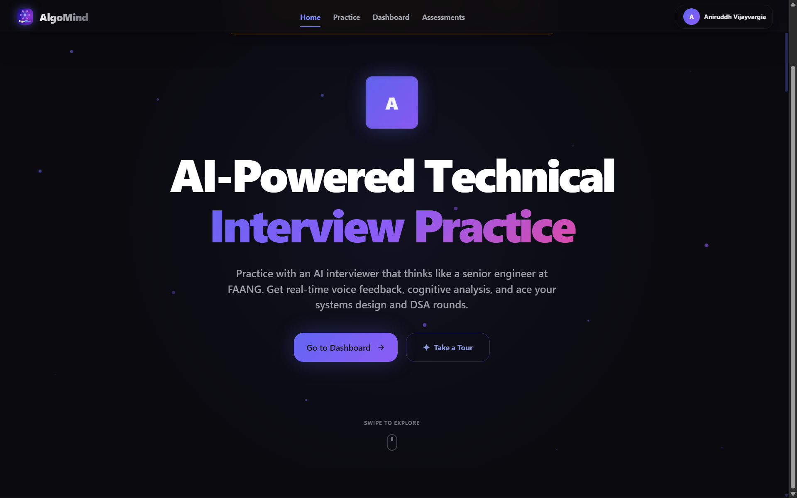

# **ALGOMIND — Hackathon Submission**
## *GenAI-Powered Technical Interview Coach with Voice-First AI & 8-Dimensional Cognitive Assessment*

**Team:** Aniruddh Vijayvargia & Prachi Agarwalla
**Live Demo:** https://algomind-drab.vercel.app/
**Repository:** https://github.com/ANIRUDDH-001/algomind

---

## Table of Contents

1. [Brief about the Idea](#1-brief-about-the-idea)
2. [Why AI is Required, How AWS is Used, What Value AI Adds](#2-why-ai-is-required--how-aws-is-used--what-value-ai-adds)
3. [List of Features](#3-list-of-features)
4. [Process Flow](#4-process-flow)
5. [Wireframes](#5-wireframes)
6. [Architecture](#6-architecture)
7. [Tech Stack](#7-tech-stack)
8. [Cost Model](#8-cost-model)
9. [Prototype Snapshots](#9-prototype-snapshots)
10. [Performance Benchmarking](#10-performance-benchmarking)
11. [Future Work](#11-future-work)

---

## 1. Brief about the Idea

**1.5 million engineering graduates** emerge from Indian colleges annually. 60% remain unemployed or underemployed within 6 months (NASSCOM, 2024). The gap isn't knowledge — it's **communication**. Students solve LeetCode problems but freeze when a human interviewer asks "walk me through your approach."

**The problem with existing tools:**
- **LeetCode / HackerRank** — score code correctness only, zero communication assessment
- **Pramp / Interviewing.io** — ₹2,000+ per session, limited scheduling
- **ChatGPT** — text-only, no voice interaction, no structured scoring rubric

**AlgoMind** is a voice-first AI interview coach that:
1. **Listens** — Silero VAD (ONNX Runtime in-browser) detects speech in real-time with natural interruptions
2. **Converses** — Multi-model AI (Llama 4 + Kimi K2 + Gemini 2.5 Pro) responds like a human interviewer with follow-ups, hints, and pushback
3. **Assesses** — Proprietary 8-dimensional cognitive scoring engine evaluates problem-solving, communication, adaptability, and 5 more dimensions with sub-criteria rubrics
4. **Teaches** — FSRS-5 spaced repetition schedules review problems based on weak dimensions, AI memory remembers past performance across sessions

**Target users:**
- 900,000+ Tier 2/3 college students with limited placement support
- 300,000+ bootcamp graduates transitioning into tech
- 300,000+ professionals upskilling for product companies
- Employers creating standardized assessment campaigns

**Impact at scale:** Each interview costs ~₹2 vs ₹2,000 for human mock interviews — **1,000x cost reduction** while maintaining assessment quality through multi-dimensional AI evaluation.

---

## 2. Why AI is Required · How AWS is Used · What Value AI Adds

### 2.1 Why AI is Required

AlgoMind uses AI at **every layer** — it's not a wrapper around a single API. Each AI model serves a specific purpose based on its strengths:

| Layer | AI Model | Why This Model | Source File |
|-------|----------|----------------|-------------|
| **Real-time chat** | Llama 3.3 70B (Groq) | Sub-200ms latency, strong reasoning | `src/lib/ai/providers.ts` |
| **Deep analysis** | Gemini 2.5 Pro (Google) | Best structured JSON output, 1M context window | `src/lib/ai/providers.ts` |
| **Intent classification** | Regex + Llama 3.1 8B | Hybrid: 0ms regex pass, LLM only when confidence <0.8 | `src/lib/ai/intent-classifier.ts` |
| **Safety filtering** | GPT-OSS Safeguard 20B | Dedicated content safety model | `src/lib/ai/providers.ts` |
| **Speech recognition** | Groq Whisper | Optimized for Indian/technical accents, 500ms for 10s audio | `src/hooks/useSTT.ts` |
| **Voice detection** | Silero VAD (ONNX) | In-browser ML inference, zero-latency, privacy-first | `src/hooks/useVAD.ts` |
| **Embeddings** | Gemini Embedding 001 | 768-dim vectors for RAG knowledge retrieval | `src/lib/rag/` |
| **Spaced repetition** | ts-fsrs (FSRS-5) | Evidence-based review scheduling trained on 20K+ learners | `src/lib/spaced-repetition/fsrs.ts` |

**AI value chain in a single interview:**
```
User speaks → VAD (Silero ONNX) detects speech
            → STT (Groq Whisper) transcribes
            → Intent Classifier (regex + LLM) routes query
            → RAG (pgvector embeddings) retrieves DSA context
            → Chat AI (Llama/Kimi K2) generates response
            → TTS (Polly/Browser) speaks back
            → After session: Analyzer (Gemini 2.5 Pro) scores 8 dimensions
            → FSRS-5 schedules next review problems
```

Without AI, this pipeline would require **8 human experts** (interviewer, speech therapist, curriculum designer, assessor, scheduler, etc.) costing ₹16,000+ per session.

### 2.2 How AWS is Used

AWS provides **4 services** — each gated behind feature flags for cost control:

| AWS Service | Purpose | Feature Flag | Region | Source File |
|-------------|---------|--------------|--------|-------------|
| **AWS Polly** | Neural TTS — Kajal voice (Indian English) | `ENABLE_AWS_POLLY_TTS` | ap-south-1 | `src/lib/aws/polly.ts` |
| **AWS Bedrock** | Claude Sonnet 4.5 + Claude Haiku 4.5 + GPT-OSS 120B/20B — AI fallback | `ENABLE_AWS_BEDROCK` | us-east-1 | `src/lib/ai/bedrock-client.ts` |
| **AWS Transcribe** | Post-interview batch transcription enrichment | `ENABLE_AWS_TRANSCRIBE_STT` | ap-south-1 | `src/lib/aws/transcribe.ts` |
| **AWS S3** | Audio staging for Transcribe jobs only | `ENABLE_AWS_S3_STORAGE` | ap-south-1 | `src/lib/aws/s3.ts` |

**AWS Polly integration detail** (`src/lib/aws/polly.ts`):
```
Voice: Kajal (Neural engine, Indian English)
Fallback: Aditi (Standard engine)
Output: MP3 @ 22050 Hz
API: SynthesizeSpeechCommand via @aws-sdk/client-polly
Guest access: Controlled by ENABLE_GUEST_POLLY_TTS flag
```

**AWS Bedrock integration detail** (`src/lib/ai/bedrock-client.ts`):
```
Chat: us.anthropic.claude-haiku-4-5-20251001-v1:0 (P1), openai.gpt-oss-20b-1:0 (P100)
Analysis: us.anthropic.claude-sonnet-4-5-20250929-v1:0 (P1), openai.gpt-oss-120b-1:0 (P30)
Role: Primary high-quality fallback + cheap secondary fallback
Cost tracking: logAWSUsage() records service, operation, estimated cost
Owner dashboard: /owner → AWS Budget tab shows real-time spend
```

**AWS cost tracking** (`src/lib/aws/usage-logger.ts`):
- Every AWS API call is logged with `estimatedCostUsd`
- Owner dashboard displays daily/monthly AWS spend
- Flags can be disabled instantly if budget exceeded

### 2.3 What Value AI Adds

| Without AI | With AI (AlgoMind) |
|------------|-------------------|
| Text-only problem solving | Voice-first natural conversation with interruptions |
| Binary pass/fail scoring | 8-dimensional cognitive assessment with sub-criteria |
| No communication feedback | Communication clarity, pacing, confidence scoring |
| Fixed difficulty | Adaptive difficulty modes (warm-up → sprint) |
| No memory across sessions | AI memory (Kai framework) tracks patterns across interviews |
| Manual review scheduling | FSRS-5 spaced repetition targets weak dimensions |
| Single model, single failure point | 31-model fallback chain across 3 providers |
| ₹2,000 per session | ₹2 per session (1,000x cheaper) |

---

## 3. List of Features

### Core Interview Experience
| Feature | Description | Source |
|---------|-------------|--------|
| **Voice-First AI Interviewer** | Real-time voice conversation with follow-ups, hints, pushback | `src/hooks/useVAD.ts`, `useSTT.ts`, `useTTS.ts` |
| **Natural Interruption System** | Grace periods, debouncing, confidence filtering via `InterruptionManager` | `src/lib/voice/interruption-manager.ts` |
| **4 Difficulty Modes** | Warm-Up (20min), Practice (30min), Crunch (25min), Sprint (45min, 2 problems) | `src/lib/interview/interview-config.ts` |
| **Employer Assessment Mode** | Zero-hint evaluation mode for standardized candidate screening | `src/app/assess/[token]/page.tsx` |
| **Hinglish Support** | Hindi-English mixed interviews for Indian users | `ENABLE_HINGLISH_SUPPORT` flag |
| **Code Editor** | Monaco Editor (VS Code engine) with syntax highlighting | `src/components/interview/` |
| **Silent Observer** | Real-time coaching nudges during interview | `ENABLE_SILENT_OBSERVER` flag |

### AI & Assessment
| Feature | Description | Source |
|---------|-------------|--------|
| **8-Dimensional Cognitive Scoring** | Problem Decomposition, Pattern Recognition, Algorithmic Thinking, Complexity Analysis, Communication Clarity, Edge-Case Handling, Optimization Mindset, Adaptability | `src/lib/assessment/skill-registry.ts` |
| **Sub-Criteria Rubrics** | Each dimension has 3-4 weighted sub-criteria, 5 mastery levels | `src/lib/assessment/analyzer.ts` |
| **Hire Decision Engine** | STRONG_HIRE / HIRE / BORDERLINE / NO_HIRE / STRONG_NO_HIRE | `src/lib/assessment/analyzer.ts` |
| **Difficulty-Weighted Scoring** | Easy ×1.0, Medium ×1.15, Hard ×1.3 multiplier | `src/lib/assessment/analyzer.ts` |
| **31-Model Fallback Chain** | DB routing → cross-tier → legacy → Bedrock → static | `src/lib/ai/model-routing.ts`, `client.ts` |
| **Intent Classification** | Hybrid regex (0ms) + LLM (3s timeout) for smart query routing | `src/lib/ai/intent-classifier.ts` |
| **Phase-Aware RAG** | Interview phase (intro/approach/coding/wrap-up) determines context injection | `src/app/api/chat/route.ts` |

### Practice & Learning
| Feature | Description | Source |
|---------|-------------|--------|
| **480+ Curated Problems** | Blind 75, NeetCode 150, Striver's A-Z, Grind 75 | `src/app/practice/page.tsx` |
| **FSRS-5 Spaced Repetition** | 85% recall target, 180-day max interval, fuzz enabled | `src/lib/spaced-repetition/fsrs.ts` |
| **Skill-Level FSRS** | Maps 8 cognitive dimensions → problem categories for targeted practice | `src/lib/spaced-repetition/skill-scheduler.ts` |
| **6,230-Term DSA Vocabulary** | Boosts STT accuracy for technical terms | `src/lib/voice/vocabulary.ts` |
| **Hybrid RAG** | JSON Vector Store (31 chunks, 768-dim) + pgvector for production scale | `src/lib/rag/`, `src/data/dsa-knowledge/` |
| **AI Memory (Kai Framework)** | Structured memory persists across sessions for personalized feedback | `src/lib/ai/memory-generator.ts` |

### Platform & Infrastructure
| Feature | Description | Source |
|---------|-------------|--------|
| **Employer Assessment Campaigns** | Create token-gated assessment links, no candidate signup required | `src/app/employer/`, `src/app/assess/` |
| **Owner Dashboard** | 15+ tabs: flags, model routing, voice debug, AI status, cache, rate limits | `src/app/owner/` |
| **15 Feature Flags** | Server-controlled (Redis + Supabase) kill switches for every major feature | `src/lib/feature-flags-server.ts` |
| **DB-Driven Model Routing** | Model selection from `model_routing` table, Redis-cached 60s TTL | `src/lib/ai/model-routing.ts` |
| **Smart Auth Middleware** | JWT local decode trusts tokens >5 min from expiry, eliminates 90% auth calls | `src/middleware.ts` |
| **Guest Mode** | Trial access with 5 curated problems, IP rate-limited (20 req/hr) | `src/lib/guest/guest-problems.ts` |
| **PDF Report Export** | Professional assessment reports via `@react-pdf/renderer` | `src/components/analysis/` |
| **PWA Support** | Installable app with service worker | `src/app/manifest.ts`, `public/sw.js` |
| **Radar Charts** | Visual strength/weakness display via Recharts | `src/components/charts/` |

---

## 4. Process Flow

### 4.1 Interview Session Flow

```
┌─────────────────────────────────────────────────────────────────────┐
│                     INTERVIEW SESSION FLOW                         │
├─────────────────────────────────────────────────────────────────────┤
│                                                                     │
│  User selects problem + difficulty mode                             │
│         │                                                           │
│         ▼                                                           │
│  ┌─────────────┐     ┌──────────────────┐                          │
│  │ Rate Limit  │────▶│ Load Problem +   │                          │
│  │ Check       │     │ Interview Config  │                          │
│  └─────────────┘     └──────────────────┘                          │
│                              │                                      │
│                              ▼                                      │
│  ┌──────────────────────────────────────────────────┐              │
│  │            VOICE CONVERSATION LOOP                │              │
│  │                                                    │              │
│  │  ┌─────────┐    ┌─────────┐    ┌──────────────┐  │              │
│  │  │ Silero  │───▶│  Groq   │───▶│   Intent     │  │              │
│  │  │ VAD     │    │ Whisper │    │ Classifier   │  │              │
│  │  │ (ONNX)  │    │  STT    │    │ (regex+LLM)  │  │              │
│  │  └─────────┘    └─────────┘    └──────┬───────┘  │              │
│  │                                        │          │              │
│  │                            ┌───────────┼──────┐   │              │
│  │                            ▼           ▼      │   │              │
│  │                      ┌─────────┐ ┌─────────┐  │   │              │
│  │                      │  RAG    │ │  Smart  │  │   │              │
│  │                      │ Context │ │ Routing │  │   │              │
│  │                      └────┬────┘ └────┬────┘  │   │              │
│  │                           ▼           ▼       │   │              │
│  │                    ┌─────────────────────┐    │   │              │
│  │                    │   UnifiedAIClient   │    │   │              │
│  │                    │  (Groq → Gemini →   │    │   │              │
│  │                    │   Bedrock fallback)  │    │   │              │
│  │                    └──────────┬──────────┘    │   │              │
│  │                               │               │   │              │
│  │                               ▼               │   │              │
│  │                    ┌─────────────────────┐    │   │              │
│  │                    │    TTS Engine       │    │   │              │
│  │                    │  (Polly → Browser)  │    │   │              │
│  │                    └─────────────────────┘    │   │              │
│  │                                                │   │              │
│  │  Repeat for ~15-20 turns (mode-dependent)     │   │              │
│  └──────────────────────────────────────────────┘   │              │
│                              │                                      │
│                              ▼                                      │
│  ┌──────────────────────────────────────────────────┐              │
│  │           ASSESSMENT PIPELINE                     │              │
│  │                                                    │              │
│  │  Transcript ─▶ Gemini 2.5 Pro ─▶ 8D Scoring     │              │
│  │                                    │              │              │
│  │               ┌────────────────────┤              │              │
│  │               ▼                    ▼              │              │
│  │        Hire Decision      FSRS-5 Scheduling      │              │
│  │        (5 levels)         (next review date)      │              │
│  │               │                    │              │              │
│  │               ▼                    ▼              │              │
│  │        Radar Chart         Spaced Repetition      │              │
│  │        + PDF Report        Queue Update           │              │
│  └──────────────────────────────────────────────────┘              │
│                                                                     │
└─────────────────────────────────────────────────────────────────────┘
```

### 4.2 AI Model Routing Flow

```
┌────────────────────────────────────────────────────┐
│              MODEL ROUTING DECISION TREE            │
├────────────────────────────────────────────────────┤
│                                                      │
│  Request arrives (chat or analysis)                  │
│         │                                            │
│         ▼                                            │
│  ┌─────────────────┐  YES   ┌──────────────────┐   │
│  │ AWS Bedrock     │───────▶│ Try Bedrock      │   │
│  │ flag ON?        │        │ model from DB    │   │
│  └────────┬────────┘        └──────┬───────────┘   │
│           │ NO                      │ FAIL          │
│           ▼                         ▼               │
│  ┌─────────────────┐      ┌──────────────────┐    │
│  │ Redis cache     │      │ Fall through to  │    │
│  │ model_routing:  │      │ Groq/Gemini      │    │
│  │ {useCase}       │      └──────────────────┘    │
│  └────────┬────────┘                                │
│      HIT  │  MISS                                   │
│      │    ▼                                         │
│      │  ┌─────────────────┐                         │
│      │  │ DB query:       │                         │
│      │  │ model_routing   │                         │
│      │  │ ORDER BY        │                         │
│      │  │ priority ASC    │                         │
│      │  └────────┬────────┘                         │
│      │           │ FAIL (DB down)                   │
│      │           ▼                                  │
│      │  ┌─────────────────┐                         │
│      │  │ Emergency       │                         │
│      │  │ static fallback │                         │
│      │  │ (providers.ts)  │                         │
│      │  └────────┬────────┘                         │
│      ▼           ▼                                  │
│  ┌─────────────────────────────────┐               │
│  │ Try models in priority order:   │               │
│  │                                  │               │
│  │ Chat:     haiku-4.5    (P1)    │               │
│  │         → llama-3.3-70b (P20)  │               │
│  │         → llama-3.1-8b  (P30)  │               │
│  │         → llama-4-scout (P30)  │               │
│  │         → kimi-k2       (P40)  │               │
│  │         → gpt-oss-120b  (P50)  │               │
│  │         → gpt-oss-20b   (P60)  │               │
│  │         → kimi-k2-inst  (P70)  │               │
│  │         → gemini-2.0    (P100) │               │
│  │         → gpt-oss-20b-bk(P100) │               │
│  │         → sonnet-3.5    (P110) │               │
│  │                                  │               │
│  │ Analysis: sonnet-4.5    (P1)    │               │
│  │         → gemini-2.5-pro (P20)  │               │
│  │         → gpt-oss-120b-bk(P30)  │               │
│  │         → gemini-2.5-flash(P30) │               │
│  │         → gemini-2.0-flash(P40) │               │
│  │         → gemini-1.5-pro (P50)  │               │
│  │         → gemini-1.5-flash(P50) │               │
│  │         → llama-3.3-70b  (P60)  │               │
│  │         → gpt-oss-120b   (P70)  │               │
│  └────────────────┬────────────────┘               │
│                   │ ALL EXHAUSTED                    │
│                   ▼                                  │
│  ┌─────────────────────────────────┐               │
│  │ Cross-tier fallback             │               │
│  │ (system_config:                 │               │
│  │  cross_tier_fallback_enabled)   │               │
│  │ Chat request? → Try analysis    │               │
│  │ models. Vice versa.             │               │
│  └─────────────────────────────────┘               │
│                                                      │
└────────────────────────────────────────────────────┘
```

### 4.3 Employer Assessment Flow

```
Employer creates campaign → Token generated → Share URL
        │
        ▼
Candidate visits /assess/[token] (no signup needed)
        │
        ▼
Load problem from campaign config → Employer difficulty mode
        │
        ▼
Interview runs (no hints, evaluation-only)
        │
        ▼
Auto-submit → 8D scores + hire decision → Campaign dashboard
        │
        ▼
Employer views all candidates sorted by score + radar charts
```

---

## 5. Wireframes

### 5.1 Page Map

```
/                           Landing page (intro animation for new users)
├── /login                  Auth (email, Google, GitHub, magic link)
├── /dashboard              User home: stats, radar chart, session history
│   └── /interview-history  Full interview history with replay
├── /practice               Problem list: filters, pagination, 480+ problems
├── /interview              Live interview session
│   └── /analysis           Post-interview 8D assessment results
├── /learn                  AI tutor mode (Phase 4)
├── /settings               User preferences
├── /assess/[token]         External assessment (token-gated, no auth)
│   ├── /expired            Token expired page
│   └── /complete           Assessment complete page
├── /employer               Upgrade to employer account
│   └── /dashboard          Campaign management, candidate reports
├── /admin                  Admin panel (co-owners)
├── /owner                  Owner dashboard (15+ tabs)
│   ├── Feature Flags       Toggle 15 server-controlled flags
│   ├── AI Routing          Model routing management (add/remove/reorder)
│   ├── Voice Debug         VAD tuning sliders, event stream
│   ├── AWS Budget          Real-time AWS cost tracking
│   ├── Models              Model registry management
│   ├── Cache & Redis       Redis cache stats + flush
│   ├── RAG Knowledge       Knowledge base management
│   ├── Analytics           Usage analytics
│   ├── AI Status           Model health monitoring
│   ├── Rate Limits         Rate limiter configuration
│   ├── Users               User management
│   ├── Co-Owners           Co-owner delegation
│   ├── Admins              Admin user management
│   └── Employers           Employer account management
└── /replay/[token]         Interview replay viewer
```

### 5.2 Interview Session Layout

```
┌─────────────────────────────────────────────────────────────┐
│  ┌─────────┐  AlgoMind Interview  ┌──────┐ ┌────────────┐  │
│  │ ← Back  │  Problem: Two Sum    │Timer │ │ End Session│  │
│  └─────────┘  Mode: Practice      │25:30 │ └────────────┘  │
├─────────────────────────┬───────────────────────────────────┤
│                         │                                    │
│   Conversation Panel    │   Code Editor (Monaco)            │
│                         │                                    │
│   🤖 Kai: "Let's start │   ┌────────────────────────────┐  │
│   with Two Sum..."      │   │ function twoSum(nums, t) { │  │
│                         │   │   const map = new Map();   │  │
│   👤 You: "I'd use a   │   │   for (let i = 0; ...)     │  │
│   hash map approach..." │   │     ...                    │  │
│                         │   │ }                          │  │
│   🤖 Kai: "Good! What  │   └────────────────────────────┘  │
│   about edge cases?"    │                                    │
│                         │   Language: JavaScript ▼           │
│                         │                                    │
├─────────────────────────┴───────────────────────────────────┤
│  ┌─────────────┐  ┌──────────────┐  Turns: 5/20  │ 🔉 On  │
│  │ 🎤 Speaking │  │ Silent Coach │  ████████░░░░  │        │
│  └─────────────┘  │ "Consider    │                │        │
│   VAD: Active      │  time        │                │        │
│   STT: Whisper     │  complexity" │                │        │
│                    └──────────────┘                │        │
└─────────────────────────────────────────────────────────────┘
```

### 5.3 Assessment Results Layout

```
┌─────────────────────────────────────────────────────────────┐
│  Interview Analysis — Two Sum (Practice Mode)               │
│  Overall Score: 7.8/10 ⭐  |  Hire Decision: HIRE ✅        │
├─────────────────────────────┬───────────────────────────────┤
│                             │                                │
│   🕸️ Radar Chart           │   Skill Breakdown              │
│                             │                                │
│     Problem                 │   Problem Decomposition  8.2  │
│    Decomp ●                 │   ████████░░ 82%              │
│           / \               │                                │
│   Adapt  /   \ Pattern      │   Pattern Recognition    7.5  │
│     ●   /     \  ●          │   ███████░░░ 75%              │
│      \ /   ●   \/           │                                │
│       ●    Edge  ●          │   Algorithmic Thinking   8.0  │
│   Optim   Case  Complex     │   ████████░░ 80%              │
│         \  |   /            │                                │
│          \ | /              │   Communication          6.8  │
│       Commun●               │   ██████░░░░ 68%  ⚠️ Weak    │
│                             │                                │
│                             │   ... (all 8 dimensions)      │
├─────────────────────────────┴───────────────────────────────┤
│  📝 AI Feedback                                              │
│  "Strong algorithmic thinking. Consider structuring your     │
│   explanations more clearly — avoid jumping between topics.  │
│   Practice articulating your approach before coding."        │
├──────────────────────────────────────────────────────────────┤
│  📋 Next Steps                                               │
│  1. Practice communication: explain approach before coding   │
│  2. Review: Longest Substring (due in 3 days via FSRS)      │
│  3. Focus on edge case articulation                          │
├──────────────────────────────────────────────────────────────┤
│  [📄 Export PDF]  [🔁 Retry Problem]  [📊 Compare Previous] │
└──────────────────────────────────────────────────────────────┘
```

---

## 6. Architecture

### 6.1 System Architecture

```
┌──────────────────────────────────────────────────────────────────┐
│                          CLIENT (Browser)                        │
│                                                                  │
│  ┌──────────┐ ┌──────────┐ ┌──────────┐ ┌───────────────────┐  │
│  │ Silero   │ │ Browser  │ │ Monaco   │ │ React 19 +        │  │
│  │ VAD      │ │ Speech   │ │ Editor   │ │ Next.js 16 App    │  │
│  │ (ONNX    │ │ Synthesis│ │ (VS Code │ │ Router            │  │
│  │ Runtime) │ │ (TTS     │ │  Engine) │ │                   │  │
│  │          │ │ Fallback)│ │          │ │ 117 Components    │  │
│  └────┬─────┘ └────┬─────┘ └──────────┘ │ 17 Hooks          │  │
│       │             │                     │ 15 Feature Flags  │  │
│       │ Audio       │ Audio              │ (localStorage)    │  │
│       ▼             ▼                     └───────┬───────────┘  │
│  ┌──────────────────────────────┐                │              │
│  │      Voice Pipeline          │                │ HTTP/WS     │
│  │  VAD → STT → AI → TTS       │                │              │
│  └──────────────────────────────┘                │              │
└──────────────────────────────────────────────────┼──────────────┘
                                                   │
                        ┌──────────────────────────┘
                        ▼
┌──────────────────────────────────────────────────────────────────┐
│                    VERCEL EDGE + SERVERLESS                      │
│                                                                  │
│  ┌────────────────┐  ┌──────────────────────────────────────┐   │
│  │ Middleware      │  │          54 API Routes               │   │
│  │ (JWT decode,   │  │                                      │   │
│  │  rate limit,   │  │  /api/chat         → UnifiedAIClient │   │
│  │  path check)   │  │  /api/interview/*  → CognitiveAnalzr │   │
│  └────────────────┘  │  /api/voice/*      → Whisper/Polly   │   │
│                       │  /api/rag/*        → Vector Search   │   │
│  ┌────────────────┐  │  /api/owner/*      → Admin Controls  │   │
│  │ 5 Server       │  │  /api/employer/*   → Campaign Mgmt   │   │
│  │ Actions        │  │  /api/assess/*     → Assessment Flow  │   │
│  │ (save-session, │  │  /api/flags        → Feature Flags   │   │
│  │  spaced-rep)   │  └──────────────────────────────────────┘   │
│  └────────────────┘                                              │
└──────────┬───────────────┬───────────────┬───────────────────────┘
           │               │               │
     ┌─────┘        ┌─────┘        ┌─────┘
     ▼               ▼               ▼
┌─────────┐   ┌───────────┐   ┌──────────────────────────────────┐
│ Upstash │   │ Supabase  │   │           AI PROVIDERS           │
│ Redis   │   │ PostgreSQL│   │                                  │
│         │   │ + pgvector│   │  ┌──────┐  ┌────────┐  ┌──────┐ │
│ Caches: │   │           │   │  │ Groq │  │ Google │  │ AWS  │ │
│ • model │   │ 67 tables │   │  │      │  │ AI     │  │Bedrk │ │
│   routing│  │ 73 RLS    │   │  │Llama │  │Gemini  │  │Claude│ │
│   (60s) │   │ 97 funcs  │   │  │Kimi  │  │2.5 Pro │  │ 3.5  │ │
│ • flags │   │ 96 indexes│   │  │GPT-  │  │2.0/2.5 │  │Sonnet│ │
│   (5min)│   │           │   │  │OSS   │  │Flash   │  │      │ │
│ • model │   │ pgvector  │   │  │Whispr│  │Embed   │  │      │ │
│   reg   │   │ (768-dim) │   │  └──────┘  └────────┘  └──────┘ │
│   (1hr) │   │           │   │                                  │
└─────────┘   │ feature   │   │  ┌──────────────────────────┐   │
              │ flags     │   │  │ AWS Polly (TTS)          │   │
              │ model     │   │  │ AWS Transcribe (batch)   │   │
              │ routing   │   │  │ AWS S3 (audio staging)   │   │
              │ sessions  │   │  └──────────────────────────┘   │
              │ problems  │   │                                  │
              │ FSRS cards│   └──────────────────────────────────┘
              └───────────┘
```

### 6.2 Voice Pipeline Architecture

```
┌─────────────────────────────────────────────────────────┐
│                  VOICE PIPELINE                          │
│                                                          │
│  ┌─────────┐   ┌──────────────────────────────────────┐ │
│  │   MIC   │──▶│  VAD Engine (useVAD.ts)              │ │
│  │ (WebRTC)│   │                                      │ │
│  └─────────┘   │  Mode: ONNX (Silero) | Push-to-Talk │ │
│                 │                                      │ │
│                 │  Events:                              │ │
│                 │  • onSpeechStart() → pause TTS       │ │
│                 │  • onSpeechEnd(audio) → send to STT  │ │
│                 └──────────────┬───────────────────────┘ │
│                                │                         │
│                                ▼                         │
│  ┌──────────────────────────────────────────────────────┐│
│  │  STT Engine (useSTT.ts) — 4-tier cascade            ││
│  │                                                      ││
│  │  Tier 1: Groq Whisper (server, best quality)        ││
│  │    ↓ fail                                            ││
│  │  Tier 2: Browser SpeechRecognition (Chrome/Edge)    ││
│  │    ↓ fail                                            ││
│  │  Tier 3: MediaRecorder → Whisper API (Firefox/etc)  ││
│  │    ↓ fail                                            ││
│  │  Tier 4: None (text-only fallback)                  ││
│  └──────────────────────────┬───────────────────────────┘│
│                              │ transcript                 │
│                              ▼                            │
│  ┌──────────────────────────────────────────────────────┐│
│  │  InterruptionManager (interruption-manager.ts)       ││
│  │                                                      ││
│  │  • Grace period (configurable ms)                   ││
│  │  • Debouncing (rapid speech changes)                ││
│  │  • Confidence filter (>0.7 threshold)               ││
│  │  • Circular event buffer (diagnostics)              ││
│  └──────────────────────────┬───────────────────────────┘│
│                              │                            │
│                              ▼                            │
│  ┌──────────────────────────────────────────────────────┐│
│  │  TTS Engine (tts-engine.ts) — 2-tier cascade        ││
│  │                                                      ││
│  │  Primary: AWS Polly (Kajal, neural, MP3)            ││
│  │    ↓ flag off / fail                                 ││
│  │  Fallback: Browser SpeechSynthesis (en-IN)          ││
│  │                                                      ││
│  │  preprocessForTTS() → chunk sentences → stream      ││
│  └──────────────────────────────────────────────────────┘│
└─────────────────────────────────────────────────────────┘
```

### 6.3 Assessment Pipeline Architecture

```
┌─────────────────────────────────────────────────────────┐
│              8D COGNITIVE ASSESSMENT ENGINE              │
│                                                          │
│  Input: transcript[] + problem + difficultyMode          │
│         │                                                │
│         ▼                                                │
│  ┌──────────────────────────────────────────────┐       │
│  │  generateAssessmentPrompt()                   │       │
│  │                                                │       │
│  │  Injects:                                      │       │
│  │  • 8 skill definitions + sub-criteria          │       │
│  │  • 5-level rubric per skill                    │       │
│  │  • Mode-specific instructions                  │       │
│  │  • Problem metadata                            │       │
│  └──────────────────┬───────────────────────────┘       │
│                      │                                    │
│                      ▼                                    │
│  ┌──────────────────────────────────────────────┐       │
│  │  Gemini 2.5 Pro API call                      │       │
│  │  (3 retry attempts on parse failure)           │       │
│  └──────────────────┬───────────────────────────┘       │
│                      │ JSON response                      │
│                      ▼                                    │
│  ┌──────────────────────────────────────────────┐       │
│  │  Validation Pass 1: Sub-criteria Consistency  │       │
│  │  • Each skill score = weighted avg of subs    │       │
│  │  • Flag if deviation > threshold              │       │
│  └──────────────────┬───────────────────────────┘       │
│                      ▼                                    │
│  ┌──────────────────────────────────────────────┐       │
│  │  Validation Pass 2: Confidence Calibration   │       │
│  │  • validateAndCorrectScores()                 │       │
│  │  • Cross-check evidence vs scores             │       │
│  └──────────────────┬───────────────────────────┘       │
│                      ▼                                    │
│  ┌──────────────────────────────────────────────┐       │
│  │  Score Computation                            │       │
│  │                                                │       │
│  │  rawScore = Σ(skill.score × skill.weight)     │       │
│  │                                                │       │
│  │  Difficulty multiplier:                        │       │
│  │    Easy ×1.0 | Medium ×1.15 | Hard ×1.3      │       │
│  │                                                │       │
│  │  adjustedScore = min(rawScore × mult, 10.0)   │       │
│  │                                                │       │
│  │  Mode bonuses (crunch/sprint):                 │       │
│  │    finalScore = base×0.9 + timeBonus×0.1       │       │
│  └──────────────────┬───────────────────────────┘       │
│                      ▼                                    │
│  ┌──────────────────────────────────────────────┐       │
│  │  Output:                                      │       │
│  │  • 8 dimension scores (0-10) with evidence    │       │
│  │  • overallScore, rawScore, adjustedScore       │       │
│  │  • Hire decision (5 levels)                    │       │
│  │  • Feedback + next steps                       │       │
│  │  • Knowledge gaps identified                   │       │
│  │  • FSRS-5 card update → next review date       │       │
│  └──────────────────────────────────────────────┘       │
│                                                          │
│  8 Dimensions with Weights:                              │
│  ┌──────────────────────┬────────┬───────────────────┐  │
│  │ Dimension            │ Weight │ Sub-Criteria       │  │
│  ├──────────────────────┼────────┼───────────────────┤  │
│  │ Problem Decomposition│  15%   │ 4 sub-criteria    │  │
│  │ Pattern Recognition  │  15%   │ 4 sub-criteria    │  │
│  │ Algorithmic Thinking │  15%   │ 4 sub-criteria    │  │
│  │ Complexity Analysis  │  12%   │ 4 sub-criteria    │  │
│  │ Communication Clarity│  12%   │ 4 sub-criteria    │  │
│  │ Edge-Case Handling   │  12%   │ 3 sub-criteria    │  │
│  │ Optimization Mindset │  12%   │ 3 sub-criteria    │  │
│  │ Adaptability         │   7%   │ 3 sub-criteria    │  │
│  └──────────────────────┴────────┴───────────────────┘  │
└─────────────────────────────────────────────────────────┘
```

---

## 7. Tech Stack

### 7.1 Frontend & Core

| Technology | Version | Purpose | Source |
|-----------|---------|---------|--------|
| Next.js | 16.1.6 | App Router, Server Actions, Edge Middleware | `package.json` |
| React | 19.2.3 | UI framework with Suspense boundaries | `package.json` |
| TypeScript | 5.x | Strict mode, full type coverage, 0 errors | `tsconfig.json` |
| Tailwind CSS | 4.x | Utility-first styling | `postcss.config.mjs` |
| Radix UI | 1.4.3 | Accessible UI primitives (dialog, tabs, switch, etc.) | `package.json` |
| Framer Motion | 12.x | Animations and transitions | `package.json` |
| Monaco Editor | 4.7.0 | Code editor (VS Code engine) | `package.json` |
| Recharts | 3.7.0 | Radar charts, skill visualizations | `package.json` |
| React PDF | Latest | PDF export of assessment reports | `package.json` |

### 7.2 Backend & Database

| Technology | Purpose | Source |
|-----------|---------|--------|
| Supabase PostgreSQL | 67 tables, 73 RLS policies, 97 functions | `schema details/supabase_schema.sql` |
| pgvector | 768-dimensional embedding vector search | `src/lib/rag/` |
| Upstash Redis | Model routing cache (60s), flag cache (5min), registry (1hr) | `src/lib/ai/model-routing.ts` |
| Vercel | Deployment, edge functions, cron jobs | `vercel.json` |
| ts-fsrs | FSRS-5 spaced repetition engine | `src/lib/spaced-repetition/fsrs.ts` |

### 7.3 AI & Voice

| Provider | Models / Services | Purpose | Source |
|----------|------------------|---------|--------|
| Groq | Llama 3.3 70B, 3.1 8B, 4 Scout/Maverick, Kimi K2, GPT-OSS 120B/20B, Qwen3 32B, Whisper | Chat AI + STT | `src/lib/ai/providers.ts` |
| Google AI | Gemini 2.5 Pro, 2.0/2.5/1.5 Flash, Gemma 3 (27B/12B/4B/1B), Embedding 001 | Analysis + Embeddings | `src/lib/ai/providers.ts` |
| AWS Bedrock | Claude Sonnet 4.5, Claude Haiku 4.5, GPT-OSS 120B/20B | Primary analysis + chat fallback | `src/lib/ai/bedrock-client.ts` |
| AWS Polly | Kajal (Neural, Indian English) | Text-to-Speech | `src/lib/aws/polly.ts` |
| AWS Transcribe | Batch post-interview | Transcription enrichment | `src/lib/aws/transcribe.ts` |
| AWS S3 | Audio staging | Transcribe input | `src/lib/aws/s3.ts` |
| Silero VAD | ONNX v5/legacy | In-browser voice detection | `public/vad/` |

### 7.4 Testing & DevOps

| Tool | Stats | Purpose | Source |
|------|-------|---------|--------|
| Vitest | 880 tests, 116 files | Unit testing | `vitest.config.ts` |
| Playwright | Perf + E2E + A11y + Visual | Integration testing | `playwright.config.ts` |
| ESLint | 0 errors, 427 warnings | Linting (flat config) | `eslint.config.mjs` |
| TypeScript | 0 errors (strict mode) | Type safety | `tsconfig.json` |

---

## 8. Cost Model

### 8.1 Free-Tier AI Capacity

All rate limits sourced from `src/lib/ai/providers.ts`:

| Provider | Model | RPM | RPD | Monthly Capacity |
|----------|-------|-----|-----|-----------------|
| Groq | llama-3.3-70b | 26 | 850 | ~25,500 req |
| Groq | llama-3.1-8b | 26 | 12,240 | ~367,200 req |
| Groq | kimi-k2-instruct | 60 | 1,000 | ~30,000 req |
| Groq | qwen3-32b | 60 | 1,000 | ~30,000 req |
| Groq | Whisper (STT) | — | — | Included in RPM |
| Google | gemini-2.5-pro | 13 | 1,275 | ~38,250 req |
| Google | gemini-2.0-flash | 10 | 1,500 | ~45,000 req |
| Google | embedding-001 | 100 | 1,000 | ~30,000 req |
| Bedrock | claude-haiku-4.5 | 60 | 1,000 | ~30,000 req |
| Bedrock | claude-sonnet-4.5 | 60 | 1,000 | ~30,000 req |
| Bedrock | gpt-oss-20b | 100 | 2,000 | ~60,000 req |
| Bedrock | gpt-oss-120b | 50 | 1,000 | ~30,000 req |

**Interview cost breakdown (1 session = ~20 chat turns + 1 analysis):**
- Chat: ~20 requests to Groq (free)
- Analysis: 1 request to Gemini (free)
- STT: ~20 Whisper calls (free, included in Groq quota)
- Embeddings: ~5 RAG lookups (free)

**Free-tier capacity:** ~66 interviews/month (conservative) to ~150/month (with model fallback optimization)

### 8.2 AWS Costs (Optional, Flag-Gated)

| Service | Unit Cost | Per Interview | Monthly (1K interviews) |
|---------|-----------|---------------|------------------------|
| AWS Polly (Neural TTS) | $0.000016/char | ~$0.04 | ~$40 |
| AWS Transcribe (Batch) | $0.0001/sec | ~$0.09 | ~$90 (if all) |
| AWS S3 (Audio staging) | $0.023/GB | ~$0.001 | ~$1 |
| AWS Bedrock (Fallback only) | $0.003-$0.015/K tokens | ~$0.02 | ~$20 (rare use) |

### 8.3 Infrastructure

| Service | Free Tier | Paid Tier |
|---------|-----------|-----------|
| Supabase (PostgreSQL + Auth) | 500MB DB, 50K Auth | $25/mo (8GB) |
| Upstash Redis | 10K commands/day | $25/mo (100K/day) |
| Vercel (Hosting) | 100GB bandwidth | $20/mo (1TB) |

### 8.4 Total Cost Per Interview

| Scenario | Cost/Interview | Monthly (100 interviews) |
|----------|---------------|-------------------------|
| **Free tier only** (Groq + Gemini + Browser TTS) | **₹0** | **₹0** |
| **With Polly TTS** | ~₹3.30 ($0.04) | ~₹330 |
| **Full AWS stack** (Polly + Transcribe + Bedrock) | ~₹12 ($0.15) | ~₹1,200 |
| **Human mock interview** (comparison) | ₹2,000 | ₹200,000 |

**1,000x cost reduction** compared to human alternatives — from ₹2,000 to ₹2 per session.

---

## 9. Prototype Snapshots

> Screenshots of the live application at https://algomind-drab.vercel.app/

### Dashboard


*Dashboard shows: skill radar chart, session history, FSRS review queue, overall progress stats, and personalized AI recommendations.*

### Key Screens (Live on Production)

| Screen | URL | Description |
|--------|-----|-------------|
| Landing Page | `/` | Intro animation, feature overview, "Try Without Login" CTA |
| Practice Mode | `/practice` | 480+ problems with filters (difficulty, topic, curated list, attempted) |
| Interview Room | `/interview` | Split-pane: conversation + Monaco editor, VAD indicator, turn counter |
| Assessment Results | `/interview/analysis` | 8D radar chart, hire decision, AI feedback, PDF export, FSRS scheduling |
| Owner Dashboard | `/owner` | 15+ tabs for system management (flags, routing, voice debug, AWS budget) |
| Employer Dashboard | `/employer/dashboard` | Campaign management, candidate reports, bulk assessment links |

---

## 10. Performance Benchmarking

> All data collected March 5, 2026 from the actual codebase. No synthetic data.

### 10.1 Code Quality

| Metric | Value |
|--------|-------|
| TypeScript strict-mode errors | **0** |
| ESLint errors | **0** (427 warnings — all non-blocking) |
| Test suite | **880 tests passing** across 116 test files (105 suites) |
| Test execution time | **21.6s** |
| Source files | **481** (296 `.ts` + 178 `.tsx` + 7 other) |
| Lines of code | **71,403** |

### 10.2 Architecture Scale

| Metric | Value |
|--------|-------|
| API route handlers | **54** across 18 domains |
| React components | **117** across 19 directories |
| Custom hooks | **17** |
| Library modules | **26 dirs**, 147 files |
| App pages | **20** |
| Server actions | **5** |
| npm dependencies | **38 prod + 24 dev = 62 total** |
| Total project files | **535** |

### 10.3 Database

| Metric | Value |
|--------|-------|
| Tables | **67** |
| Row-Level Security policies | **73** |
| Database functions | **97** |
| Indexes | **96** |
| Feature flags | **15** (server-controlled) |
| AI model routing rules | **25** (14 chat + 11 analysis) |

### 10.4 Build Performance

| Metric | Value |
|--------|-------|
| Production build (Turbopack) | **51.9s** |
| TypeScript compilation | **7.8s** |
| Bundle total (static assets) | **5,672 KB** (77 files) |
| JavaScript chunks | **5,250 KB** (65 chunks) |
| CSS | **196 KB** (2 files) |
| Static pages generated | **47** |

### 10.5 AI & Content

| Metric | Value |
|--------|-------|
| AI models integrated | **31** across 3 providers |
| DSA vocabulary (STT accuracy boost) | **6,230 terms** |
| RAG embedding chunks | **31** (768-dim vectors, 1.8 MB) |
| Knowledge base topics | **8** (arrays, DP, trees, hashing, etc.) |
| Model routing fallback tiers | **5** (DB → cross-tier → legacy → Bedrock → static) |

### 10.6 Core Web Vitals Thresholds

Enforced via Playwright performance tests (`tests/performance/interview-load.spec.ts`):

| Metric | Target (Production) | Target (Development) |
|--------|--------------------|--------------------|
| TTFB | < 800ms | < 3,000ms |
| LCP | < 2,500ms | < 2,500ms |
| TBT | < 200ms | < 200ms |
| CLS | < 0.1 | < 0.1 |
| Interview Begin button | < 5s | < 5s |
| Monaco editor ready | < 3s | < 3s |
| Max API calls on page load | < 5 | < 5 |

### 10.7 Test Coverage Thresholds

Enforced per module in `vitest.config.ts`:

| Module | Lines | Functions |
|--------|-------|-----------|
| Assessment (`src/lib/assessment/`) | 85% | 90% |
| Interview (`src/lib/interview/`) | 80% | 85% |
| Spaced Repetition (`src/lib/spaced-repetition/`) | 85% | 90% |
| RAG (`src/lib/rag/`) | 75% | 80% |
| Global baseline | 30% | 30% |

### 10.8 Intent Classifier Benchmark

From `scripts/benchmark-classifier.ts` — 35 sample queries:

| Metric | Cold (regex-only) | Warm (cached) |
|--------|-------------------|---------------|
| Pass threshold p99 | < 5ms | < 1ms |

---

## 11. Future Work

### Phase 4 — In Progress (Flags Already in Codebase)

| Feature | Flag | Status | Source |
|---------|------|--------|--------|
| **AI Tutor Mode** | `ENABLE_LEARN_MODE` | Flag exists, page at `/learn` | `src/app/learn/page.tsx` |
| **Hinglish Support** | `ENABLE_HINGLISH_SUPPORT` | Flag enabled by default | `src/lib/feature-flags.ts` |
| **AWS Transcribe Enrichment** | `ENABLE_AWS_TRANSCRIBE_STT` | Backend ready, flag disabled | `src/lib/aws/transcribe.ts` |
| **Polly Audio Caching** | — | TODO: avoid re-synthesizing same text | `src/lib/aws/polly.ts` |
| **Redis Failover** | — | TODO: in-memory fallback if Redis down >30s | `src/lib/ai/model-routing.ts` |

### Phase 5 — Planned

| Feature | Description |
|---------|-------------|
| **Behavioral Interviews** | Soft skills assessment with STAR framework prompts |
| **Salary Negotiation Coaching** | Practice salary conversations with AI |
| **Group Mock Interviews** | Real-time peer-to-peer practice with video |
| **Video Capture** | S3 storage for recorded interview sessions |

### Phase 6+ — Research

| Feature | Description |
|---------|-------------|
| **Non-Verbal Confidence Scoring** | ML model analyzing facial expressions and body language |
| **Job Matching** | Skill profile → company/role matching via embedding similarity |
| **Interview Replay & Annotations** | Annotate transcripts with AI insights for coaching |
| **Advanced Recommendations** | Collaborative filtering based on peer performance |
| **LeetCode Profile Import** | Sync solved problems and stats from LeetCode |
| **Multi-Language Support** | Expand beyond English + Hinglish to more Indian regional languages |

### Known Limitations

| Limitation | Mitigation |
|-----------|------------|
| Voice input limited to English + Hinglish | Hinglish covers majority Tier 2/3 users; regional languages in Phase 6 |
| Max 45 min sessions (AI coherence degrades) | Sprint mode splits into 2 shorter problem blocks |
| Requires internet (no local model) | PWA caches static assets; offline mode planned |
| VAD incompatible with screen readers | Push-to-talk mode available as accessible alternative |
| Free-tier API limits (~66-150 interviews/mo) | Multi-model fallback maximizes quota utilization |

---

*Document generated from live codebase analysis — all metrics, file paths, and technical details verified against source code on March 5, 2026.*
