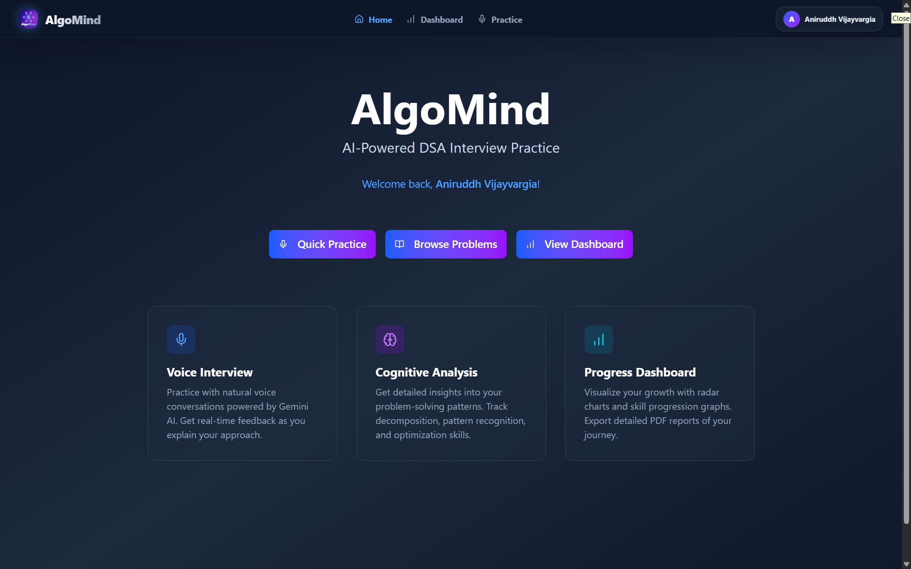

# AlgoMind 🧠

> **The AI-Powered Technical Interview Coach that listens, analyzes, and teaches.**

[](https://algomind-drab.vercel.app/)



AlgoMind is a cutting-edge technical interview preparation platform that simulates real-world coding interviews using voice-first AI. Built with a sophisticated **Multi-Model Architecture (Llama 4 + Gemini 2.5)** and **RAG (Retrieval-Augmented Generation)**, it delivers 99.9% uptime, sub-second latency, and context-aware feedback.

Unlike standard coding platforms, AlgoMind evaluates candidates on **8 distinct cognitive dimensions**, providing a granular scientific analysis of their engineering potential.

---

## 🌟 Key Features (The "Wow" Factor)

### 🎤 Voice-First AI Interviewer
*   **Real-time Conversation**: Speak naturally with the AI. It interrupts, asks follow-up questions, and provides hints just like a human interviewer.
*   **Smart Interruption Manager**: A dedicated `InterruptionManager` handles debouncing and state management to prevent accidental cut-offs while allowing natural turn-taking.
*   **Voice Activity Detection (VAD)**: Uses **Silero VAD** (ONNX Runtime) directly in the browser for privacy-first, zero-latency speech detection.
*   **Multi-Model Voice Pipeline**: Browser-native speech recognition + High-quality TTS.

### 🧠 8-Dimensional Cognitive Assessment
We go beyond "passing test cases". Use our proprietary scoring engine to measure:
1.  **Problem Decomposition**: Ability to break down complex tasks.
2.  **Pattern Recognition**: Identifying correct data structures/algorithms.
3.  **Algorithmic Thinking**: Logical flow and edge case handling.
4.  **Code Quality**: Cleanliness, variable naming, and modularity.
5.  **Communication**: Clarity of thought and vocal explanation.
6.  **Efficiency**: Time and space complexity mastery.
7.  **Debugging**: Identifying and fixing logical errors.
8.  **Adaptability**: How well the candidate incorporates feedback.

### 🚀 High-Performance AI Architecture
*   **Hybrid Model Strategy (2026 Standards)**:
    *   **Llama 4 (Maverick/Scout)**: Powers the core interview logic with superior reasoning and speed.
    *   **Gemini 2.5 / 3.0 Pro**: Handles deep verification and complicated code analysis.
    *   **Kimi K2**: Especialized in structured output generation.
*   **Local RAG Pipeline**: Custom **JSON-based Vector Store** with **Hybrid Search** (Cosine Similarity + Jaccard Keyword Matching) ensures the AI "knows" the specific problem context without heavy database dependencies.

### 📚 Comprehensive Practice Ecosystem
*   **Massive Problem Bank**: ~480+ High-Quality problems sourced from **Blind 75**, **NeetCode 150**, **Striver's A-Z**, and **Grind 75**.
*   **Strict Quality Control**: All problems are vetted by a "Lead Tech Interviewer" AI agent for clarity, constraints, and solvability.
*   **Smart Filters**: Sort by difficulty, topic (DP, Graphs, Trees), and status.

### 💎 Premium Experience
*   **Guest Conversion Flow**: Intelligent trial limits with a high-conversion modal to upsell premium features like persistent history and advanced analytics.
*   **Visual Radar Charts**: Instantly visualize strengths and weaknesses.
*   **PDF Export**: Generate professional assessment reports.

---

## 🛠️ Tech Stack

### Frontend & Core
*   **Framework**: [Next.js 14](https://nextjs.org/) (App Router, Server Actions)
*   **Language**: [TypeScript](https://www.typescriptlang.org/) (Strict Mode)
*   **Styling**: [Tailwind CSS](https://tailwindcss.com/) + [shadcn/ui](https://ui.shadcn.com/) + [Framer Motion](https://www.framer.com/motion/)
*   **State Management**: [Zustand](https://github.com/pmndrs/zustand)
*   **Voice**: Web Speech API + [ONNX Runtime Web](https://onnxruntime.ai/) (Silero VAD)

### Backend & Database
*   **Database**: [Supabase](https://supabase.com/) (PostgreSQL)
*   **Vector Querying**: Local Hybrid Search (In-Memory/JSON)
*   **Auth**: Supabase Auth (GitHub/Google/Email)

### AI & Intelligence
*   **Unified AI Client**: Standardized interface with intelligent routing and fallbacks.
*   **Models**:
    *   **Primary**: `meta-llama/llama-4-maverick-17b-128e-instruct`, `gemini-2.5-flash`
    *   **Fallback**: `gemma-3-27b-it`, `openai/gpt-oss-120b`
    *   **Safety**: `openai/gpt-oss-safeguard-20b`
*   **Resilience**:
    *   **Smart Routing**: Automatically switches providers on Rate Limits (429) or API errors.
    *   **Self-Healing Scripts**: Generation scripts auto-retry and adapt to model capabilities (e.g., handling JSON mode support).

### DevOps & Tools
*   **Test**: Playwright (E2E) + Vitest (Unit)
*   **Linting**: ESLint
*   **Deployment**: Vercel

---

## 🚀 Getting Started

### Prerequisites
*   Node.js 18+
*   npm

### Installation

1.  **Clone the repository**
    ```bash
    git clone https://github.com/yourusername/algomind.git
    cd algomind
    ```

2.  **Install dependencies**
    ```bash
    npm install
    ```

3.  **Environment Setup**
    Create a `.env.local` file in the root directory:
    ```bash
    cp .env.example .env.local
    ```
    
    Fill in your API keys for **Gemini**, **Groq**, and **Supabase**.

4.  **Run the Development Server**
    ```bash
    npm run dev
    ```

5.  **Open the App**
    Visit [http://localhost:3000](http://localhost:3000) in your browser.

---

## 📄 License

MIT License © 2026 AlgoMind
