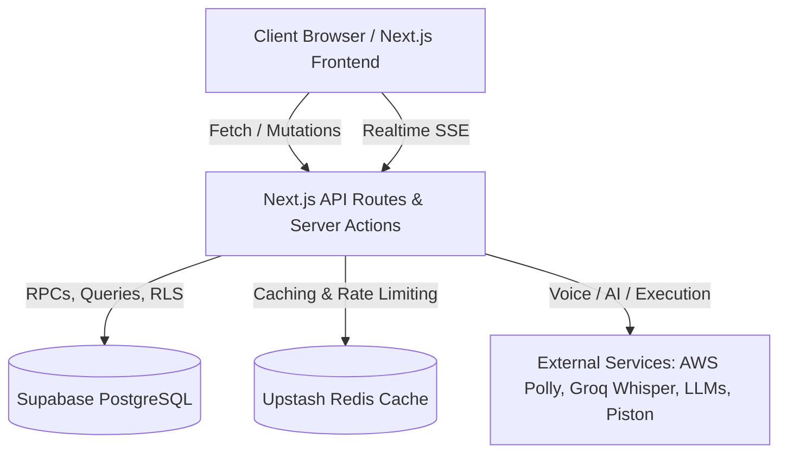
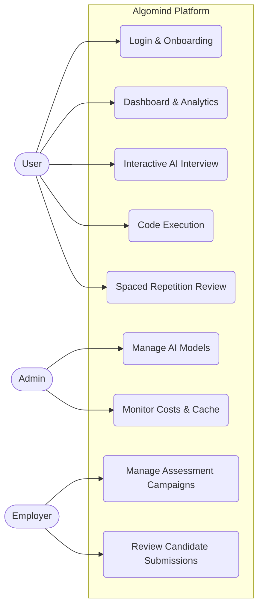

# 🧠 Algomind

Welcome to **Algomind**, the next-generation AI-powered mock interview platform. This repository serves as the core blueprint for the application's backend, frontend, and database architecture.

## 🚀 Overview

Algomind is built to provide a highly interactive, voice-driven, and code-enabled interview experience. It features strict timing/turn constraints, highly responsive UI dual-layouts, and fallback-heavy backend services to ensure 100% uptime during live sessions.

### Key Capabilities
- **Voice Pipeline**: Real-time STT/TTS processing with fallback mechanisms.
- **Code Execution**: In-browser synchronized code editing and remote execution via Piston.
- **Cognitive Assessment**: Multi-dimensional grading covering algorithmic thinking, communication, problem decomposition, and pattern recognition.
- **Spaced Repetition**: Adaptive learning integrations for post-interview reviews.
- **Robust Telemetry**: Fire-and-forget backend logging and performance monitoring.

---

## 🛠 Tech Stack

- **Frontend**: Next.js, React 18, Tailwind CSS, Lucide Icons
- **Backend Architecture**: Next.js App Router (Serverless Functions), Upstash Redis (Caching & Rate Limiting)
- **Database & Auth**: Supabase (PostgreSQL, Row-Level Security, JWT Auth, Atomic RPCs)
- **AI / Voice Integration**:
  - **STT**: Groq Whisper (Primary) -> Web Speech API (Fallback)
  - **TTS**: AWS Polly (Primary) -> Browser TTS (Fallback)
  - **Assessment Engine**: Groq/Gemini routing determinism
- **Testing**: Vitest, React Testing Library

---

## 🏗 Architecture & System Design

### 1. Graceful Degradation (Voice & AI)
The system is designed with multiple fail-safes. If Groq Whisper or AWS Polly experiences an outage, Algomind instantly falls back to native Browser Speech APIs without crashing the active user session. AI routing gracefully cascades through fallback models for assessment grading.

### 2. Frontend Modularity & Layouts
The primary `InterviewSession` orchestrates logic globally, distributing state via `InterviewLayoutContext`.
- **`DesktopLayout`**: A dynamic 4-quadrant UI for side-by-side video/voice, problem description, code execution, and chat history.
- **`MobileLayout`**: A heavily optimized, swipe-friendly UI isolating concerns into focused tabs (Voice, Code, Problem) to prevent viewport stretching.

### 3. Database Integrity & Security (Supabase)
Our PostgreSQL instance strictly guards user data.
- **Row-Level Security (RLS)**: Enforced via JWT claims (`auth.uid()`).
- **Atomic Operations**: Core session completions are performed via secure RPCs (`save_interview_session_atomic`) to prevent partial multi-table writes.
- **CHECK Constraints**: Score boundaries (0-100) and enum matching are native to the DB schema to prevent phantom dirty states.
- **JSONB Optimization**: Deep-nested data (`transcript`, `skill_evidence`) are highly optimized with `GIN` indexes.

---

## 🧪 Testing

The repository boasts a massive suite of ~1,300+ tests spanning unit, integration, and UI component layers. We utilize `vitest` for blisteringly fast test parallelization.

```bash
# Run the complete test suite
npm run test
```

*Note: Component tests involving deeply nested context providers must be wrapped in their respective layout providers (e.g., `InterviewLayoutContext.Provider`).*

---

## 🔒 Security Best Practices
- Ensure you have configured all ENV variables prior to deploying the Next.js edge functions. Missing ENVs will trigger graceful service degradation rather than full crashes, but primary models will be bypassed.
- RLS Policies restrict reads/writes strictly to authenticated users. System-level DB patches bypass these constraints safely during atomic RPC execution.

---
**Prepared post-audit (Launch Version 1.0.0). Happy coding!**

---

## 📊 System Diagrams

The following diagrams have been generated through an automated investigation of the system's frontend components, backend routes, server actions, and database schemas.

### Architecture Diagram
This diagram outlines the complete end-to-end architecture of Algomind, mapping the client, backend, database, cache, and external service layers.



### Use Case Diagram
This diagram maps out the primary interactions between various actors (User, Admin, Employer) and the core platform workflows.



### High-Level Diagram
This diagram breaks down the separation of concerns across the Frontend, Backend, and Infrastructure domains.

```mermaid
graph TD
    subgraph Frontend "Frontend (React 19 / Tailwind / Radix)"
        AppRouter[Next.js App Router]
        Pages[Pages: Dashboard, Interview, Learn, Auth]
        Hooks[Custom Hooks: useInterview, useSTT, useVAD, useProgress]
        State[State: React Query, React Context]
        AppRouter --> Pages
        Pages --> Hooks
        Hooks --> State
    end
    
    subgraph Backend "Backend (Next.js Edge / Node)"
        ServerActions[Server Actions: saveSession, getDashboardAverages, etc.]
        APIRoutes[API Routes: /api/chat, /api/assess, /api/admin]
        Lib[Lib: Assessment Engine, Knowledge Graph, Caching]
        APIRoutes --> Lib
        ServerActions --> Lib
    end
    
    subgraph Infrastructure "Infrastructure & DB"
        Supabase[(Supabase DB & RPCs)]
        Redis[(Upstash Redis)]
        AWS[AWS Polly]
        Groq[Groq / Gemini]
        Lib --> Supabase
        Lib --> Redis
        Lib --> AWS
        Lib --> Groq
    end
    
    Frontend <-->|REST / SSE / Server Actions| Backend
```

### Low-Level Component Diagrams

#### Frontend Low-Level Architecture
This highlights how the highly interactive `Dashboard` and `Interview` components manage state, fetch data, and coordinate children.

```mermaid
graph TD
    subgraph Dashboard "Dashboard Component (`app/dashboard`)"
        DBController[Dashboard Controller]
        RQ[React Query Provider]
        DBController --> RQ
        RQ --> |fetches| getDashboardAveragesAction
        DBController --> StatsOverview
        DBController --> SessionTimeline
        DBController --> RecommendationEngine
        RecommendationEngine --> ReviewQueueWidget
        RecommendationEngine --> SkillTrendCard
        RecommendationEngine --> RadarChart
    end
    
    subgraph Interview "Interview Component (`app/interview`)"
        IntController[InterviewSession & useInterview.ts]
        SM[InterviewStateMachine]
        IntController --> SM
        IntController --> DesktopLayout
        IntController --> MobileLayout
        DesktopLayout --> VoiceUI[MicrophoneButton, LiveTranscript]
        DesktopLayout --> CodeUI[CodeEditor]
        VoiceUI --> useVAD
        VoiceUI --> useSTT
        IntController --> SSE[SSE Stream to /api/chat]
    end
```

#### Backend Low-Level Architecture
This details the critical API endpoints and Database persistence logic handling the core real-time session workflows.

```mermaid
graph TD
    subgraph API_Chat "API: /api/chat & Interview Loop"
        ChatRoute[POST /api/chat]
        VoiceAPI[POST /api/voice/transcribe]
        ContextBuilder[Build User Context]
        LLM[LLM / Groq API]
        TTS[Voice Synthesize]
        ChatRoute --> ContextBuilder
        VoiceAPI --> ChatRoute
        ContextBuilder --> LLM
        LLM --> TTS
    end
    
    subgraph DB_Interaction "Data Persistence via Server Actions"
        Action[saveInterviewSession Action]
        AuthCheck[Verify Auth / RLS]
        AssessEngine[AI Assessment Engine]
        SpacedRep[Spaced Repetition Updater]
        SupabaseRPC[RPC: save_interview_session_atomic]
        
        Action --> AuthCheck
        Action --> AssessEngine
        AssessEngine --> SpacedRep
        AssessEngine --> SupabaseRPC
    end
```
