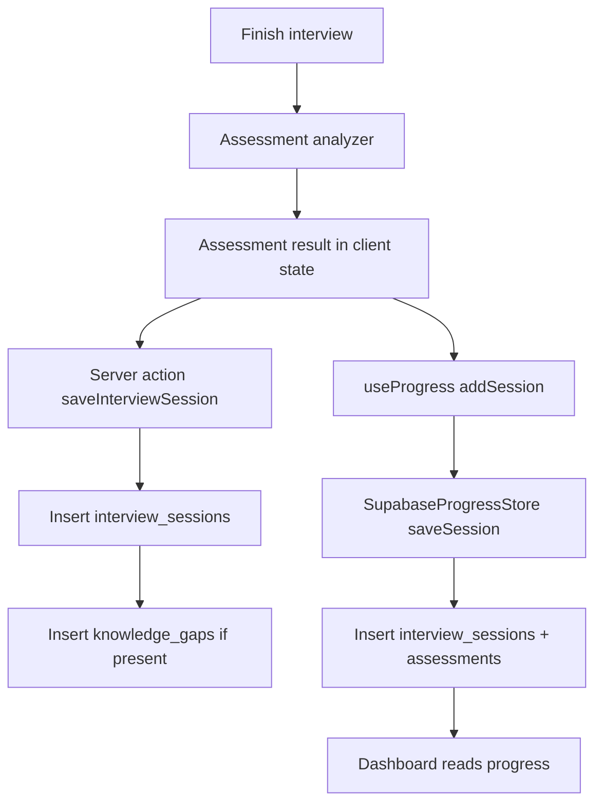
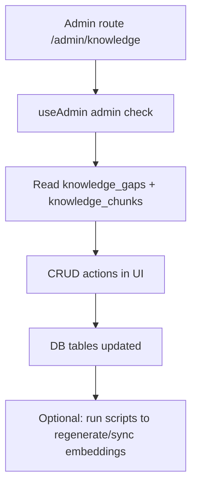

# AlgoMind System Reference (Canonical)

Last verified: 2026-02-08 (updated after AI fallback changes)
Source of truth: repository code under `src/*`, SQL under `sql/final/*`, scripts under `scripts/*`
Scope: practical developer reference for structure, flows, APIs, data contracts, dependencies, and risks

## 1. Project Snapshot

AlgoMind is a Next.js App Router web app for DSA interview practice with:
- voice interview interaction (browser speech APIs)
- AI interviewer + AI assessment (Gemini with Groq fallback)
- RAG grounding from local embeddings (plus optional DB-backed knowledge management)
- Supabase auth + persistence (sessions, assessments, preferences, usage, knowledge ops)
- dashboard analytics and PDF export

### Runtime model
- Frontend and backend both live in Next.js (`src/app` + route handlers).
- AI orchestration happens server-side via `/api/chat`.
- Most app data is in Supabase when configured; otherwise selected features degrade to browser storage.

### Current stack versions (from `package.json`)
- Next: `16.1.6`
- React: `19.2.3`
- TypeScript: `^5`
- Supabase client: `@supabase/supabase-js ^2.94.0`, `@supabase/ssr ^0.8.0`
- AI SDKs: `@google/generative-ai ^0.24.1`, `groq-sdk ^0.37.0`, `@xenova/transformers ^2.17.2`
- UI/Charts/PDF: Tailwind v4, Radix/shadcn-style components, Recharts, `@react-pdf/renderer`

### Primary user journeys
1. Sign in (OAuth) -> browse/start practice -> voice interview -> assessment -> dashboard insights/history.
2. Guest trial interview -> limited turn flow -> prompt to sign in.
3. Admin user -> knowledge gap/chunk management -> update knowledge content.

## 2. Repo Structure Map

### Top-level
- `src/`: application code (pages, API routes, hooks, libs, UI)
- `sql/final/`: canonical DB schema, RLS policies, DB functions/triggers
- `scripts/`: ingestion/sync helper scripts for knowledge/embeddings/demo
- `supabase/`: additional SQL utilities and schema files
- `docs/`: product/design/supporting docs
- `public/`: static assets and service worker
- `src/data/dsa-knowledge/`: raw markdown knowledge + generated embeddings JSON

### `src/app` routes (UI pages)
- `/` -> `src/app/page.tsx` (home + onboarding animation gate)
- `/login` -> `src/app/login/page.tsx`
- `/practice` -> `src/app/practice/page.tsx`
- `/interview` -> `src/app/interview/page.tsx`
- `/dashboard` -> `src/app/dashboard/page.tsx`
- `/settings` -> `src/app/settings/page.tsx`
- `/admin/knowledge` -> `src/app/admin/knowledge/page.tsx`
- `/tts-test`, `/voice-test` -> diagnostics pages

### `src/app` route handlers / server actions
- `POST /api/chat` -> `src/app/api/chat/route.ts`
- `POST /api/rag/search` -> `src/app/api/rag/search/route.ts`
- `GET /api/health` -> `src/app/api/health/route.ts`
- `GET /auth/callback` -> `src/app/auth/callback/route.ts`
- server action `saveInterviewSession` -> `src/app/actions/save-session.ts`

### Key library areas
- `src/lib/ai/*`: provider registry, rate limiter, unified AI client
- `src/lib/rag/*`: vector store, retriever, types
- `src/lib/supabase/*`: browser/server clients, problems/progress/preferences adapters
- `src/lib/assessment/*`: analyzer, prompts, skill registry, confidence/trends
- `src/lib/interview/*`: prompt/state machine utilities
- `src/lib/rate-limit/*`: per-user daily usage checks/recording
- `src/lib/auth/session-manager.ts`: client auth/session refresh behavior

### Hooks and components
- Hooks orchestrate behavior: interview loop, voice I/O, progress loading, admin checks, limits/trials.
- Components implement page-level UX (interview workspace, dashboard, admin views, settings, charts, PDF export).

## 3. Runtime Flow Diagrams

### 3.1 Auth/session flow
```mermaid
flowchart TD
  A[User clicks OAuth sign-in] --> B[Supabase OAuth]
  B --> C[/auth/callback GET with code]
  C --> D[exchangeCodeForSession]
  D --> E[Redirect / or /dashboard]
  E --> F[AuthProvider loads session]
  F --> G[useSessionPersistence watches auth events and refreshes token]
```

### 3.2 Interview flow
```mermaid
flowchart TD
  A[/interview page] --> B[Load problem + rate limit]
  B --> C[InterviewSession + useInterview]
  C --> D[Voice input transcript]
  D --> E[POST /api/chat]
  E --> F[Load vector store embeddings.json]
  F --> G[Hybrid retrieval or pre-embedded guest context]
  G --> H[Inject context into system prompt]
  H --> I[Unified AI client chat]
  I --> J[Return AI response]
  J --> K[TTS speaks response]
  K --> D
```

### 3.3 Persistence and analytics flow


### 3.4 Admin knowledge flow


## 4. API Catalog

## `POST /api/chat`
File: `src/app/api/chat/route.ts`

Purpose:
- Core AI conversation endpoint.
- Performs RAG retrieval and prompt augmentation before model call.

Request body (actual fields used):
```json
{
  "messages": [{"role":"user|assistant|system","content":"..."}],
  "systemPrompt": "string",
  "problemContext": {
    "title": "string",
    "content": "string",
    "ragContext": "optional pre-embedded context string"
  }
}
```

Behavior:
- Validates `messages` array.
- Loads local vector store from `src/data/dsa-knowledge/embeddings/embeddings.json`.
- Uses `problemContext.ragContext` directly for guest path, else runs hybrid retrieval.
- Appends retrieved context to system prompt.
- Calls `UnifiedAIClient.chat(...)`.

Responses:
- `200`: AI result object from unified client (`response`, `modelUsed`, `provider`, optional tokens).
- `400`: invalid message format.
- `500`: internal failure.

## `POST /api/rag/search`
File: `src/app/api/rag/search/route.ts`

Purpose:
- Exposes RAG retrieval directly.

Request:
```json
{ "query": "string", "topic": "optional", "difficulty": "optional" }
```

Behavior:
- Calls `retrieveContext(query, { topK: 3, includeTopic, includeDifficulty })`.

Responses:
- `200`: `{ "status": "ok", "context": "string" }`
- `400`: missing `query`
- `500`: retrieval failure

## `GET /api/health`
File: `src/app/api/health/route.ts`

Purpose:
- Health/status for AI providers and in-memory rate limiter usage.

Responses:
- `200`: at least one provider healthy, includes provider status + usage summary.
- `503`: no providers available.
- `500`: unexpected errors.

## `GET /auth/callback`
File: `src/app/auth/callback/route.ts`

Purpose:
- Supabase OAuth code exchange and post-auth redirect.

Behavior:
- Reads `code` query param.
- Calls `supabase.auth.exchangeCodeForSession(code)`.
- Redirects to `/dashboard` if onboarding cookie exists, else `/`.
- Redirects to `/login?error=auth_failed` on error.

## 5. External APIs and Services

### AI providers
Files: `src/lib/ai/client.ts`, `src/lib/ai/providers.ts`, `src/lib/ai/rate-limiter.ts`

- Groq (text):
  - `llama-3.3-70b-versatile`
  - `llama-3.1-8b-instant`
  - `openai/gpt-oss-120b` (configurable via env)
- Gemini (text + embeddings):
  - text: `gemini-2.5-flash`, `gemini-2.5-flash-lite`, `gemma-3-27b-it`, and env-configured free-tier slot
  - embeddings: `gemini-embedding-001`
- Local embeddings fallback:
  - `Xenova/all-MiniLM-L6-v2` via `@xenova/transformers`

Fallback strategy:
- Selects available model by internal tier/rate limits.
- Text: on model failure, retries with the next lower-priority tier.
- Embeddings: tries Gemini embedding first, then local MiniLM fallback.

### Supabase
Files: `src/lib/supabase/client.ts`, `src/lib/supabase/server.ts`, auth/progress/preferences modules

Used for:
- OAuth session management
- RLS-governed reads/writes to problems, sessions, assessments, usage, preferences, knowledge data
- RPC calls for admin check, random problems, rate limiting

### Browser platform APIs
- Speech-to-text: `SpeechRecognition` / `webkitSpeechRecognition` (`useVoiceInput`)
- Text-to-speech: `speechSynthesis` (`useVoiceOutput`, settings previews)
- Storage: `localStorage`, `sessionStorage`
- Service worker registration in root layout (`/sw.js`)
- Clipboard API in code editor component

## 6. Data Model and DB Contract

Canonical DB definitions are in:
- `sql/final/01_schema.sql`
- `sql/final/02_security.sql`
- `sql/final/03_functions.sql`

### Core runtime tables
- `profiles`: user profile mirror from auth
- `admin_users`: admin allowlist by email
- `user_preferences`: voice/UI preference persistence
- `user_daily_usage`: per-user/day question counters
- `problems`: practice problem catalog
- `interview_sessions`: session records + transcript + summary fields
- `assessments`: skill scoring data linked to sessions
- `knowledge_chunks`: RAG knowledge records + embedding column
- `knowledge_gaps`: unresolved query gaps for admin triage

### RPC/functions called by application code
- `get_random_problem(problem_difficulty)`
- `check_user_rate_limit(p_user_id, p_limit)`
- `record_user_question(p_user_id)`
- `is_admin(...)` / `check_is_admin()` (intended admin check path; see mismatch section)

### RLS/admin intent
- Users can read/write only their own personal rows (`profiles`, `preferences`, `sessions`, `assessments`, usage rows).
- `problems` are public read.
- `knowledge_*` operations are admin-scoped (public read active chunks allowed by policy).

### Data writes per flow
- Interview start:
  - `record_user_question` increments daily usage (authenticated users)
- Interview completion:
  - session and assessment writes (through client/store and server action paths)
  - optional `knowledge_gaps` inserts from assessment output
- Settings:
  - `user_preferences` upsert
- Admin knowledge:
  - `knowledge_chunks` insert/update and `knowledge_gaps` status updates

## 7. State and Storage Layers

### Supabase-backed state (when configured + signed in)
- Auth session/user
- Problems list/random fetch
- Progress history and assessments
- Rate limit usage
- Voice preferences
- Admin knowledge data

### Browser storage usage
- `localStorage`:
  - demo mode flag
  - attempted problems
  - fallback user preferences
  - fallback rate limiting
  - tour completion/skipped
  - legacy/fallback progress store
- `sessionStorage`:
  - onboarding/session flags
  - redirect-after-login
  - cached current problem
  - guest trial counter

### Guest and degraded modes
- If Supabase is not configured:
  - auth is effectively disabled
  - problem retrieval from DB fails
  - some features use local fallback (preferences/rate-limit/demo), but core DB content remains unavailable
- Guest interviews can use hardcoded problem path (`src/lib/guest/guest-problems.ts`) with pre-embedded context.

## 8. Environment and Config Dependencies

### Required for AI
- `GEMINI_API_KEY`: required for Gemini chat/embedding.
- `GROQ_API_KEY`: required for Groq text fallback chain.

### Optional AI config
- `GROQ_GPT_OSS_MODEL_ID`: override GPT-OSS Groq model id (default `openai/gpt-oss-120b`).
- `GEMINI_FREE_TIER_MODEL_ID`: override Gemini free-tier text model id (default `gemini-2.0-flash` in code).

### Required for Supabase runtime
- `NEXT_PUBLIC_SUPABASE_URL`
- `NEXT_PUBLIC_SUPABASE_ANON_KEY`

### Required for admin sync scripts
- `SUPABASE_SERVICE_ROLE_KEY` (required by `push-embeddings-to-db.ts`, preferred by sync scripts)

### Behavior when missing
- Missing AI keys:
  - `/api/health` likely returns provider unavailable.
  - `/api/chat` fails when no model can serve the request.
- Missing Groq key:
  - text chain still works only if Gemini is available.
- Missing Gemini key:
  - text chain can still run on Groq; embeddings fall back to local MiniLM.
- Missing Supabase public keys:
  - browser client returns null; auth/data flows degrade/fail.
- Missing service role key:
  - DB sync scripts fail or run with limited permissions (depending on script fallback behavior).

## 9. Scripts and Operational Workflows

### `scripts/ingest-knowledge.ts`
- Reads markdown from `src/data/dsa-knowledge/raw/`
- Chunks content and requests embeddings from Gemini
- Writes `src/data/dsa-knowledge/embeddings/embeddings.json`
- Requires `GEMINI_API_KEY`

### `scripts/sync-knowledge.ts`
- Reads local `embeddings.json`
- Upserts into `knowledge_chunks` table
- Prefers service key, falls back to anon key if provided

### `scripts/push-embeddings-to-db.ts`
- Similar DB sync path, explicitly requires service role key

### `scripts/generate-demo-data.ts`
- Uses `localStorage`; intended for browser-like usage, not pure Node execution

### Operational note
- Current runtime RAG path in `/api/chat` uses local JSON vector store, not DB vector matching function.
- If admins update DB chunks only, retrieval quality in runtime will not change until local embeddings are regenerated and deployed.

## 10. Known Mismatches and Risks

1. `saveInterviewSession` column mismatch risk
- File: `src/app/actions/save-session.ts`
- Inserts `title` and `duration_seconds` into `interview_sessions`, but schema defines `problem_title` and `duration`.
- Expected impact: insert errors unless live DB schema diverges from `sql/final/01_schema.sql`.

2. Admin RPC mismatch risk
- File: `src/hooks/useAdmin.ts`
- Calls `supabase.rpc('is_admin')` with no args.
- Canonical SQL defines `is_admin(user_id UUID)` and `check_is_admin()` wrapper.
- Expected impact: admin check may fail unless DB has an overloaded no-arg function.

3. Embedding dimension mismatch
- Files: `src/lib/ai/providers.ts`, `src/lib/rag/vectorStore.ts`, `sql/final/01_schema.sql`
- App embedding model metadata expects 768 dimensions; DB column is `vector(3072)`.
- Expected impact: DB upsert/search incompatibility unless live embeddings/table differ.

4. Knowledge chunk ID type mismatch
- Files: `scripts/*sync*`, `scripts/ingest-knowledge.ts`, `sql/final/01_schema.sql`
- Scripts use deterministic MD5 string IDs; schema defines `knowledge_chunks.id UUID`.
- Expected impact: upsert failures if schema is exactly as documented.

5. Runtime RAG source split
- Runtime `/api/chat` loads local `embeddings.json`; admin UI edits DB `knowledge_chunks`.
- Expected impact: admin updates do not immediately affect live retrieval path.

6. Session persistence cleanup key drift
- File: `src/lib/auth/session-manager.ts`
- On sign-out clears `attempted_problems`, but practice page stores `attempted_problems_${user.id}`.
- Expected impact: stale attempted-problem entries may remain.

7. Version drift in older docs
- `README.md` mentions Next 14, current package is Next 16.
- Expected impact: onboarding confusion for contributors.

8. Embedding dimension split risk (Gemini vs local fallback)
- Files: `src/lib/ai/providers.ts`, `src/lib/ai/client.ts`, `src/lib/rag/vectorStore.ts`
- Gemini embeddings are 768-d; local MiniLM fallback is 384-d.
- Expected impact: mixed-dimension corpora can break cosine similarity if embeddings are generated by different providers for the same store.

## 11. Maintenance Checklist

Update this file whenever any of these change:
1. Add/remove routes in `src/app` or route handlers.
2. Change request/response shapes of `/api/chat`, `/api/rag/search`, `/api/health`, `/auth/callback`.
3. Modify AI model registry, fallback logic, or provider dependencies.
4. Change DB schema, RLS policies, or RPC function signatures in `sql/final/*`.
5. Change persistence behavior for sessions/assessments/preferences/rate limits.
6. Add/remove scripts that alter knowledge, embeddings, or operational setup.
7. Resolve or introduce mismatch items listed in Section 10.

## Verification Notes (performed for this document)

- Route handler coverage checked against `src/app/api/*` and `src/app/auth/callback/route.ts`.
- DB tables/functions/policies verified from `sql/final/01_schema.sql`, `sql/final/02_security.sql`, `sql/final/03_functions.sql`.
- Environment key usage verified via `process.env` references across `src/lib/*`, `src/app/*`, and `scripts/*`.
- External integrations verified in AI, Supabase, voice, and service-worker modules.
- End-to-end flow traced from page/hooks to API routes and persistence layers.
