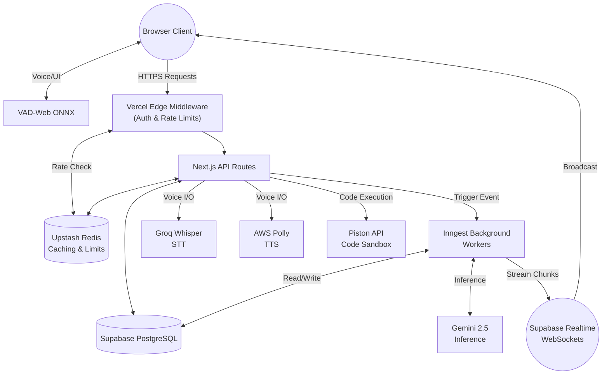
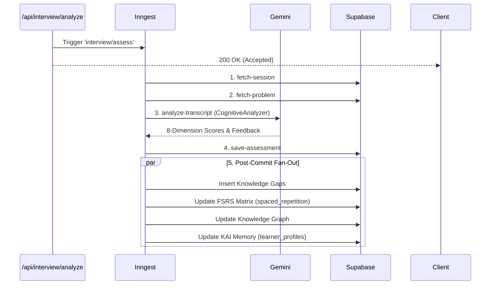

# 01. System Architecture & High-Level Design (HLD)

AlgoMind is architected as a **Serverless Monolith with Edge Enhancements**. It utilizes Next.js App Router for both the frontend UI and the backend API Gateway. Heavy asynchronous workloads and parallel processing are offloaded to **Inngest**.

## High-Level Architecture (Mermaid)

## Parallel Processing Pipelines (Inngest)

To keep the API fast and responsive, AlgoMind heavily relies on Inngest background functions defined in `src/lib/inngest/functions.ts`. 

### 1. `assessInterviewFunction`
Triggered by the event `interview/assess` when a user ends a session. It runs a complex series of steps:
1. `fetch-session` & `fetch-problem` (Load DB context)
2. `analyze-transcript` (Passes the entire transcript to the `CognitiveAnalyzer` / Gemini)
3. `save-assessment` (Saves the 8-dimension scores: Problem Decomposition, Pattern Recognition, etc.)
4. `post-commit-updates` (Massive parallel fan-out):
    - Updates **Knowledge Gaps** if the user asked questions the RAG didn't know.
    - Updates the **Spaced Repetition (FSRS)** queue (`addToQueue` and `updateSkillRepetition`).
    - Updates the user's **Knowledge Graph** via `getKnowledgeGraphService()`.
    - Regenerates the overarching **KAI Memory Narrative** (`updateKaiMemory`).

### 2. `chatAssistantFunction`
Triggered by `interview/chat`. Instead of holding an open Vercel serverless function (which times out after 10-60 seconds depending on plan), AlgoMind streams AI responses asynchronously.
1. The API fires the Inngest event and immediately returns `200 OK`.
2. The Inngest worker calls `getAIClient().generateStream()`.
3. As Gemini generates tokens, Inngest sends them to a **Supabase Realtime Channel** (`interview_${sessionId}`) via REST.
4. The client's WebSocket connection receives the chunks and renders the text dynamically.
