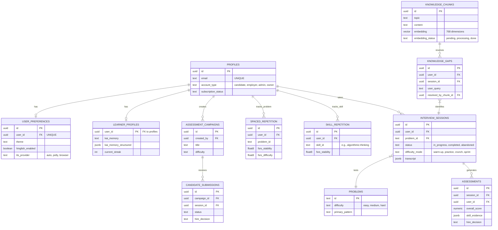

# 02. Database Schema & Architecture

AlgoMind uses **Supabase (PostgreSQL)** as its primary data store. The database is heavily normalized and utilizes Postgres advanced features such as **Row Level Security (RLS)**, **pgvector** for RAG embeddings, and robust foreign key constraints to maintain data integrity.

## Entity Relationship Diagram (ERD)

The following Mermaid diagram maps the core architecture of the `public` schema.

## Core Table Breakdown

### Authentication & Profiles
- **`profiles`**: The central user table, extending the underlying `auth.users`. Contains role-based `account_type` (`candidate`, `employer`, `admin`, `owner`), enforcing macro-level access control.
- **`user_preferences`**: 1:1 mapping with `profiles`. Stores deep UX settings like TTS fallback (`tts_provider`), multi-lingual support (`hinglish_enabled`), and target companies.
- **`learner_profiles`**: 1:1 mapping storing unstructured and structured memory (`kai_memory_structured`) generated by the AI to maintain narrative continuity across sessions.

### Session & Assessment Engine
- **`problems`**: The core catalog of algorithmic tasks, including curated lists and complexity matrices.
- **`interview_sessions`**: Tracks active and historical mocks. Includes sophisticated fields like `difficulty_mode` (Sprint, Crunch) and records the entire `transcript`.
- **`assessments`**: Deep, AI-generated grading linked to a session. Breaks down performance across 8 distinct dimensions (e.g., `algorithmic_thinking`, `communication_clarity`) and outputs a final `hire_decision`.

### RAG & Vector Memory (`pgvector`)
- **`knowledge_chunks`**: Houses the platform's domain knowledge. The `embedding` column uses the `vector(768)` type to store text embeddings. An asynchronous cron pipeline scans for `embedding_status = 'pending'` to vectorize new content.
- **`knowledge_gaps`**: Captures user questions during interviews that the current RAG context failed to answer, queueing them up for admin review or AI generation to improve the system organically.

### Spaced Repetition (FSRS)
- **`spaced_repetition`** & **`skill_repetition`**: These tables implement the Free Spaced Repetition Scheduler (FSRS) algorithm. They track `fsrs_stability`, `fsrs_difficulty`, and `fsrs_due` dates, calculating the precise optimal time a user needs to revisit a specific problem or overarching skill.

### B2B Employer Workflows
- **`assessment_campaigns`**: Employers can bundle problems into a timed campaign with a public entry code.
- **`candidate_submissions`**: Tracks an external candidate's progress through a campaign, tracking `integrity_flags` (anti-cheat) and generating a final `hire_decision`.

## Row Level Security (RLS)
The database enforces strict multitenancy via RLS.
1. **Candidates** can only `SELECT/UPDATE` their own rows in `profiles`, `interview_sessions`, etc. where `user_id = auth.uid()`.
2. **Employers** have elevated access to view aggregate anonymized data for campaigns they created (`created_by = auth.uid()`), but cannot view private candidate sessions.
3. **Owners** use a separate admin role or bypass RLS via server-side service keys in specific `/api/owner` edge functions to access platform-wide analytics.
