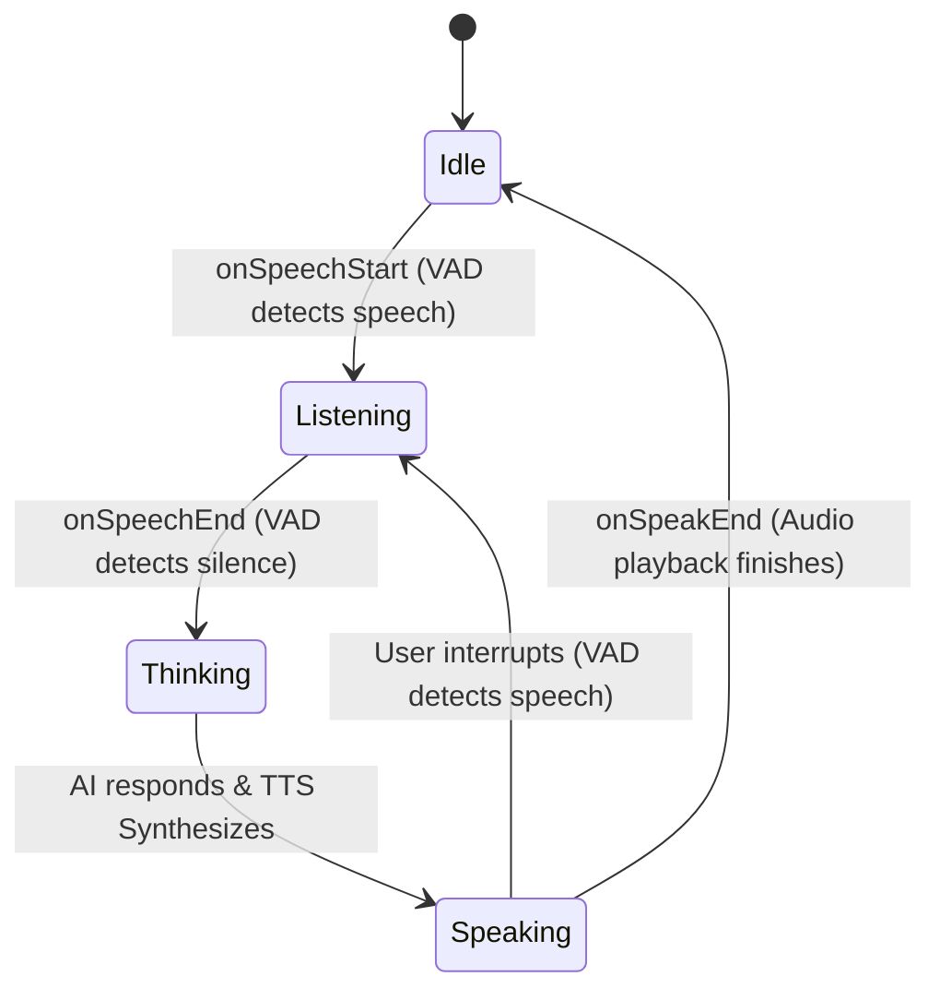
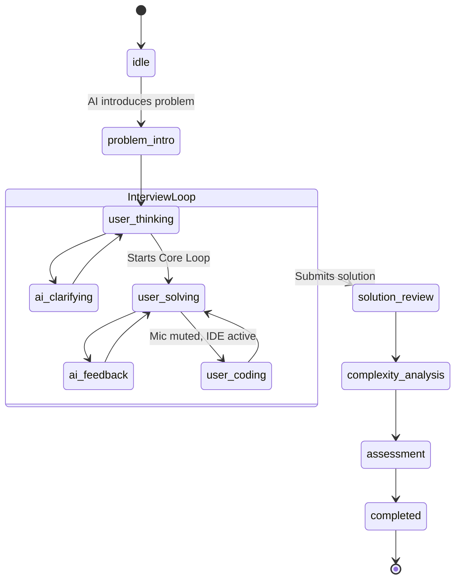

# 04. Frontend UI/UX & Voice State Machines

AlgoMind's frontend is built using Next.js 14 App Router, React 19, Tailwind CSS v4, and Radix UI primitives. The most complex piece of the frontend architecture is the real-time AI Interview interface.

## Voice State Machine Architecture

The interview interface orchestrates two interacting state machines: the Hardware Voice Layer (managing the microphone and speakers) and the Interview Protocol Layer (managing the logic of the algorithmic interview).

### 1. Hardware & Voice State Transitions

Controls VAD (Voice Activity Detection), STT (Speech-To-Text), and TTS (Text-To-Speech). These states are visually represented in the UI by colored indicator rings around the AI avatar.

- **Idle / Ready (`bg-emerald-500`)**: Microphone is accessible but no active capturing is occurring.
- **Listening (`bg-indigo-500`)**: Silero ONNX (or STT fallback) actively captures the audio buffer.
- **Thinking / Processing (`bg-amber-400`)**: Passes audio to STT (`stt.transcribeAudio(audio)`), which resolves into a transcript and invokes `submitUserResponse()` to ping the Gemini AI.
- **Speaking (`bg-purple-500`)**: AI text is yielded and `tts.speak()` is called. The microphone is intentionally suppressed (via echo-cancellation or muting) while TTS (Polly/Browser) streams audio.

**VAD Cascading:** 
If WebAssembly or AudioContext dependencies fail on initialization, VAD cascades to a standard `push-to-talk` mode powered natively by browser STT.

### 2. Interview Protocol State Machine

Defined in `src/lib/interview/state-machine.ts`, this dictates the logical flow of the mock interview:

*Edge States:* The system includes `network-error` and `paused` states which gracefully capture `savedState` references to seamlessly resume the interview upon reconnection or unpausing.

## Layout & Dashboards

### Component Boundaries
- **Server Components:** Utilized heavily for initial data fetching (e.g., loading the `dashboard/page.tsx` with user metrics, recent campaigns, and FSRS schedules directly from Supabase).
- **Client Components:** Highly interactive elements like the code editor (Monaco), the Voice Visualizer (`react-resizable-panels`), and the Radar Charts.

### 8-Dimensional Cognitive Profile
The `RadarChart` component renders a dynamic SVG mapping the user's proficiency across 8 algorithmic dimensions (Problem Decomposition, Pattern Recognition, Algorithmic Thinking, Complexity Analysis, Communication Clarity, Edge Case Awareness, Optimization Mindset, Debugging Approach). These values are pulled directly from the `skill_repetition` database table and averaged over recent sessions.
