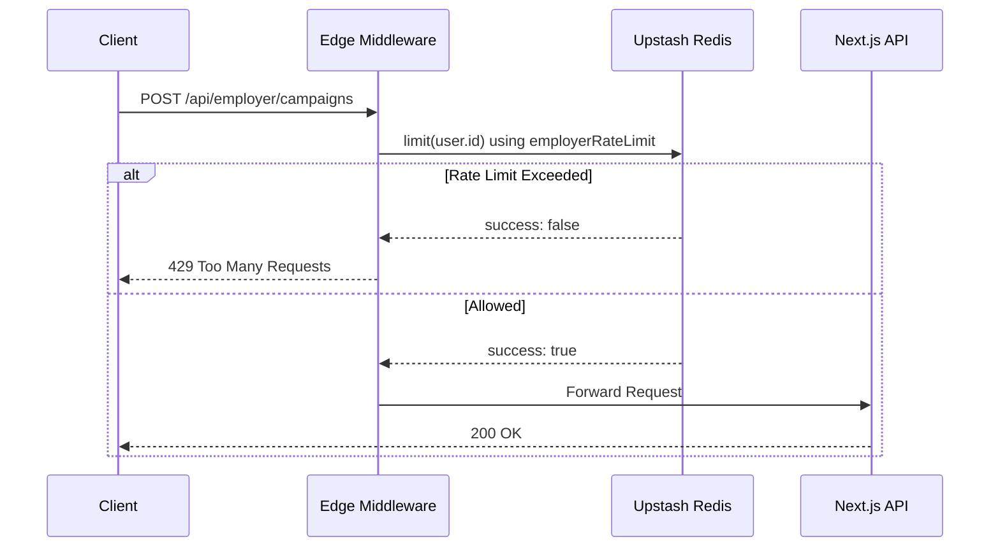

# 05. Security, Authentication & Edge Middleware

AlgoMind utilizes a multi-layered security approach to protect candidate data, enforce rate limits, and securely execute code. The most critical component is the **Next.js Edge Middleware**, which intercepts every request.

## Authentication Architecture

We use **Supabase Auth** combined with **`@supabase/ssr`** for secure Server-Side Rendering. 

### Cookie Synchronization
In `src/middleware.ts`, the middleware performs a crucial function: it creates a Supabase Server Client and forcefully synchronizes the JWT authentication cookies into the request headers and response cookies.
```typescript
// From src/middleware.ts
supabase = createServerClient(supabaseUrl, supabaseAnonKey, {
    cookies: {
        getAll: () => request.cookies.getAll(),
        setAll: (cookiesToSet) => {
            cookiesToSet.forEach(({ name, value }) => request.cookies.set(name, value));
            // Followed by setting on the NextResponse
        }
    }
});
```
This guarantees that Server Components and API Routes down the line have an accurate, validated `user` object without needing to re-parse the tokens.

## Role-Based Access Control (RBAC)

The Edge Middleware acts as a global router guard. It defines strict path boundaries:
- `isDashboard` (`/dashboard/*`) - For candidates.
- `isEmployer` (`/employer/*`) - For B2B clients.
- `isAdmin` (`/admin/*`) - Internal team access.
- `isOwnerRoute` (`/owner/*`) - Highest level platform metrics.

If an unauthenticated user attempts to access any of these paths, they are redirected to `/login` with a `redirect` search param.

### Guest Mode & E2E Bypasses
- **Guest Mode:** The `/interview` route allows unauthenticated access *if* the `algomind_demo_mode` cookie is set or `?demo=true` is present, but ONLY if the global feature flag `ENABLE_GUEST_MODE` is active.
- **E2E Testing:** Playwright tests can bypass auth locally by setting the `playwright-e2e` cookie, but this is explicitly blocked in production via a `process.env.NODE_ENV !== 'production'` check.

## Edge Rate Limiting (Upstash Redis)

To protect the API infrastructure and prevent runaway LLM costs, we implement strict, tier-based rate limiting directly at the edge before the Next.js API router is even invoked.



**Tier Limits:**
- **Admin Tier (`/api/admin/*`)**: 200 requests (sliding window).
- **Employer Tier (`/api/employer/*`)**: 200 requests (sliding window).
- **Owner Tier (`/api/owner/*`)**: Unrestricted.
- **Candidate Tier**: Rate limiting is applied per-endpoint (e.g., chat streams) rather than globally in the middleware.

## Diagnostic Enforcement
The middleware also enforces an onboarding flow. If a user tries to access `/learn/*` but lacks the `DIAGNOSTIC_COMPLETE_COOKIE`, the middleware queries Supabase to check the `has_completed_diagnostic` flag on the `profiles` table. If false, the user is forcefully redirected to `/learn/diagnostic`.

## Execution Security (Piston API)
When code is executed via `/api/execute`, the platform does not run the code natively on Vercel. Instead, the payload is serialized and sent to the **Piston API** (an external sandboxed execution engine). This ensures that malicious while-loops or system calls cannot compromise the primary Node.js server.
