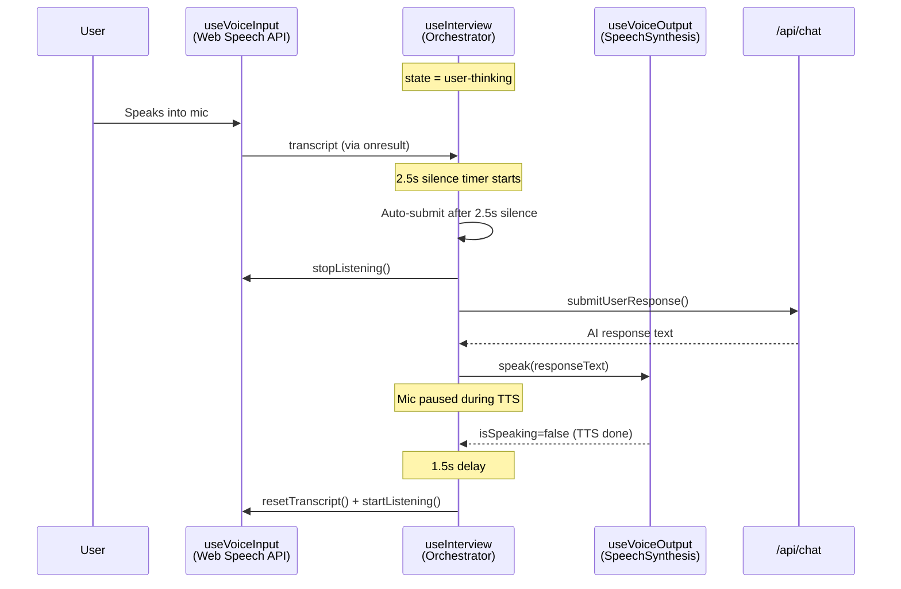
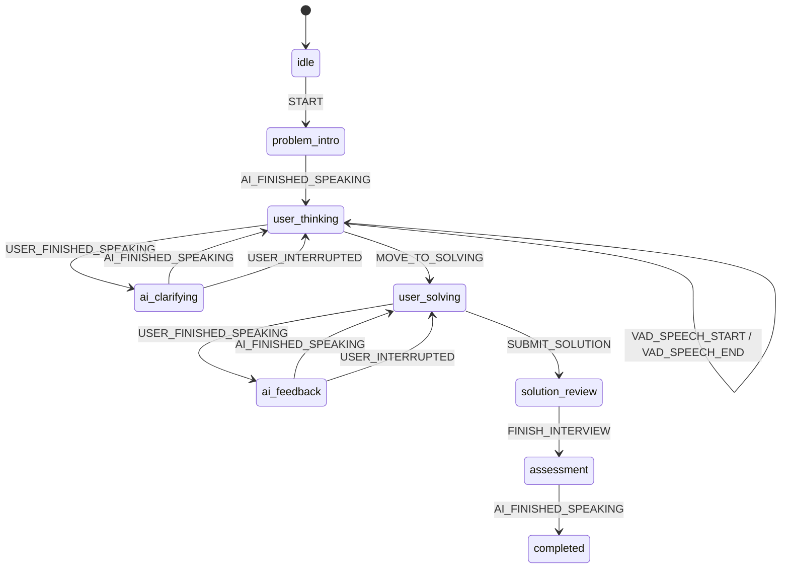

# VAD Integration Architecture

## Overview

Integrate the proven `VADManager` + `useVoiceActivityDetection` hook into the existing interview flow to enable **real-time voice activity detection alongside Web Speech API**, replacing the fragile 2.5s silence timer with a VAD-driven auto-submit and AI interruption system.

> [!IMPORTANT]
> All new behavior is gated behind feature flags (default: `false`). The existing interview flow is untouched when flags are off.

---

## Current Voice Flow (Before)



**Current Pain Points:**
- **2.5s silence timer** is blind — can't distinguish "thinking pause" from "done speaking"
- **No interruption** — user must wait for AI to finish speaking before responding
- **7s silence timeout** disables mic entirely, requiring manual re-enable
- **Echo risk** — 1.5s delay after TTS is a crude anti-echo measure

---

## New Voice Flow (After — VAD Enabled)

```mermaid
sequenceDiagram
    participant U as User
    participant VAD as VADManager<br/>(ONNX Model)
    participant MI as useVoiceInput<br/>(Web Speech API)
    participant INT as useInterview<br/>(Orchestrator)
    participant MO as useVoiceOutput<br/>(SpeechSynthesis)
    participant AI as /api/chat

    Note over INT: state = user-thinking
    INT->>VAD: startListening()
    INT->>MI: startListening()
    U->>VAD: Speaks (audio frames)
    VAD-->>INT: onSpeechStart
    Note over INT: Mark user as speaking
    U->>MI: Speech → transcript
    VAD-->>INT: onSpeechEnd
    Note over INT: User stopped — wait 1s confirmation
    INT->>MI: stopListening()
    INT->>AI: submitUserResponse()
    AI-->>INT: AI response text
    INT->>MO: speak(responseText)

    rect rgb(40, 40, 60)
        Note over U,MO: INTERRUPTION (flag: ENABLE_VAD_INTERRUPTIONS)
        U->>VAD: Starts speaking during TTS
        VAD-->>INT: onSpeechStart
        INT->>MO: stopSpeaking()
        INT->>MI: startListening()
        Note over INT: Resume user turn
    end

    MO-->>INT: isSpeaking=false
    INT->>VAD: Resume listening
    INT->>MI: startListening()
```



---

## State Machine Extension

New events added to `InterviewStateMachine`:

| Event | Trigger | Behavior |
|---|---|---|
| `USER_INTERRUPTED` | VAD detects speech during AI TTS | Stop TTS, resume user turn |
| `VAD_SPEECH_START` | VAD onSpeechStart callback | Mark user as actively speaking |
| `VAD_SPEECH_END` | VAD onSpeechEnd callback | Start short confirmation timer before auto-submit |



---

## Integration Points in `useInterview.ts`

### 1. Replace Auto-Submit Timer (L94-108)
**Current:** 2.5s silence timer from `lastResultTime`  
**New (VAD):** Use `onSpeechEnd` → 1s confirmation → auto-submit  
- If VAD says user stopped speaking AND no new speech in 1s → submit
- Falls back to current timer if VAD is unavailable

### 2. Mic Sync Effect (L215-257)
**Current:** Stops mic when `isSpeaking || isProcessing`, resumes after 1.5s  
**New (VAD):** 
- When `ENABLE_VAD_INTERRUPTIONS`: keep VAD listening during TTS
- If VAD detects speech during TTS → `stopSpeaking()` + resume mic
- Without interruption flag: same as current behavior

### 3. 7s Silence Timeout (L261-274)
**Current:** Disables mic after 7s of no speech  
**New (VAD):** VAD provides continuous activity signal
- Replace Web Speech API's `lastResultTime` with VAD's `onFrameProcessed`
- Only timeout if VAD confirms no speech activity for 7s

---

## Feature Flag Design

```typescript
// src/lib/feature-flags.ts
export const FEATURE_FLAGS = {
  ENABLE_VAD_INTERRUPTIONS: false,  // Allow user to interrupt AI mid-speech
  ENABLE_SMART_ROUTING: false,      // Route between STT providers based on quality
  ENABLE_CHUNKED_RESPONSES: false,  // Stream AI response chunks to TTS
} as const;
```

- **Storage:** `localStorage` (key: `algomind_feature_flags`)
- **Override:** env vars `NEXT_PUBLIC_FF_*` take precedence
- **Hook:** `useFeatureFlag('ENABLE_VAD_INTERRUPTIONS')` returns `boolean`
- **A/B Testing:** Random assignment stored in localStorage, sticky per user

---

## Edge Cases & Failure Modes

| Scenario | Behavior |
|---|---|
| VAD fails to initialize | Fall back to current timer-based flow silently |
| Mic permission denied | VAD and STT both fail — show existing error banner |
| User interrupts mid-API-call | Queue interrupted response, submit new user input |
| Rapid speech start/stop | Debounce VAD events (ignore <400ms bursts) |
| Tab hidden during interview | Existing `visibilitychange` handler stops both VAD and STT |
| VAD + STT mic conflict | Both use same `getUserMedia` stream — VAD runs in AudioWorklet, no conflict |
| Mobile browser | VAD may not be supported — feature flag auto-disables, falls back to current flow |

---

## Rollback Plan

1. **Instant rollback:** Set all feature flags to `false` in admin panel or localStorage
2. **Code rollback:** All VAD code is additive (new hook usage, new effects) — removing the hook call fully restores original behavior
3. **No schema changes** — no database migration needed

---

## Files to Create/Modify

| Action | File | Purpose |
|---|---|---|
| NEW | `src/lib/feature-flags.ts` | Flag definitions, localStorage persistence, env overrides |
| NEW | `src/hooks/useFeatureFlag.ts` | React hook for reading flags with reactivity |
| NEW | `src/app/admin/features/page.tsx` | Admin toggle UI for feature flags |
| MODIFY | `src/hooks/useInterview.ts` | Add VAD integration behind feature flags |
| MODIFY | `src/lib/interview/state-machine.ts` | Add `USER_INTERRUPTED`, `VAD_SPEECH_*` events |
| MODIFY | `src/components/interview/InterviewSession.tsx` | Wire VAD status indicators |

---

## Verification Plan

### Automated
- `npm run type-check` — passes with all new files
- Feature flags default to `false` — existing tests unaffected

### Manual
1. Flags OFF: Verify interview works exactly as before
2. `ENABLE_VAD_INTERRUPTIONS` ON: Verify user can interrupt AI mid-speech
3. Toggle flags in admin panel, verify persistence across page loads
4. Test on Chrome, Edge (primary targets)
